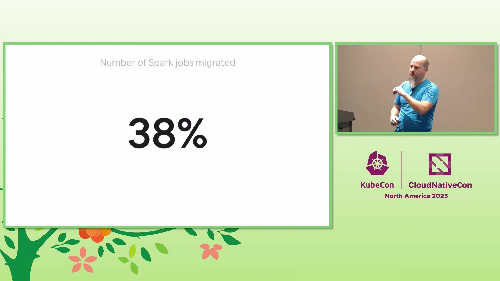
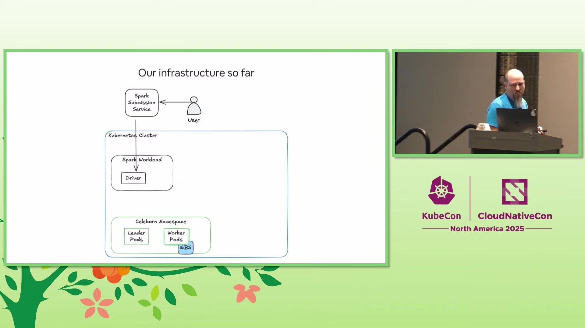

# [Airbnb](https://www.airbnb.com) Case Study

> **Source:** [Spark on Kubernetes, a Practical Guide - Damon Cortesi, Airbnb](https://www.youtube.com/watch?v=ejJ6A0sIdbw)  
> **Duration:** 29:52

---

## Overview

Airbnb is a leading global technology company operating one of the world's largest online marketplaces for lodging and tourism experiences. With a massive data infrastructure supporting millions of transactions daily, Airbnb relies heavily on Apache Spark for data processing and analytics workloads at extraordinary scale.

Airbnb's data platform team managed approximately **1 petabyte of memory** provisioned for Spark workloads, with **87,000 running containers** at any given time executing between **700,000 and 900,000 jobs daily**. This infrastructure had been running on Hadoop and YARN for nearly two decades, but the platform's limitations were becoming increasingly apparent as the company's data needs continued to grow.

The engineering team recognized that modernizing their Spark infrastructure by migrating to **[Kubernetes](https://kubernetes.io)** could unlock significant benefits in flexibility, automation, observability, and developer experience while maintaining their industry-leading **88% resource utilization**.

---

## Challenge

Airbnb faced several critical challenges with their existing Hadoop-based Spark infrastructure that threatened their ability to scale and innovate effectively.

Upgrading Spark versions in their existing YARN clusters was challenging and time-consuming, requiring a full lift-and-shift approach for the entire cluster. Java runtime support lagged significantly behind industry standards, with Java 11 support only introduced to Hadoop in 2022. Compute optimization was largely manual, requiring teams to pick and choose instance types rather than leveraging automated solutions that could dynamically select the most efficient compute resources.

Observability was more difficult compared to modern Kubernetes-native solutions. While Airbnb used **OpenTelemetry** internally for metrics collection, the integration with their Hadoop infrastructure lacked the streamlined pathways available in Kubernetes environments. The developer experience also needed improvement to better serve internal users and reduce friction in their workflows.

Key challenges:
- **Manual Spark version upgrades** requiring cluster-wide lift-and-shift migrations
- **Lagging Java runtime support** limiting ability to adopt modern Java versions
- **Manual compute optimization** instead of automated instance type selection
- **Limited observability integration** compared to Kubernetes-native solutions
- **Bursty workloads** spiking from 5,000-10,000 pods to **30,000-40,000 pods**
- **Complex developer experience** requiring improvement for internal teams

*Traditional deployment pipeline challenges (7:30)*

---

## Solution

Airbnb embarked on a comprehensive migration journey to move their Spark workloads from Hadoop/YARN to **[Kubernetes](https://kubernetes.io)**, building a sophisticated platform that addressed all their existing challenges while maintaining operational excellence.

The foundation of the new platform was **[Kubernetes](https://kubernetes.io)** for [container orchestration](https://glossary.cncf.io/container-orchestration/), with Karpenter as the autoscaler to enable intelligent, automated instance type selection based on workload requirements. Rather than adopting existing Spark operators (Kubeflow Spark Operator or Apache's Spark Operator), the team leveraged their existing centralized Spark submission service, which simplified deployment and maintained consistency with their established workflows.

To replace YARN's native shuffle service and enable dynamic resource allocation, Airbnb deployed Apache Celeborn as their remote shuffle service. After evaluating multiple options including Uber RSS and AWS cloud shuffle plugin, Celeborn was selected for its excellent documentation, strong community support, and compatibility with their Spark 3.1.1 version. The team deployed Celeborn in the same cluster as Spark workloads to leverage cluster-local DNS and simplify networking.

For observability, the platform integrated **OpenTelemetry** collector sidecars on each Spark driver and executor pod, forwarding logs to S3. The team built a custom reverse proxy and log server that provided unified access to Spark UI, history server, and container logs through stable HTTP endpoints. This solved a common pain point where Spark UIs disappear after job completion, implementing automatic redirects from running jobs to the history server for completed workloads.

The deployment architecture embraced GitOps principles using **[Argo CD](https://argoproj.github.io/cd/)** for continuous delivery and **[Helm](https://helm.sh)** for package management. Configuration for Spark, Celeborn, and Unicorn (their chosen scheduler) resided in Git repositories, enabling the team to spin up new clusters with just two pull requests using the app-of-apps pattern.

Crucially, Airbnb implemented a gradual ramp-and-opt-in process using Airflow to orchestrate the migration. Specific DAGs could be opted into the Kubernetes platform, with automatic fallback to the legacy Hadoop environment if failures occurred. This approach allowed seamless migration without disrupting users or requiring changes to existing workflows.

*Kubernetes implementation architecture (18:00)*

---

## Impact

The migration to Kubernetes achieved remarkable success, demonstrating both technical excellence and operational efficiency at massive scale.

Benchmark testing using TPC-DS 3TB scale showed that Spark on Kubernetes performed better than YARN for most queries, with particularly strong improvements for shuffle-heavy workloads when using NVMe disks. Critically, the team maintained their industry-leading **88% resource utilization** throughout the migration.

The new platform handled Airbnb's demanding scale requirements effortlessly, managing workloads that spike from baseline levels to **30,000-40,000 running and pending pods** during peak periods. The infrastructure processed **90 terabytes of container logs per week** while providing developers with instant access to debugging information through the custom reverse proxy.

Operational efficiency improved significantly. Infrastructure deployment became streamlined to the point where spinning up a new cluster required only two Git pull requests, with Argo CD automatically handling the deployment. The migration proceeded transparently to end users through an internal portal where developers could search for job IDs across both old and new environments with consistent UI access.

Key improvements:
- **38% of production workload** migrated to Kubernetes successfully
- **37% migration acceleration** from 1% to 38% in one month
- **88% resource utilization** maintained at petabyte scale
- **Better performance** than YARN in TPC-DS benchmarks
- **Seamless scaling** handling spikes to 30,000-40,000 pods
- **Streamlined deployment** requiring only 2 pull requests per cluster
- **Transparent user experience** with automatic failover to legacy environment
- **90 terabytes** of logs per week managed efficiently

The team's evaluation and integration of multiple open-source projects including Celeborn, **OpenTelemetry**, and Unicorn demonstrated the power of the CNCF ecosystem for solving complex data platform challenges.

*Results: 38% of their production workload (25:30)*

---

## Conclusion

Airbnb's journey from Hadoop to **[Kubernetes](https://kubernetes.io)** for Spark workloads demonstrates how thoughtful platform engineering can modernize critical infrastructure at massive scale without disrupting business operations. By combining **[Kubernetes](https://kubernetes.io)**, **[Argo CD](https://argoproj.github.io/cd/)**, **[Helm](https://helm.sh)**, **OpenTelemetry**, and carefully selected open-source tools, the team achieved technical modernization while maintaining operational excellence.

The key to Airbnb's success was their incremental, user-focused approach. Rather than forcing a big-bang migration, the team built robust automation with automatic fallback capabilities, allowing workloads to transition gradually while maintaining reliability. The year-long platform development phase, focused on internal integrations and careful evaluation of open-source options, enabled the dramatic acceleration from 1% to 38% migration in a single month. This exemplifies how investing in solid foundations and developer experience pays dividends when scaling transformative infrastructure changes across large organizations.

---

## Metadata

**Company:** [Airbnb](https://www.airbnb.com)

**CNCF Projects Used:**
- **[Kubernetes](https://kubernetes.io)**: Container orchestration platform for running Spark workloads, replacing Hadoop/YARN
- **[Argo CD](https://argoproj.github.io/cd/)**: GitOps continuous delivery for deploying Spark configurations and Helm charts to Kubernetes clusters
- **[Helm](https://helm.sh)**: Package management for deploying Spark, Celeborn, and other components to Kubernetes
- **[OpenTelemetry](https://opentelemetry.io)**: Observability and log collection from Spark driver and executor containers

**Key Metrics:**
- As of this month, we've migrated about 38% of our production workload onto Kubernetes
- A month ago, this was 1%. So we started this project over a year ago and that number jumped from 1 to 38% in the span of a month
- At any given time, we've got about a petabyte of memory provisioned for our Spark workloads
- Of that we're about 88% utilized which from what I've seen around the industry is a pretty good utilization number
- At any given time we've got about 87,000 running yarn containers
- Every day we run somewhere between 700,000 and 900,000 jobs across the cluster
- It's not unusual for us to spike up to from 5 or 10,000 running and pending pods up to 30 or 40,000 running and pending pods
- We do about 90 terabytes of logs per week from our containers just for the spark containers
- The most recent Spark release 4.0, it had over 300 Kubernetes related JIRAs merged

**Video Source:**
- **Title:** Spark on Kubernetes, a Practical Guide - Damon Cortesi, Airbnb
- **URL:** https://www.youtube.com/watch?v=ejJ6A0sIdbw
- **Duration:** 29:52

---

*This case study was automatically generated from the video interview.*