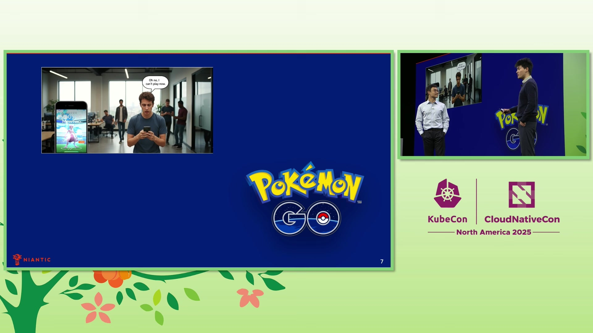
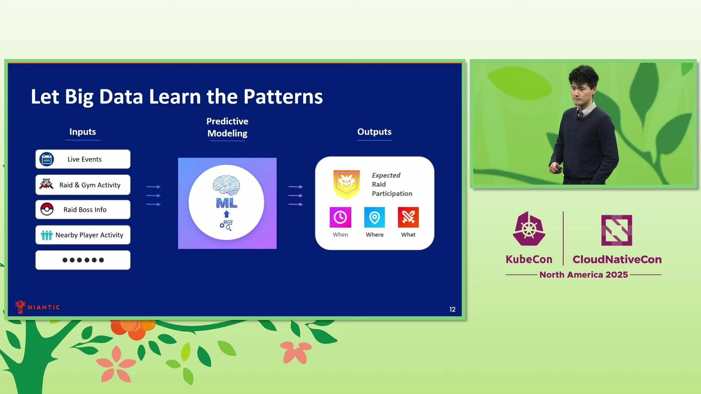
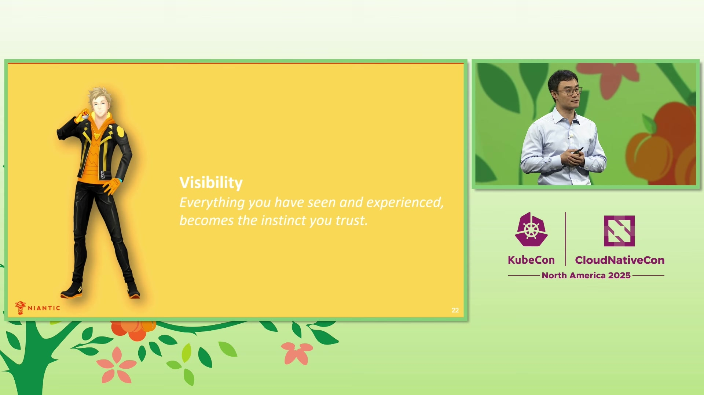

# [Niantic](https://www.niantic.com) Case Study

> **Source:** [Keynote: Scaling Geo-Temporal ML: How Pokémon Go Optimizes Global Gameplay With... Y. Liu & A. Zhang](https://www.youtube.com/watch?v=NbfyR_tNMXY)  
> **Duration:** 15:26

---

## Overview

Niantic is a mobile gaming company known for pioneering augmented reality experiences that encourage people to explore the real world. Founded with the mission of using technology to get people outside rather than keeping them glued to screens, the company develops games like Pokémon Go, Monster Hunter Now, and Pikmin Bloom that reward exploration, exercise, and social connection. Pokémon Go, launched in 2016, became a global phenomenon, changing how millions of people interact with their cities by transforming parks, landmarks, and public spaces into interactive gaming destinations.

As the game evolved beyond its initial launch, Niantic introduced raid battles—a core social feature where players gather at real-world locations to cooperatively defeat rare Pokémon. This seemingly simple game mechanic created one of the industry's most complex geotemporal optimization challenges: scheduling raids across millions of locations worldwide, at any second of the day, while balancing player preferences, skill levels, and engagement patterns. Solving this problem required robust, scalable machine learning infrastructure that could handle trillions of daily scheduling possibilities.

---

## Challenge

Niantic faced a massive global-scale geotemporal optimization problem in scheduling raid battles for Pokémon Go. The challenge centered on what the team called "the optimal triplet problem"—determining the right raid (what), at the right location (where), at the right time (when) for every player community worldwide. Players frequently encountered frustrating situations: finding a raid when they couldn't play, or being ready to play but finding only inappropriate raids nearby.

Scaling this problem globally revealed its true complexity. The system needed to optimize across **seven-plus raid tiers**, **millions of gyms worldwide**, and raids schedulable at **any second during the day**—creating more than **trillions of possible scheduling combinations**. The challenge extended beyond simple optimization: the system had to account for diverse game logic constraints, honor live events, respect community differences, and handle the fundamental constraint that the game map is shared—every raid spawned affects all nearby players simultaneously.

Key challenges:
- Solving the optimal triplet across **trillions of scheduling possibilities** daily
- Processing geotemporal data with **close to a thousand features** per prediction
- Balancing maximum participation with game diversity and long-term engagement
- Avoiding the pitfall where greedy algorithms pushed all content to dense urban areas
- Building a robust ML infrastructure to handle global-scale predictions and scheduling
- Operating at scale with reproducibility, experimentation, and real-time visibility

*Traditional deployment pipeline challenges (3:43)*

---

## Solution

Niantic addressed the geotemporal scheduling challenge by building a comprehensive machine learning platform on top of CNCF technologies. The team moved from simple rule-based scheduling to a sophisticated data-driven approach, leveraging **[Kubernetes](https://kubernetes.io)** as the foundation for running nearly all self-managed workloads. This provided the robust, scalable infrastructure needed to process millions of predictions across global gaming communities.

For the machine learning platform, Niantic adopted **Kubeflow** as the cornerstone, using **KServe** and **Knative** to power model predictions and serverless workloads. The team built a sophisticated regression model utilizing **close to a thousand features** including geotemporal data, live events, and player activity patterns. This model predicts expected raid participation for every possible triplet combination across the globe. The predictions feed into a hybrid scheduler that combines linear programming for maximizing participation with weighted random sampling to maintain diversity and player excitement.

The platform leveraged **[Argo Workflows](https://argoproj.github.io/workflows/)** and **[Argo CD](https://argoproj.github.io/cd/)** for managing ML jobs, pipelines, and deployments, with **[Helm](https://helm.sh)** handling package management. **[Envoy](https://www.envoyproxy.io)** and other CNCF projects completed the [microservices](https://glossary.cncf.io/microservices-architecture/) ecosystem. Beyond CNCF technologies, the stack included MLflow for experiment tracking, Ray for distributed training, Milvus for embeddings management, PyTorch for model training, and Optuna for hyperparameter tuning. This comprehensive open-source stack enabled the team to scale machine learning across data, models, and production without sacrificing development agility.

The solution embraced [cloud-native](https://glossary.cncf.io/cloud-native-tech/) principles from day zero, reflecting Niantic's infrastructure philosophy. Idempotent designs enabled graceful recovery from failures, extensive offline experimentation built confidence in model performance, and rigorous geo-experimentation frameworks allowed rapid iteration on real player feedback.

*The model utilizes close to a thousand features including geotemporal data, live events, and player activity - Implementation (7:24)*

---

## Impact

Niantic's cloud-native machine learning platform delivered substantial improvements in both player engagement and operational capabilities. The system achieved **double-digit growth in raid engagement** while delivering sustainable and meaningful improvements to player experience. By solving the geotemporal scheduling challenge, Niantic ensured players found appropriate raids at convenient times and locations, addressing the core pain points that previously frustrated the community.

The technical foundation enabled sophisticated ML operations at global scale. The platform processes predictions across **trillions of scheduling possibilities every single day**, evaluating options across **millions of gyms worldwide** using models trained on **close to a thousand features**. The hybrid scheduling approach successfully balanced participation maximization with the diversity and surprise that keep players engaged long-term, avoiding the trap where naive optimization killed gameplay variety.

Key improvements:
- **Double-digit growth** in raid engagement and player participation
- **Trillions of scheduling possibilities** evaluated daily across global gaming communities  
- **Millions of gyms** optimized with geotemporal precision for local communities
- **Close to a thousand features** utilized in ML models for accurate participation prediction
- Robust ML operations including reproducibility, fast experimentation, and real-time monitoring
- Sustainable player experience improvements through balanced optimization

The platform's observability capabilities provide visibility into model performance and system metrics through a geotemporal lens, enabling the team to understand how ML systems behave in real-world conditions. Fast, configurable schedulers support rapid testing and iteration on player feedback, while automated model retraining ensures the system adapts to seasonal gameplay pattern changes.

*Results: We have millions of gyms worldwide (13:51)*

---

## Conclusion

Niantic's implementation demonstrates how CNCF technologies can solve complex real-world optimization problems at global scale. By building on **[Kubernetes](https://kubernetes.io)**, **Kubeflow**, **[Argo CD](https://argoproj.github.io/cd/)**, and complementary open-source tools, the company created a machine learning platform capable of processing trillions of daily scheduling decisions while maintaining development velocity and operational reliability.

The key to success was embracing [cloud-native](https://glossary.cncf.io/cloud-native-tech/) principles from the beginning and prioritizing player experience over pure metrics optimization. The hybrid approach—combining linear programming with randomized sampling—shows the importance of balancing algorithmic efficiency with human factors like excitement and diversity. As one speaker noted, "When the players are happy, we know we're doing it right." This player-first philosophy, combined with robust open-source infrastructure and rigorous ML operations, enabled Niantic to transform a game design challenge into a showcase for geotemporal machine learning at planetary scale.

---

## Metadata

**Company:** [Niantic](https://www.niantic.com)

**CNCF Projects Used:**
- **[Kubernetes](https://kubernetes.io)**: Running nearly all self-managed workloads as the foundation of infrastructure
- **[Kubeflow](https://kubeflow.io)**: Cornerstone machine learning platform for ML workflows
- **[KServe](https://kserve.io)**: Powering model predictions
- **[Knative](https://knative.io)**: Powering serverless workloads
- **[Argo Workflows](https://argoproj.github.io/workflows/)**: Managing jobs and pipelines
- **[Argo CD](https://argoproj.github.io/cd/)**: Managing deployments
- **[Helm](https://helm.sh)**: Package management for microservices
- **[Envoy](https://www.envoyproxy.io)**: Part of microservices ecosystem

**Key Metrics:**
- We have millions of gyms worldwide
- We have trillions of possibilities every single day
- Seven plus raid tiers
- We achieved the double-digit growth in the raid engagement
- The model utilizes close to a thousand features including geotemporal data, live events, and player activity

**Video Source:**
- **Title:** Keynote: Scaling Geo-Temporal ML: How Pokémon Go Optimizes Global Gameplay With... Y. Liu & A. Zhang
- **URL:** https://www.youtube.com/watch?v=NbfyR_tNMXY
- **Duration:** 15:26

---

*This case study was automatically generated from the video interview.*