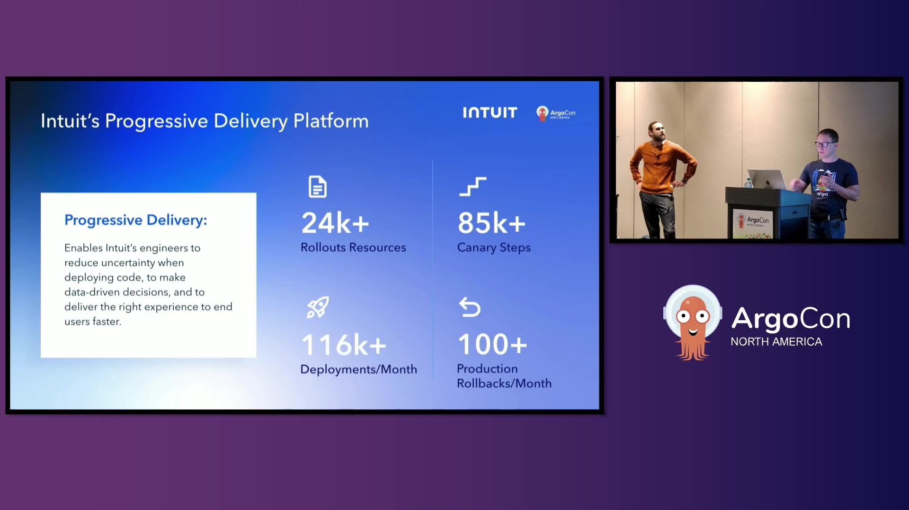
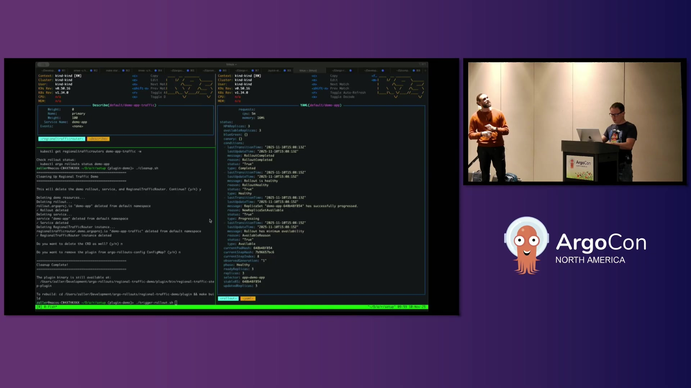
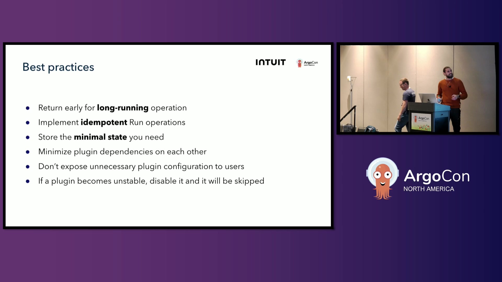

# [Intuit](https://www.intuit.com) Case Study

> **Source:** [Supercharge Your Canary Deployments With Argo Rollouts Step Plu... Alexandre Gaudreault & Zach Aller](https://www.youtube.com/watch?v=7r-rjA4TLhI)  
> **Duration:** 25:23

---

## Overview

[Intuit](https://www.intuit.com) is a global fintech company behind popular financial software brands including TurboTax, Credit Karma, QuickBooks, and Mailchimp, serving millions of customers worldwide. As a leader in the open source community, Intuit made the strategic decision to open source **[Argo CD](https://argoproj.github.io/cd/)** several years ago and continues to actively contribute to the [cloud-native](https://glossary.cncf.io/cloud-native-tech/) ecosystem.

Operating at massive scale with **24,000 rollout resources** and performing **116,000 deployments per month**, Intuit needed robust [progressive delivery](https://glossary.cncf.io/progressive-delivery/) capabilities to maintain velocity while ensuring reliability. The engineering teams required sophisticated [canary deployment](https://glossary.cncf.io/canary-deployment/) strategies to safely roll out changes across their extensive [microservices](https://glossary.cncf.io/microservices-architecture/) architecture without disrupting customer experiences.

---

## Challenge

Before **[Argo Rollouts](https://argoproj.github.io/rollouts/)** 1.8, the available [canary deployment](https://glossary.cncf.io/canary-deployment/) steps served very specific, limited purposes—primarily controlling traffic distribution to canary instances. Teams attempting to implement more sophisticated deployment workflows found themselves working around system limitations rather than leveraging purpose-built capabilities.

Some users resorted to misusing the analysis step as a makeshift plugin system by spinning up Kubernetes jobs to execute custom logic. This approach created significant complexity, introduced maintenance overhead, and made deployments harder to reason about. Additionally, different traffic routers had unique feature sets that required custom integration logic, such as routing traffic between regions during multi-region rollouts.

Key challenges:
- **Limited extensibility** for custom canary deployment workflows beyond basic traffic shifting
- Complexity and overhead from repurposing analysis steps as a plugin mechanism
- **No standardized way** to implement canary gating, deployment synchronization, or custom notifications
- Traffic router-specific features required bespoke implementations within core codebase
- Maintenance burden concentrated on core Argo Rollouts maintainers rather than distributed across community

*Before: at Intuit we have 24,000 rollout resources with a combined 85,000 steps (1:49)*

---

## Solution

[Intuit](https://www.intuit.com) implemented Canary Step Plugins in **[Argo Rollouts](https://argoproj.github.io/rollouts/)** 1.8, completing the trilogy of plugin systems alongside existing traffic router and metric provider plugins. This new capability extended Argo Rollouts' [progressive delivery](https://glossary.cncf.io/progressive-delivery/) experience to accommodate a multitude of deployment scenarios previously impossible or impractical.

The plugin architecture uses standalone Go processes running gRPC servers, leveraging HashiCorp's Go plugin library in net RPC mode. While this approach requires plugins to be written in Go, it dramatically simplifies implementation by eliminating the complexity of protocol buffers and code generation. Plugins implement a straightforward interface with three core methods: run, terminate, and abort.

The run method handles plugin execution and can operate asynchronously for long-running operations. Plugins save state in the rollout resource status, ensuring resilience across controller restarts. The system includes intelligent backoff mechanisms, allowing plugins to control reconciliation timing without blocking other operations. When rollouts abort—whether manually or due to failures—the abort method is called in reverse order, enabling proper cleanup like canceling in-progress jobs. The terminate method provides similar cleanup capabilities when users force-promote rollouts to skip remaining steps.

A critical operational feature is the disable capability. When external dependencies like Jenkins experience outages, operators can temporarily disable specific plugins via the Argo Rollouts ConfigMap. This prevents widespread deployment failures while maintaining the ability to deploy critical fixes.

Intuit also integrated the plugin system with their existing **[Kubernetes](https://kubernetes.io)**, **[Istio](https://istio.io)**, **[Prometheus](https://prometheus.io)**, and **[Datadog](https://www.datadoghq.com)** infrastructure, creating comprehensive [progressive delivery](https://glossary.cncf.io/progressive-delivery/) workflows. The plugin interface proved so intuitive that a working demo implementation was created using AI in just three prompts.

*Argo Rollouts implementation architecture (17:43)*

---

## Impact

The introduction of step plugins transformed [Intuit](https://www.intuit.com)'s [progressive delivery](https://glossary.cncf.io/progressive-delivery/) capabilities, providing unprecedented flexibility in deployment workflows. Teams gained the ability to fully control what happens during canary processes and implement custom functionality tailored to their specific requirements.

The measurable impact on deployment safety was substantial. By automating sophisticated canary workflows with custom validation logic, Intuit now **prevents approximately 100+ incidents per month** through automatic rollout aborts when issues are detected. This represented a significant improvement in production stability and customer experience.

Key improvements:
- **100+ incidents prevented** per month through automated rollout aborts
- **24,000 rollout resources** leveraging the plugin system across the organization
- **85,000 canary steps** orchestrating complex progressive delivery workflows
- **116,000 deployments per month** with enhanced safety and flexibility
- **Distributed maintenance model** where community members maintain traffic router plugins instead of centralizing complexity

The simplicity of the plugin interface enabled rapid adoption and experimentation. Teams implemented use cases including canary gating, cross-cluster deployment synchronization, custom notifications during rollouts, and region-specific traffic routing patterns. The plugin system's ease of use was demonstrated when a fully functional demo plugin was created in just three AI prompts, showcasing how accessible the technology is for teams wanting to extend their deployment capabilities.

*Performance improvements and key results (21:35)*

---

## Conclusion

[Intuit](https://www.intuit.com)'s implementation of Canary Step Plugins in **[Argo Rollouts](https://argoproj.github.io/rollouts/)** demonstrates how extensible architecture empowers organizations to customize [cloud-native](https://glossary.cncf.io/cloud-native-tech/) tooling for their specific needs. By completing the plugin trilogy alongside traffic and metric providers, Argo Rollouts evolved into a truly flexible [progressive delivery](https://glossary.cncf.io/progressive-delivery/) platform.

The success of this approach validates the power of well-designed plugin interfaces. By choosing simplicity over feature richness—net RPC instead of gRPC, straightforward Go interfaces instead of complex frameworks—Intuit created a system that teams can adopt quickly and customize confidently. This distributed maintenance model scales community contribution while reducing burden on core maintainers, benefiting the entire [cloud-native](https://glossary.cncf.io/cloud-native-tech/) ecosystem.

---

## Metadata

**Company:** [Intuit](https://www.intuit.com)

**CNCF Projects Used:**
- **[Argo Rollouts](https://argoproj.github.io/rollouts/)**: progressive delivery with blue/green and canary deployments
- **[Argo CD](https://argoproj.github.io/cd/)**: continuous delivery that Intuit open sourced
- **[Kubernetes](https://kubernetes.io)**: container orchestration platform for running rollouts
- **[Istio](https://istio.io)**: traffic routing for canary deployments
- **[Prometheus](https://prometheus.io)**: metrics provider for progressive delivery decisions

**Key Metrics:**
- at Intuit we have 24,000 rollout resources with a combined 85,000 steps
- 24,000 rollout resources with a combined 85,000 steps
- we do about 116,000 different deployments a month
- we save an incident roughly 100 plus times a month as well due to rollouts aborting a particular change

**Video Source:**
- **Title:** Supercharge Your Canary Deployments With Argo Rollouts Step Plu... Alexandre Gaudreault & Zach Aller
- **URL:** https://www.youtube.com/watch?v=7r-rjA4TLhI
- **Duration:** 25:23

---

*This case study was automatically generated from the video interview.*