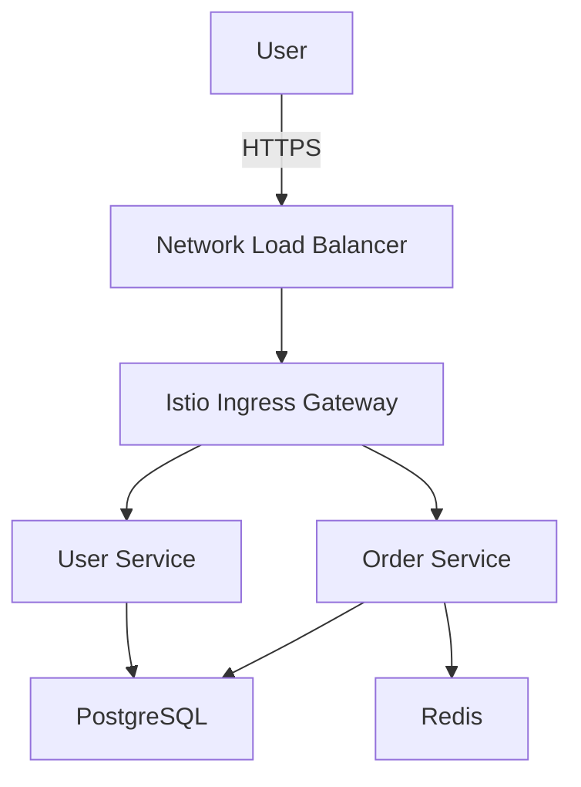

# Reference Architecture User Guide

## What Are Reference Architectures?

Reference architectures are **comprehensive technical documents** (2000-5000 words) that capture production cloud-native architectures from CNCF community talks. They are designed for **engineers and architects** who want to understand how organizations implement complex cloud-native systems.

### Key Characteristics

- **Technical Depth**: Detailed implementation specifics, not just high-level overviews
- **Architecture Focus**: 3-layer breakdown (Infrastructure, Platform, Application) with integration patterns
- **CNCF Project Rich**: Documents 5+ CNCF projects with concrete usage examples
- **Production Ready**: Based on real-world implementations shared at KubeCon and CNCF events
- **TAB Submission Ready**: Meets CNCF Technical Advisory Board quality standards

### Example Use Cases

**For Engineers:**
- "How did Company X implement service mesh at scale?"
- "What does a production Kubernetes platform with observability look like?"
- "How do you integrate 7+ CNCF projects in a cohesive architecture?"

**For Architects:**
- "What are common patterns for multi-cluster orchestration?"
- "How do production systems handle security and compliance?"
- "What integration patterns work well with CNCF projects?"

**For Organizations:**
- "What architectures should we evaluate for our cloud-native transformation?"
- "How do similar companies in our industry implement these technologies?"
- "What lessons can we learn from production implementations?"

---

## Reference Architecture vs Case Study

### Quick Decision Guide

```
Is the video 15+ minutes with detailed architecture? → Reference Architecture
Is the video 10-20 minutes focused on business outcomes? → Case Study
```

### Detailed Comparison

| Aspect | Reference Architecture | Case Study |
|--------|----------------------|-----------|
| **Audience** | Engineers, architects, technical decision-makers | Business leaders, executives, managers |
| **Focus** | How it's built (architecture, integration, implementation) | Why it was built (challenge, solution, business impact) |
| **Length** | 2000-5000 words | 500-1500 words |
| **Sections** | 13 sections (architecture-focused) | 5 sections (narrative-focused) |
| **CNCF Projects** | 5+ projects with technical details | 2+ projects with usage context |
| **Architecture Details** | 3-layer breakdown + integration patterns + diagrams | High-level overview only |
| **Technical Depth Score** | ≥0.70 (stringent) | ≥0.60 (moderate) |
| **Video Requirements** | 15-40 minutes, architecture-heavy | 10-20 minutes, story-focused |
| **Diagrams** | Textual component + data flow specifications | None |
| **Screenshots** | 6+ (architecture-focused captures) | 3 (key moments) |
| **Metrics** | Technical metrics with transcript citations | Business metrics |
| **Use Case** | "Show me how to build this" | "Convince leadership to adopt this" |
| **CNCF TAB Submission** | Explicitly designed for submission | Not suitable |

### When to Choose Each

**Choose Reference Architecture if:**
- ✅ Video discusses comprehensive architecture (5+ CNCF projects)
- ✅ Speaker shows detailed diagrams or system architecture
- ✅ Content includes integration patterns and implementation details
- ✅ Video is 15-40 minutes long
- ✅ Target audience needs technical implementation guidance
- ✅ Goal is CNCF TAB submission

**Choose Case Study if:**
- ✅ Video tells a story: challenge → solution → impact
- ✅ Focus is on business outcomes and metrics
- ✅ Video is 10-20 minutes long
- ✅ Target audience is business stakeholders
- ✅ Goal is showcasing success stories

**Can't Decide?**
- If video has both narrative and architecture, start with Reference Architecture (it's more comprehensive)
- You can always convert: Reference Architecture can be distilled into Case Study later
- When in doubt, request Reference Architecture - it captures more information

---

## Requesting a Reference Architecture

### Step 1: Verify Video Suitability

Before requesting, check that the video meets minimum requirements:

#### ✅ Required Criteria

1. **Video Length**: 15-40 minutes
   - Shorter videos (<15 min) lack architectural depth
   - Longer videos (>40 min) may need manual editing

2. **Captions Available**: High-quality closed captions
   - Check: Video → Settings → Captions → English (auto-generated or manual)
   - Auto-generated captions are OK if video has clear audio

3. **CNCF Projects**: Discusses 5+ CNCF projects
   - Look for: Kubernetes, Prometheus, Envoy, Helm, Flagger, etc.
   - Check video description for project mentions

4. **Architecture Content**: Shows system architecture
   - Diagrams visible in video
   - Speaker describes components and integration
   - Implementation details discussed

5. **Company Context**: CNCF End User Member (preferred)
   - Check: https://www.cncf.io/enduser/
   - Non-members can still be processed but with note in output

#### ⚠️ Warning Signs (May Result in Lower Quality)

- Video is mostly demo without architecture explanation
- Speaker doesn't show or describe system architecture
- Only 3-4 CNCF projects mentioned briefly
- Video has poor audio quality (affects caption quality)
- Highly abstract discussion without concrete implementation

### Step 2: Create GitHub Issue

**Navigate to:** https://github.com/cncf/casestudypilot/issues/new/choose

**Select Template:** "Reference Architecture Request"

**Fill out the template:**

```markdown
---
name: Reference Architecture Request
about: Generate a comprehensive reference architecture from a YouTube video
title: "[Reference Architecture] Company Name - Short Description"
labels: reference-architecture
---

## Video Information

**YouTube URL**: https://www.youtube.com/watch?v=VIDEO_ID

**Video Title**: [Paste from YouTube]

**Company**: [Company name]

**Expected CNCF Projects** (if known):
- Kubernetes
- Prometheus
- Envoy
- [Add more...]

## Requirements Checklist

- [x] Video is 15-40 minutes long
- [x] Video has high-quality captions
- [x] Video discusses 5+ CNCF projects
- [x] Video includes architecture diagrams/demos
- [x] Video features technical implementation details

## Additional Context

[Any additional information about the video or architecture]
- Industry/domain context
- Known integration patterns
- Special considerations
```

### Step 3: Wait for Processing

The reference-architecture-agent will:

1. **Fetch video data** (transcript, metadata)
2. **Validate transcript quality** (minimum 2000 characters)
3. **Extract and verify company name**
4. **Perform deep analysis** (5+ CNCF projects, 3 layers, integration patterns)
5. **Extract 6+ screenshots** (architecture-focused)
6. **Generate architecture diagrams** (textual specifications)
7. **Generate 13 sections** of content
8. **Validate quality** (technical depth score ≥0.70)
9. **Create pull request** with generated content

**Timeline:** 10-20 minutes for the agent to complete workflow

### Step 4: Review and Provide Feedback

You'll receive a comment on your issue when:

- ✅ **Generation succeeds**: PR link with generated reference architecture
- ⚠️ **Validation warnings**: Content generated but quality concerns noted
- ❌ **Validation fails**: Issue closed with error explanation and action required

#### If Generation Succeeds

1. **Review the PR**: Click the PR link in the issue comment
2. **Check the markdown**: Review generated content in `reference-architectures/company.md`
3. **Verify technical accuracy**: Ensure CNCF projects and architecture details are correct
4. **Check screenshots**: Verify images are relevant to architecture
5. **Approve or request changes**: Comment on PR with feedback

#### If Generation Fails

The agent will post an error message with:
- **What went wrong**: Specific failure reason
- **Critical issues**: List of problems found
- **Action required**: Steps to fix the issue

**Common failures:**

| Error | Cause | Fix |
|-------|-------|-----|
| Transcript Quality | Video <15 min or poor captions | Use longer video with better captions |
| Insufficient CNCF Projects | <5 projects identified | Verify video discusses architecture in detail |
| Missing Architecture Layers | Can't identify 3 layers | Check video has infrastructure/platform/app discussion |
| Technical Depth Score Low | Content lacks implementation details | Use more technical video with specifics |
| Company Name Ambiguous | Can't extract company from transcript | Manually specify company in issue comment |

---

## Understanding Validation

### Validation Checkpoints

The reference-architecture-agent has **7 validation checkpoints** (5 critical fail-fast):

#### 1. Transcript Quality (Step 2) - CRITICAL ⛔

**What it checks:**
- Transcript exists and is not empty
- Minimum 2000 characters (vs 1000 for case studies)
- At least 50 transcript segments
- At least 100 words

**Why it matters:** Short transcripts lack the architectural depth needed for comprehensive reference architectures.

**If it fails:**
```markdown
❌ **Validation Failed: Transcript Quality**

The transcript is too short or empty.

**Critical Issues:**
- Transcript has only 800 characters (minimum: 2000)
- Video may be too short or captions may be disabled

**Action Required:**
- Verify the YouTube video has captions enabled
- Use a longer video (15+ minutes recommended)
- Check that the video discusses architecture in detail
```

#### 2. Company Identification (Step 3) - CRITICAL ⛔

**What it checks:**
- Company name is not generic placeholder ("Company", "Organization", "Unknown")
- Confidence level ≥0.7 for automated extraction
- Name is not empty

**Why it matters:** Prevents "wrong company" hallucination bug (Spotify/Intuit issue).

**If it fails:** Agent will request manual company name in issue comment.

#### 3. Deep Analysis (Step 6) - CRITICAL ⛔

**What it checks:**
- **CNCF Projects**: 5+ projects (PASS), 4 projects (WARN), <4 (CRITICAL)
- **Architecture Layers**: All 3 layers present (Infrastructure, Platform, Application)
- **Integration Patterns**: 2+ patterns (PASS), 1 pattern (WARN), 0 (CRITICAL)
- **Screenshots**: 6+ opportunities (PASS), 4-5 (WARN), <4 (CRITICAL)
- **Sections**: All 6 required analysis sections present
- **Word Counts**: Each section 200-800 words

**Why it matters:** This is the foundation for the entire reference architecture. If deep analysis fails, the rest will be low quality.

**If it fails:**
```markdown
❌ **Validation Failed: Deep Analysis**

The transcript does not contain sufficient architectural depth.

**Critical Issues:**
- Only 3 CNCF projects identified (minimum: 5)
- Missing Application layer in architecture
- No integration patterns identified

**Possible Causes:**
- Video is too high-level without implementation details
- Speaker doesn't discuss specific CNCF projects
- Architecture is not explained in sufficient detail

**Action Required:**
- Use a more technical video with detailed architecture discussion
- Ensure video includes system diagrams and implementation specifics
```

#### 4. Metric Fabrication (Step 10) - CRITICAL ⛔

**What it checks:**
- All metrics in generated content have transcript quotes
- No fabricated numbers or improvements
- Fuzzy matching allows for rephrasing

**Why it matters:** Prevents false claims not supported by source material.

**If it fails:**
```markdown
❌ **Validation Failed: Metric Fabrication Detected**

Generated content includes metrics not found in transcript.

**Fabricated Metrics:**
- "300% improvement in deployment speed" - no supporting transcript quote
- "99.99% uptime" - number not mentioned in video

**Action Required:**
- Agent will regenerate content with only transcript-sourced metrics
- This is automatic, no user action required
```

#### 5. Company Consistency (Step 11) - CRITICAL ⛔

**What it checks:**
- Generated content mentions the verified company (not a different company)
- Detects "Spotify hallucination" bug

**Why it matters:** Critical safeguard against generating reference architecture about the wrong company.

**If it fails:**
```markdown
❌ **Validation Failed: Company Consistency**

Generated content mentions a different company than verified.

**Issues:**
- Verified company: Intuit
- Content mentions: Spotify

**Action Required:**
- Agent will regenerate content focused on correct company
- This indicates the video may discuss multiple companies - verify video is suitable
```

#### 6. Technical Depth Score (Step 13) - CRITICAL ⛔

**What it checks:** 5-dimensional scoring algorithm

```python
technical_depth_score = (
    0.25 * cncf_project_depth +      # 5+ projects, detailed descriptions
    0.20 * technical_specificity +    # Concrete implementation details
    0.20 * implementation_detail +    # Version numbers, configurations
    0.20 * metric_quality +           # Quantifiable results with citations
    0.15 * architecture_completeness  # All 3 layers documented
)
```

**Thresholds:**
- **≥0.70**: PASS (exit code 0) ✅
- **0.60-0.69**: WARNING (exit code 1) ⚠️
- **<0.60**: CRITICAL (exit code 2) ❌

**Why it matters:** Ensures content meets CNCF TAB quality standards.

**If score is 0.60-0.69 (WARNING):**
```markdown
⚠️ **Warning: Technical Depth Below Optimal**

Technical depth score: 0.65 (threshold: 0.70)

**Score Breakdown:**
- CNCF Project Depth: 0.60 (needs more detail on project usage)
- Technical Specificity: 0.70 (good)
- Implementation Detail: 0.65 (could use more version numbers/configs)
- Metric Quality: 0.70 (good)
- Architecture Completeness: 0.60 (application layer needs more detail)

**Recommendation:**
- Content is usable but may benefit from manual enhancement
- Consider adding more implementation details from video
- PR will be created but marked "needs-review"
```

**If score is <0.60 (CRITICAL):**
```markdown
❌ **Validation Failed: Insufficient Technical Depth**

Technical depth score: 0.55 (threshold: 0.70)

**Critical Issues:**
- CNCF Project Depth: 0.50 (insufficient detail on projects)
- Technical Specificity: 0.45 (lacks concrete implementation details)
- Implementation Detail: 0.40 (no version numbers or configurations)

**Action Required:**
- Video does not contain sufficient technical depth for reference architecture
- Consider using this video for a case study instead (threshold: 0.60)
- Or find a more technical video from the same company
```

#### 7. Word Count & Structure (Step 13)

**What it checks:**
- Total word count: 2000-5000 words (PASS), <2000 or >5000 (WARN)
- All 13 sections present
- CNCF projects list populated

**Why it matters:** Ensures output meets format requirements.

---

## Understanding the Output

### File Structure

```
reference-architectures/
├── company-cloud-native-platform.md       # Main content (2000-5000 words)
└── images/
    └── company-cloud-native-platform/
        ├── screenshot-1.jpg               # Infrastructure layer
        ├── screenshot-2.jpg               # Platform services
        ├── screenshot-3.jpg               # Application layer
        ├── screenshot-4.jpg               # Integration pattern
        ├── screenshot-5.jpg               # Observability
        └── screenshot-6.jpg               # Security/deployment
```

### Markdown Structure

#### YAML Frontmatter

```yaml
---
title: "Reference Architecture: Company Cloud-Native Platform"
subtitle: "Multi-cluster Kubernetes with Service Mesh and Progressive Delivery"
company: "Company Name"
industry: "Technology"
video_url: "https://www.youtube.com/watch?v=VIDEO_ID"
publication_date: "2026-02-10"
tab_status: "ready_for_submission"
primary_patterns:
  - "Multi-cluster orchestration"
  - "Service mesh architecture"
  - "Progressive delivery"
---
```

**Metadata fields:**
- `title`: Full title with "Reference Architecture:" prefix
- `subtitle`: Key architectural patterns or technologies
- `company`: Verified company name
- `industry`: Extracted from video or company data
- `video_url`: Source YouTube video
- `publication_date`: Date generated
- `tab_status`: `ready_for_submission`, `needs_review`, or `draft`
- `primary_patterns`: 2-4 key architectural patterns identified

#### Section 1: Executive Summary (100-200 words)

High-level overview for technical leaders:
- What the architecture achieves
- Key CNCF projects used
- Primary architectural patterns
- Unique or innovative aspects

**Example:**
```markdown
## Executive Summary

Company X implemented a comprehensive cloud-native platform using 7 CNCF projects
to support their multi-cluster Kubernetes infrastructure serving 10 million users.
The architecture employs a service mesh (Envoy via Istio) for inter-service
communication, progressive delivery with Flagger and Argo CD, and a full
observability stack (Prometheus, Grafana, Jaeger). This reference architecture
demonstrates enterprise-scale implementation of multi-cluster orchestration,
zero-downtime deployments, and comprehensive observability patterns that reduced
deployment risk by 80% while increasing deployment frequency from weekly to daily.
```

#### Section 2: Background & Context (300-500 words)

Company context and why this architecture was needed:
- Company industry and scale
- Business requirements
- Previous architecture limitations
- Goals for cloud-native transformation

#### Section 3: Technical Challenge (300-500 words)

Specific technical problems addressed:
- Legacy infrastructure issues
- Scale or performance challenges
- Operational complexity
- Security or compliance requirements

#### Section 4: Architecture Overview (400-600 words)

**3-Layer Architecture Breakdown:**

**Infrastructure Layer:**
- Compute (Kubernetes clusters)
- Networking (service mesh, load balancers)
- Storage (persistent volumes, object storage)

**Platform Layer:**
- CI/CD pipelines
- Service mesh control plane
- Observability stack
- Security tooling

**Application Layer:**
- Microservices architecture
- API gateway
- Application-specific services
- Data layer

**Example:**
```markdown
## Architecture Overview

The architecture follows a three-layer model:

### Infrastructure Layer

**Multi-Cluster Kubernetes:**
- 3 production clusters (US-East, US-West, EU-Central)
- Kubernetes 1.28 with EKS (AWS Elastic Kubernetes Service)
- Cross-cluster service discovery via Istio multi-primary model
- Shared storage layer using EBS CSI driver and S3

**Networking:**
- Envoy-based service mesh (Istio 1.19)
- AWS Network Load Balancers for ingress
- VPC peering for cluster-to-cluster communication

### Platform Layer

**Progressive Delivery:**
- Flagger 1.32 for automated canary deployments
- Argo CD 2.8 for GitOps-based continuous deployment
- Prometheus 2.45 for metric-based promotion decisions

**Observability:**
- Prometheus for metrics collection
- Grafana 10.1 for visualization
- Jaeger 1.49 for distributed tracing
- Loki 2.9 for log aggregation

### Application Layer

**Microservices:**
- 120 microservices written in Go and Python
- gRPC for internal communication
- REST APIs exposed via API gateway
- PostgreSQL (primary) and Redis (caching)
```

#### Section 5: Architecture Diagrams (200-400 words)

**Textual specifications only** (no Mermaid/PlantUML code to avoid hallucination):

**Component Diagram Description:**
- Services and their responsibilities
- Data stores
- External dependencies
- Trust boundaries

**Data Flow Diagram Description:**
- Request flow from ingress to services
- Data pipeline flows
- Async communication patterns

**Example:**
```markdown
## Architecture Diagrams

### Component Diagram

**Core Components:**

1. **Ingress Layer:**
   - AWS Network Load Balancer (external traffic entry)
   - Istio Ingress Gateway (internal service mesh entry)

2. **Service Mesh Control Plane:**
   - Istiod (service discovery, configuration, certificate management)
   - Envoy proxies (sidecar in each pod)

3. **Application Services (120 microservices):**
   - User Service (authentication, authorization)
   - Order Service (e-commerce transactions)
   - Inventory Service (product catalog)
   - Payment Service (payment processing)
   - [... additional services]

4. **Data Layer:**
   - PostgreSQL clusters (primary data store)
   - Redis clusters (caching layer)
   - S3 (object storage for media)

5. **Platform Services:**
   - Prometheus (metrics collection)
   - Grafana (dashboards)
   - Jaeger (tracing)
   - Flagger (canary controller)

**Trust Boundaries:**
- External → NLB → Istio Gateway (TLS termination)
- Service-to-service mTLS (via Istio)
- Data layer in private subnets (no internet access)

### Data Flow Diagram

**User Request Flow:**

1. User → NLB (TLS) → Istio Ingress Gateway
2. Gateway → User Service (authentication check)
3. User Service → Order Service (create order)
4. Order Service → Inventory Service (check stock)
5. Order Service → Payment Service (process payment)
6. All services emit metrics → Prometheus
7. All services emit traces → Jaeger
8. Order Service → PostgreSQL (persist order)
9. Order Service → Redis (cache user session)
10. Response path: Order Service → Gateway → User

**Canary Deployment Flow:**

1. Developer → Git push → GitHub
2. Argo CD detects change → deploys canary (10% traffic)
3. Flagger monitors Prometheus metrics (error rate, latency)
4. If metrics good → Flagger increases canary traffic (25%, 50%, 75%)
5. If metrics bad → Flagger rolls back to stable
6. If canary reaches 100% → promotes to stable version
```

#### Section 6: CNCF Projects Deep Dive (600-1000 words)

**For each of 5+ CNCF projects:**
- Project name and category (e.g., "Kubernetes - Orchestration")
- Version used
- Specific use case in this architecture
- Configuration highlights
- Integration with other projects
- Lessons learned or best practices

**Example:**
```markdown
## CNCF Projects Deep Dive

This architecture leverages 7 CNCF projects:

### 1. Kubernetes (Orchestration)

**Version:** 1.28 (EKS)

**Usage:** Container orchestration platform running 120 microservices across 3 clusters.

**Configuration Highlights:**
- Multi-cluster setup with Istio for cross-cluster service discovery
- Node groups: t3.xlarge (general workloads), c5.2xlarge (CPU-intensive), r5.xlarge (memory-intensive)
- Autoscaling: Cluster Autoscaler + Horizontal Pod Autoscaler
- Network policy enforcement via Calico

**Integration:**
- Istio service mesh for traffic management
- Prometheus for cluster metrics
- Flagger for progressive delivery

**Lessons Learned:**
- Multi-cluster requires careful planning of service discovery
- EKS simplifies management but requires IAM RBAC integration
- Cluster Autoscaler and HPA must be tuned together to avoid conflicts

### 2. Istio (Service Mesh)

**Version:** 1.19

**Usage:** Service-to-service communication, traffic management, security, and observability.

**Configuration Highlights:**
- Multi-primary deployment across 3 clusters
- mTLS enabled for all service-to-service communication
- Virtual Services for traffic routing and canary deployments
- Circuit breakers and retry policies for resilience

**Integration:**
- Flagger uses Istio traffic splitting for canary analysis
- Prometheus scrapes Istio metrics for observability
- Jaeger receives traces from Envoy proxies

**Lessons Learned:**
- Start with permissive mTLS, then move to strict
- Istio adds latency (~2ms per hop) - budget accordingly
- Multi-cluster setup requires careful certificate management

[... continue for remaining 5 projects: Prometheus, Grafana, Flagger, Argo CD, Jaeger ...]
```

#### Section 7: Integration Patterns (300-500 words)

How the CNCF projects work together:
- Service-to-service communication patterns
- Data flow patterns
- Deployment patterns
- Observability patterns

#### Section 8: Implementation Details (400-600 words)

Concrete implementation specifics:
- Version numbers
- Configuration samples
- Resource requirements
- Scaling characteristics

#### Section 9: Deployment Architecture (200-400 words)

How the system is deployed:
- Infrastructure-as-code tools
- CI/CD pipeline
- Deployment strategies
- Rollback procedures

#### Section 10: Security Considerations (200-400 words)

Security implementation:
- Authentication and authorization
- Network security (mTLS, network policies)
- Secrets management
- Compliance requirements

#### Section 11: Observability & Operations (300-500 words)

How the system is monitored and operated:
- Metrics collected
- Dashboards created
- Alerting rules
- Incident response

#### Section 12: Results & Impact (200-400 words)

Quantifiable outcomes:
- Performance improvements (with transcript citations)
- Operational metrics
- Business impact
- Team productivity gains

#### Section 13: Lessons Learned & Best Practices (200-400 words)

Wisdom from implementation:
- What worked well
- What was challenging
- What they'd do differently
- Advice for others

#### Conclusion (100-200 words)

Wrap-up and key takeaways.

---

## CNCF TAB Submission Process

### What is the CNCF TAB?

The **Technical Advisory Board (TAB)** is a technical governing body of the CNCF that:
- Defines and maintains the technical vision for the CNCF
- Approves new projects for CNCF adoption
- Reviews reference architectures and technical case studies
- Provides technical guidance to the Governing Board

**Reference architectures** submitted to the TAB serve as exemplars for the community on how to implement cloud-native systems.

### Submission Checklist

Before submitting to TAB, verify:

- ✅ Technical depth score ≥0.70
- ✅ 5+ CNCF projects documented in detail
- ✅ All 3 architecture layers described
- ✅ Implementation details included (versions, configurations)
- ✅ Metrics cited with transcript quotes
- ✅ Company is CNCF End User Member (preferred)
- ✅ Content reviewed for technical accuracy
- ✅ Architecture diagrams added (optional: convert textual specs to Mermaid)

### Submission Steps

#### 1. Review Generated Content

**What to check:**
- Technical accuracy of CNCF project descriptions
- Architecture layer descriptions are complete
- Metrics are correct and properly cited
- No placeholder or generic content
- Screenshots are relevant and high-quality

#### 2. Enhance Content (Optional)

You can manually enhance the generated reference architecture:

**Add Mermaid Diagrams:**
```markdown

```

**Add Code Samples:**
```yaml
# Istio Virtual Service for canary deployment
apiVersion: networking.istio.io/v1beta1
kind: VirtualService
metadata:
  name: order-service
spec:
  hosts:
  - order-service
  http:
  - match:
    - headers:
        canary:
          exact: "true"
    route:
    - destination:
        host: order-service
        subset: canary
      weight: 100
  - route:
    - destination:
        host: order-service
        subset: stable
      weight: 90
    - destination:
        host: order-service
        subset: canary
      weight: 10
```

**Expand Technical Details:**
- Add more specific configuration examples
- Include resource requirements and scaling metrics
- Add operational runbooks or troubleshooting guides

#### 3. Create TAB Submission Issue

**Navigate to:** https://github.com/cncf/toc/issues/new

**Title:** `[Reference Architecture] Company Cloud-Native Platform`

**Body:**
```markdown
## Reference Architecture Submission

**Title:** Reference Architecture: Company Cloud-Native Platform

**Company:** Company Name (CNCF End User Member)

**Link to Content:** https://github.com/cncf/casestudypilot/blob/main/reference-architectures/company-cloud-native-platform.md

**Source Video:** https://www.youtube.com/watch?v=VIDEO_ID (KubeCon NA 2023)

## Summary

This reference architecture documents a production multi-cluster Kubernetes platform
using 7 CNCF projects to serve 10 million users with zero-downtime deployments.

**Key Architectural Patterns:**
- Multi-cluster orchestration with service mesh
- Progressive delivery with automated canary analysis
- Comprehensive observability stack

**CNCF Projects:**
- Kubernetes 1.28 (orchestration)
- Istio 1.19 (service mesh)
- Prometheus 2.45 (metrics)
- Grafana 10.1 (visualization)
- Flagger 1.32 (progressive delivery)
- Argo CD 2.8 (GitOps)
- Jaeger 1.49 (tracing)

## Technical Depth Score

**Overall:** 0.78 (exceeds 0.70 threshold)

**Breakdown:**
- CNCF Project Depth: 0.85
- Technical Specificity: 0.75
- Implementation Detail: 0.80
- Metric Quality: 0.75
- Architecture Completeness: 0.75

## Metrics

All metrics cited with video transcript quotes:
- 80% reduction in deployment risk
- Deployment frequency: weekly → daily
- Mean time to recovery: 4 hours → 15 minutes
- Service uptime: 99.5% → 99.95%

## Request

Requesting TAB review and potential inclusion in CNCF reference architecture collection.

cc @cncf/toc
```

#### 4. Engage with TAB Feedback

TAB members may:
- Request clarifications or additional details
- Suggest improvements to content
- Ask about specific technical decisions
- Request validation of metrics or claims

**Be prepared to:**
- Provide additional context from the video
- Connect TAB with the company for technical questions
- Update the reference architecture based on feedback

#### 5. Publication

If approved by TAB:
- Reference architecture may be featured on CNCF website
- Added to CNCF reference architecture collection
- Promoted through CNCF channels (blog, social media, newsletters)
- Used as example in CNCF training materials

---

## FAQ

### General Questions

**Q: How long does generation take?**  
A: 10-20 minutes for the agent to complete the workflow, assuming the video meets quality requirements.

**Q: Can I request regeneration if I'm not happy with the output?**  
A: Yes! Comment on the issue with specific feedback (e.g., "Focus more on security aspects" or "Include more details on Prometheus configuration"). The agent can regenerate with new guidance.

**Q: Can I manually edit the generated content?**  
A: Absolutely! The generated markdown is a starting point. You can edit it directly in the PR before merging, or merge and edit later.

**Q: Is my company required to be a CNCF End User Member?**  
A: No, but it's preferred for TAB submission. Non-member companies can still have reference architectures generated - they'll just have a note indicating non-member status.

**Q: Can I generate a reference architecture from a non-KubeCon video?**  
A: Yes, as long as the video meets the technical depth requirements (15-40 min, 5+ CNCF projects, detailed architecture). Videos from meetups, company tech talks, or other conferences work too.

### Technical Questions

**Q: What if my video only discusses 4 CNCF projects?**  
A: The deep analysis validation will issue a WARNING (not critical). Content will still be generated, but technical depth score may be lower. Consider:
- Using the case-study-agent instead (requires only 2+ projects)
- Finding a more comprehensive video from the same company

**Q: Can I customize the 13-section structure?**  
A: Not automatically, but you can manually edit the generated markdown to add/remove/reorder sections after generation.

**Q: What if the technical depth score is 0.65 (borderline)?**  
A: Content will be generated with a WARNING label. You can:
- Accept it as-is for internal use
- Manually enhance it with more technical details
- Request regeneration with focus on specific areas
- Consider using case-study-agent instead

**Q: How are screenshots selected?**  
A: The transcript-deep-analysis skill identifies 6+ "screenshot opportunities" based on:
- When architecture diagrams are shown
- When speaker says "as you can see here" or "this diagram shows"
- When CNCF projects are being explained visually
- Key implementation moments

**Q: What if the video has multiple speakers discussing different architectures?**  
A: The agent will try to focus on the primary architecture. If multiple architectures are discussed independently, validation may fail. Consider:
- Creating separate issues for each architecture
- Editing the video URL to specific time ranges
- Manually specifying which architecture to focus on in issue description

### Validation Questions

**Q: Why did "Deep Analysis" validation fail with 4 CNCF projects?**  
A: Reference architectures are designed for comprehensive multi-project architectures. With only 4 projects, the architecture may lack the depth needed. Options:
- Use case-study-agent instead (2+ projects)
- Find a more comprehensive video

**Q: What does "Company Consistency" validation check?**  
A: It prevents the "Spotify hallucination bug" where the agent generates content about the wrong company. It cross-checks that the verified company name matches the company discussed in the generated content.

**Q: Can I skip validation for testing purposes?**  
A: No, validation is integral to the fail-fast architecture. However, you can manually run the CLI tools with `--force` flags for testing (not recommended for production).

**Q: Why did the technical depth score fail at 0.58?**  
A: The content lacked sufficient:
- Implementation details (version numbers, configurations)
- Concrete technical specifics
- Quantifiable metrics
- Architecture layer completeness

Try using a more technical video with detailed implementation discussion.

### Submission Questions

**Q: Do I need TAB approval before merging the PR?**  
A: No! The PR can be merged without TAB submission. TAB submission is optional and only for reference architectures intended for CNCF promotion.

**Q: How long does TAB review take?**  
A: TAB reviews are volunteer-driven and timing varies. Typical timeline: 2-4 weeks for initial feedback, longer for full approval. Be patient and responsive to feedback.

**Q: Can I submit to TAB without being a CNCF member?**  
A: Yes, but CNCF End User Member status increases likelihood of approval and promotion.

**Q: What if TAB rejects my submission?**  
A: TAB feedback will explain why. Common reasons:
- Insufficient technical depth
- Metrics not verifiable
- Architecture not novel or interesting enough
- Content needs more detail in specific areas

Use feedback to improve and resubmit, or use content internally without official CNCF endorsement.

---

## Troubleshooting

### Issue: "Transcript Quality" validation fails

**Symptoms:**
```
❌ Transcript has only 1200 characters (minimum: 2000)
```

**Causes:**
- Video is shorter than 15 minutes
- Video has auto-generated captions that are sparse
- Video has long periods without speech

**Solutions:**
1. ✅ Use a longer video (15-40 minutes ideal)
2. ✅ Check that captions are enabled on YouTube
3. ✅ If video is >15 min but fails, check caption quality - may need manual captions

### Issue: "Deep Analysis" validation fails - insufficient CNCF projects

**Symptoms:**
```
❌ Only 3 CNCF projects identified (minimum: 5)
```

**Causes:**
- Video discusses architecture at high level without naming specific projects
- Projects mentioned are not CNCF projects
- Projects mentioned briefly without usage details

**Solutions:**
1. ✅ Verify video explicitly mentions 5+ CNCF projects by name
2. ✅ Use case-study-agent instead (requires only 2+ projects)
3. ✅ Find a more detailed video from the same company

### Issue: "Deep Analysis" validation fails - missing architecture layers

**Symptoms:**
```
❌ Missing Application layer in architecture
```

**Causes:**
- Video focuses on infrastructure without discussing applications
- Speaker doesn't describe full stack
- Architecture is incomplete or specialized (e.g., just networking)

**Solutions:**
1. ✅ Use a video that discusses the full stack (infrastructure, platform, applications)
2. ✅ If architecture is specialized, manually add context in issue description
3. ✅ Consider if this is better suited as a blog post or case study

### Issue: Technical depth score is borderline (0.60-0.69)

**Symptoms:**
```
⚠️ Technical depth score: 0.65 (threshold: 0.70)
```

**Causes:**
- Video lacks specific implementation details
- Few version numbers or configurations mentioned
- High-level discussion without concrete examples

**Solutions:**
1. ✅ Accept with WARNING and manually enhance content
2. ✅ Request regeneration with prompt: "Focus on implementation details and concrete configurations"
3. ✅ Use a more technical video with detailed implementation discussion
4. ✅ Use case-study-agent instead (threshold: 0.60)

### Issue: Generated content is generic or lacks detail

**Symptoms:**
- Sections are short and high-level
- Few specific examples
- Feels like template content

**Causes:**
- Video transcript lacks detailed technical discussion
- Agent couldn't extract specific implementation details
- Video is more story-focused than technical

**Solutions:**
1. ✅ Manually enhance the generated content with details from video
2. ✅ Request regeneration with specific guidance: "Include more details on Kubernetes configuration and Istio setup"
3. ✅ Use a more technical video
4. ✅ Consider using case-study-agent for story-focused videos

### Issue: Screenshots are not relevant to architecture

**Symptoms:**
- Screenshots show speaker instead of diagrams
- Images are blurry or low quality
- Wrong moments captured

**Causes:**
- Video doesn't show architecture diagrams
- Diagram timing detection was inaccurate
- Presenter uses whiteboard or physical diagrams

**Solutions:**
1. ✅ Manually replace screenshots: Extract better frames from video, replace in `images/` directory
2. ✅ Add note in PR that screenshots need manual review
3. ✅ Use video with clear digital diagrams

---

## Best Practices

### For Requesting Reference Architectures

1. **Choose technical videos**: Look for "Architecture Deep Dive", "Under the Hood", "Implementation Details" in titles
2. **Verify CNCF projects**: Count projects mentioned in video description or first 5 minutes
3. **Check video length**: 20-30 minutes is the sweet spot (enough depth, not too long)
4. **Prefer KubeCon videos**: These are optimized for technical community audience
5. **Read video description**: Gives clues about architecture complexity

### For Reviewing Generated Content

1. **Verify technical accuracy first**: Check CNCF project versions, configurations, architecture layer descriptions
2. **Validate metrics**: Ensure all numbers match the video transcript
3. **Check for placeholders**: Search for "TODO", "PLACEHOLDER", "Company", "example.com"
4. **Test internal links**: Ensure section references work
5. **Review screenshots**: Verify images are relevant and readable

### For Enhancing Content

1. **Add code samples**: Include configuration YAML, CLI commands, Terraform snippets
2. **Add Mermaid diagrams**: Convert textual diagram specifications to visual diagrams
3. **Expand implementation details**: Add more specific configurations, resource requirements
4. **Include troubleshooting**: Add common issues and solutions
5. **Add references**: Link to official documentation for CNCF projects mentioned

### For TAB Submission

1. **Wait for PR merge**: Don't submit to TAB until content is merged to main branch
2. **Review community feedback**: If PR has comments, address before TAB submission
3. **Prepare to answer questions**: TAB may ask for clarifications or additional context
4. **Be patient**: TAB review is volunteer-driven, allow 2-4 weeks
5. **Engage constructively**: Respond to feedback professionally and promptly

---

## Getting Help

### Where to Ask Questions

1. **GitHub Issues**: For generation problems or validation failures
   - Tag with `question` label
   - Reference your specific issue number

2. **PR Comments**: For content-specific questions
   - Comment directly on the generated PR
   - Tag relevant reviewers if available

3. **CNCF Slack**: For general questions
   - Channel: `#end-user-community`
   - Mention `@casestudypilot`

### What Information to Provide

When asking for help, include:

1. **Issue/PR number**: So we can see the full context
2. **Video URL**: The YouTube video you're using
3. **Error message**: If validation failed, paste the full error
4. **What you expected**: What outcome you were hoping for
5. **What you got**: What actually happened

### Reporting Bugs

If you think you found a bug:

1. **Check existing issues**: Search for similar problems
2. **Create new issue**: Use "Bug Report" template
3. **Include reproduction steps**: How to trigger the bug
4. **Include logs**: Any error messages or validation output
5. **Describe impact**: How this affects your use case

---

**Generated:** 2026-02-10  
**Version:** 1.0.0  
**Last Updated:** 2026-02-10
