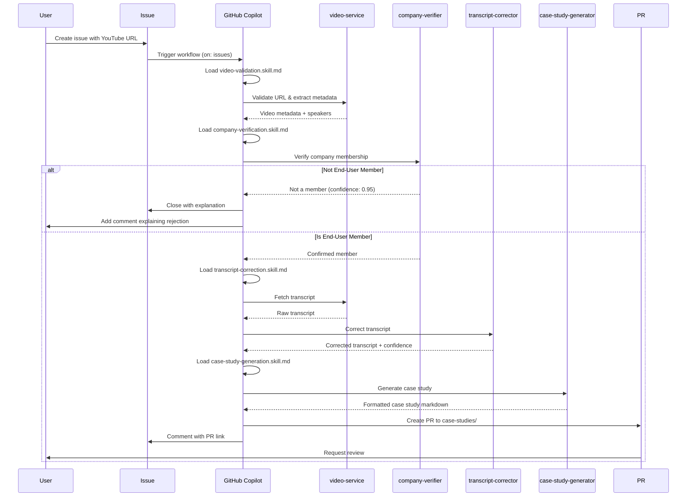
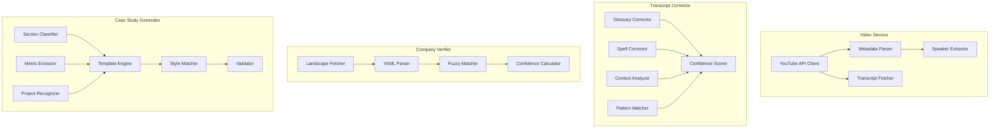
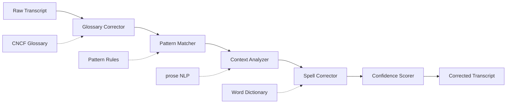
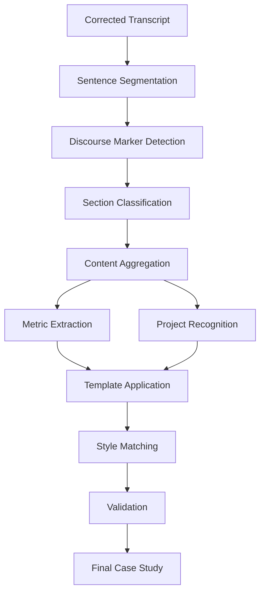
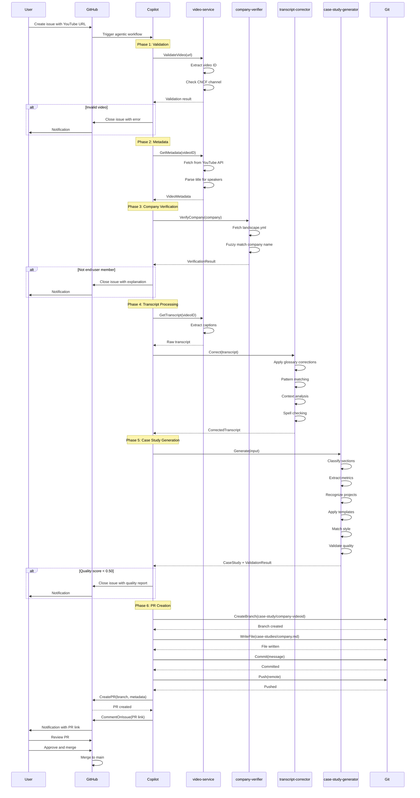
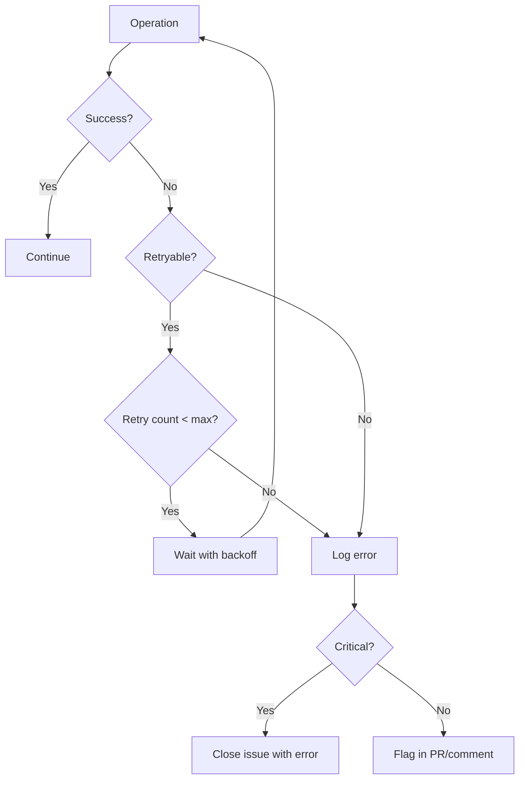
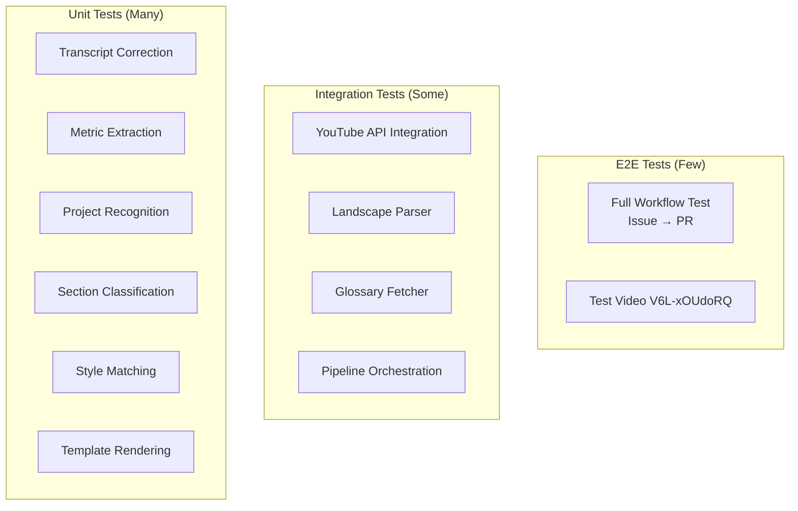
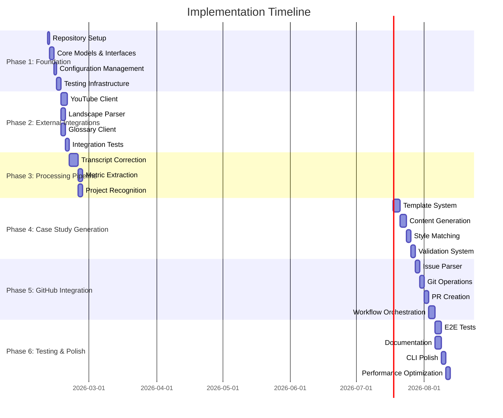

# CNCF Case Study Automation System - Comprehensive Design Document

**Date:** February 9, 2026  
**Status:** Planning Complete - Ready for Implementation  
**Version:** 1.0

---

## Table of Contents

1. [Executive Summary](#executive-summary)
2. [System Overview](#system-overview)
3. [Architecture](#architecture)
4. [Technology Stack](#technology-stack)
5. [Component Specifications](#component-specifications)
6. [Data Flow](#data-flow)
7. [Testing Strategy](#testing-strategy)
8. [Implementation Roadmap](#implementation-roadmap)
9. [Quality Assurance](#quality-assurance)
10. [Risk Mitigation](#risk-mitigation)
11. [Success Criteria](#success-criteria)
12. [References](#references)

---

## Executive Summary

### Purpose

This system automates the transformation of KubeCon conference talks into professional CNCF end-user case studies. It operates within the CNCF content ecosystem, leveraging GitHub Agentic Workflows to create an end-to-end pipeline from YouTube video submission to publication-ready case study generation.

### Key Objectives

1. Accept YouTube video URLs via GitHub issues as input triggers
2. Retrieve and validate video metadata from CNCF's YouTube channel
3. Verify speaker affiliation with CNCF end-user member companies
4. Extract and correct closed captions/transcripts from videos
5. Perform intelligent transcript correction using CNCF glossary and existing case studies
6. Generate publication-ready case studies following CNCF's official guidelines
7. Implement using GitHub Agentic Workflows with GitHub Copilot
8. Write all tooling in Go with comprehensive test coverage

### Strategic Value

- **Efficiency:** Reduces manual effort in case study creation from days to minutes
- **Consistency:** Ensures all case studies follow CNCF format and style guidelines
- **Quality:** Maintains high editorial standards through automated validation
- **Scalability:** Can process multiple videos concurrently
- **Opportunity:** No existing automation exists in CNCF ecosystem (first-mover advantage)

### Test Video

Throughout development, validation uses: https://www.youtube.com/watch?v=V6L-xOUdoRQ
- Title: "How Intuit Manages Cloud Resources Via GitOps"
- Speakers: Jerome Kuptz & Ameen Radwan, Intuit
- Projects: Kubernetes, Argo CD, Helm

---

## System Overview

### High-Level Architecture

```mermaid
graph TB
    subgraph "GitHub Repository"
        Issues[GitHub Issues]
        PR[Pull Requests]
        CaseStudies[/case-studies/ Directory]
    end
    
    subgraph "GitHub Agentic Workflows"
        Trigger[Issue Trigger Workflow]
        Orchestrator[Main Orchestrator Agent]
        
        subgraph "Processing Pipeline"
            VideoValidator[Video Validation Agent]
            MetadataExtractor[Metadata Extraction Agent]
            TranscriptProcessor[Transcript Processing Agent]
            CompanyVerifier[Company Verification Agent]
            CaseStudyGenerator[Case Study Generation Agent]
        end
    end
    
    subgraph "External APIs"
        YouTubeAPI[YouTube Data API v3]
        LandscapeData[CNCF Landscape YAML]
        GlossaryData[CNCF Glossary]
        ExistingCases[Existing Case Studies]
    end
    
    subgraph "Go Services (Containerized)"
        VideoSvc[Video Service]
        TranscriptSvc[Transcript Service]
        VerificationSvc[Verification Service]
        GenerationSvc[Generation Service]
    end
    
    Issues -->|1. New Issue| Trigger
    Trigger -->|2. Parse URL| Orchestrator
    
    Orchestrator -->|3. Validate| VideoValidator
    VideoValidator -->|4. Fetch Metadata| VideoSvc
    VideoSvc -->|5. API Call| YouTubeAPI
    
    Orchestrator -->|6. Extract Transcript| TranscriptProcessor
    TranscriptProcessor -->|7. Get Captions| VideoSvc
    VideoSvc -->|8. Retrieve| YouTubeAPI
    
    Orchestrator -->|9. Verify Company| CompanyVerifier
    CompanyVerifier -->|10. Check Membership| VerificationSvc
    VerificationSvc -->|11. Parse| LandscapeData
    
    TranscriptProcessor -->|12. Correct Terms| TranscriptSvc
    TranscriptSvc -->|13. Reference| GlossaryData
    TranscriptSvc -->|14. Learn from| ExistingCases
    
    Orchestrator -->|15. Generate| CaseStudyGenerator
    CaseStudyGenerator -->|16. Create Content| GenerationSvc
    GenerationSvc -->|17. Match style| ExistingCases
    
    GenerationSvc -->|18. Create PR| PR
    PR -->|19. Review & Merge| CaseStudies
```

### Design Principles

1. **Sandboxed Execution:** All Go services run in isolated containers with minimal permissions
2. **Safe Outputs:** Only pre-approved GitHub operations (create PR, close issue, add comments)
3. **Composability:** Each agent has a single, well-defined responsibility
4. **Observability:** Comprehensive logging at every stage
5. **Idempotency:** Operations can be safely retried without side effects
6. **Fail-Fast:** Early validation prevents wasted processing on invalid inputs

### Workflow Sequence



---

## Architecture

### Project Structure

```
casestudypilot/
├── .github/
│   ├── workflows/                    # GitHub Actions (lock files)
│   │   ├── process-case-study.lock.yml
│   │   └── manual-trigger.lock.yml
│   ├── agentic-workflows/           # Agentic workflow definitions
│   │   ├── process-case-study.md
│   │   └── manual-trigger.md
│   └── copilot-skills/              # Copilot skill definitions
│       ├── video-validation.skill.md
│       ├── company-verification.skill.md
│       ├── transcript-correction.skill.md
│       └── case-study-generation.skill.md
├── cmd/
│   ├── video-service/               # Video metadata & transcript service
│   │   └── main.go
│   ├── transcript-corrector/        # Transcript correction service
│   │   └── main.go
│   ├── company-verifier/           # Company verification service
│   │   └── main.go
│   └── case-study-generator/       # Case study generation service
│       └── main.go
├── internal/
│   ├── youtube/                     # YouTube API client
│   │   ├── client.go
│   │   ├── metadata.go
│   │   └── transcript.go
│   ├── landscape/                   # CNCF Landscape parser
│   │   ├── parser.go
│   │   ├── cache.go
│   │   └── matcher.go
│   ├── glossary/                    # CNCF Glossary client
│   │   ├── client.go
│   │   └── terms.go
│   ├── transcripts/                 # Transcript processing
│   │   ├── corrector.go
│   │   ├── glossary_corrector.go
│   │   ├── spell_corrector.go
│   │   ├── pattern_corrector.go
│   │   └── context_corrector.go
│   ├── generator/                   # Case study generation
│   │   ├── engine.go
│   │   ├── section_extractor.go
│   │   ├── metric_extractor.go
│   │   ├── project_recognizer.go
│   │   ├── template.go
│   │   ├── style_matcher.go
│   │   └── validator.go
│   └── common/                      # Shared utilities
│       ├── http.go
│       ├── logger.go
│       └── errors.go
├── pkg/
│   ├── models/                      # Shared data models
│   │   ├── video.go
│   │   ├── company.go
│   │   ├── correction.go
│   │   ├── casestudy.go
│   │   ├── project.go
│   │   └── errors.go
│   └── config/                      # Configuration management
│       └── config.go
├── test/
│   ├── unit/                        # Unit tests
│   ├── integration/                 # Integration tests
│   ├── e2e/                         # End-to-end tests
│   ├── fixtures/                    # Test data
│   │   ├── transcripts/
│   │   │   ├── raw/
│   │   │   └── corrected/
│   │   ├── landscape/
│   │   ├── case_studies/
│   │   └── videos/
│   ├── golden/                      # Golden file snapshots
│   └── helpers/                     # Test utilities
├── docs/
│   ├── plans/                       # Design documents
│   │   └── 2026-02-09-comprehensive-design.md
│   ├── README.md
│   ├── ARCHITECTURE.md
│   ├── SETUP.md
│   ├── USAGE.md
│   └── DEVELOPMENT.md
├── case-studies/                    # Generated case studies (PR target)
├── scripts/                         # Helper scripts
│   ├── setup.sh
│   └── test.sh
├── Dockerfile                       # Multi-stage build
├── docker-compose.yml               # Local development
├── .env.example                     # Example environment variables
├── .gitignore                       # Git ignore rules
├── go.mod                           # Go module definition
├── go.sum                           # Go module checksums
├── Makefile                         # Build automation
└── README.md                        # Project documentation
```

### Component Architecture



---

## Technology Stack

### Core Dependencies

All libraries selected based on:
- Production readiness (active maintenance, high adoption)
- License compatibility (MIT, Apache 2.0, BSD)
- Performance characteristics
- Community support

#### Selected Libraries

| Category | Library | Version | License | Rationale |
|----------|---------|---------|---------|-----------|
| **GitHub Integration** |
| GitHub API | `google/go-github/v58` | v58.0.0 | BSD-3-Clause | Industry standard, complete API coverage, 10k+ stars |
| Git Operations | `go-git/go-git/v5` | v5.11.0 | Apache 2.0 | Pure Go, no git binary dependency, used by Flux/ArgoCD |
| **Document Processing** |
| Markdown Parsing | `yuin/goldmark` | v1.6.0 | MIT | CommonMark compliant, used by Hugo, 3k+ stars |
| Frontmatter | `adrg/frontmatter` | v0.2.0 | MIT | Clean API, multiple format support |
| YAML Parsing | `gopkg.in/yaml.v3` | v3.0.1 | Apache+MIT | Kubernetes standard, 6k+ stars |
| **HTTP & Scraping** |
| HTTP Client | `hashicorp/go-retryablehttp` | v0.7.5 | MPL 2.0 | Auto-retry, HashiCorp battle-tested, used by Terraform |
| Rate Limiting | `golang.org/x/time/rate` | v0.5.0 | BSD | Official Go package, token bucket algorithm |
| Web Scraping | `gocolly/colly/v2` | v2.1.0 | Apache 2.0 | Concurrent scraping, 22k+ stars |
| HTML to Markdown | `JohannesKaufmann/html-to-markdown` | v1.5.0 | MIT | High quality conversion |
| **Text Processing** |
| String Similarity | `hbollon/go-edlib` | v1.6.0 | MIT | Comprehensive algorithms (Levenshtein, Jaro-Winkler, etc.) |
| Fast Levenshtein | `agnivade/levenshtein` | v1.1.1 | MIT | Performance critical paths, 17.8k dependents |
| NLP | `jdkato/prose/v2` | v2.0.0 | MIT | Best Go NLP (tokenization, POS tagging, NER), 3k+ stars |
| **Testing** |
| Testing Framework | `stretchr/testify` | v1.8.4 | MIT | Universal in Go ecosystem, 22k+ stars |
| Mocking | `golang/mock` | v1.6.0 | Apache 2.0 | Official, type-safe |
| HTTP Mocking | `jarcoal/httpmock` | v1.3.1 | MIT | Easy API mocking |
| Golden Files | `sebdah/goldie/v2` | v2.5.3 | MIT | Snapshot testing |
| **CLI** |
| CLI Framework | `spf13/cobra` | v1.8.0 | Apache 2.0 | kubectl/docker standard, 37k+ stars |
| CLI UX | `charmbracelet/huh` | v0.3.0 | MIT | Modern TUI forms |
| Progress Bars | `charmbracelet/bubbles` | v0.18.0 | MIT | Composable TUI components |
| **Configuration** |
| Env Parsing | `caarlos0/env/v10` | v10.0.0 | MIT | Simple env parsing, 4k+ stars |
| Advanced Config | `spf13/viper` | v1.18.2 | MIT | Multi-format config support, 26k+ stars |
| **Logging** |
| Structured Logging | `log/slog` | stdlib | BSD | Go 1.21+ standard library |
| **YouTube** |
| YouTube API | `google.golang.org/api/youtube/v3` | latest | BSD | Official Google SDK |
| YouTube Transcripts | `horiagug/youtube-transcript-api-go` | latest | MIT | No API key needed for transcripts |

### go.mod Structure

```go
module github.com/cncf/casestudypilot

go 1.21

require (
    // GitHub & Git
    github.com/google/go-github/v58 v58.0.0
    github.com/go-git/go-git/v5 v5.11.0
    
    // Markdown & YAML
    github.com/yuin/goldmark v1.6.0
    github.com/adrg/frontmatter v0.2.0
    gopkg.in/yaml.v3 v3.0.1
    
    // HTTP & Scraping
    github.com/hashicorp/go-retryablehttp v0.7.5
    golang.org/x/time v0.5.0
    github.com/gocolly/colly/v2 v2.1.0
    github.com/JohannesKaufmann/html-to-markdown v1.5.0
    
    // Text Processing
    github.com/hbollon/go-edlib v1.6.0
    github.com/agnivade/levenshtein v1.1.1
    github.com/jdkato/prose/v2 v2.0.0
    
    // CLI
    github.com/spf13/cobra v1.8.0
    github.com/charmbracelet/huh v0.3.0
    github.com/charmbracelet/bubbles v0.18.0
    
    // Config
    github.com/caarlos0/env/v10 v10.0.0
    github.com/spf13/viper v1.18.2
    
    // YouTube
    google.golang.org/api v0.150.0
    github.com/horiagug/youtube-transcript-api-go v0.0.1
    
    // Testing
    github.com/stretchr/testify v1.8.4
    github.com/golang/mock v1.6.0
    github.com/jarcoal/httpmock v1.3.1
    github.com/sebdah/goldie/v2 v2.5.3
)
```

---

## Component Specifications

### 1. Video Service

**Responsibility:** Interact with YouTube API to retrieve video metadata and transcripts.

#### Interface

```go
package youtube

type Client interface {
    GetMetadata(ctx context.Context, videoID string) (*models.VideoMetadata, error)
    GetTranscript(ctx context.Context, videoID string) (*models.Transcript, error)
    ValidateVideo(ctx context.Context, videoID string) error
}
```

#### Data Models

```go
package models

type VideoMetadata struct {
    VideoID      string
    Title        string
    Description  string
    ChannelName  string
    ChannelID    string
    PublishedAt  time.Time
    Speakers     []string
    Duration     string
    CaptionTracks []CaptionTrack
}

type CaptionTrack struct {
    Language       string
    IsAutoGenerated bool
    Content        string
}

type Transcript struct {
    VideoID    string
    Language   string
    Content    string
    IsManual   bool
    WordCount  int
}
```

#### Key Features

1. **Metadata Extraction:**
   - Video title, description, publish date
   - Channel information and validation
   - Speaker name extraction using pattern matching
   - Caption track enumeration

2. **Transcript Retrieval:**
   - Prefer manually created captions over auto-generated
   - Fall back to auto-generated if manual unavailable
   - Handle multiple languages (prioritize English)
   - Extract timing information if needed

3. **Validation:**
   - Verify video exists and is accessible
   - Confirm video is from CNCF YouTube channel
   - Check for available captions
   - Validate video is public

4. **Error Handling:**
   - Video not found
   - Video is private
   - No captions available
   - Wrong channel
   - API rate limits

#### Implementation Notes

- Use official `google.golang.org/api/youtube/v3` for metadata
- Use `horiagug/youtube-transcript-api-go` for transcript extraction (bypasses API quota)
- Cache metadata and transcripts to reduce API calls
- Implement rate limiting with `golang.org/x/time/rate`
- Use `hashicorp/go-retryablehttp` for resilient HTTP requests

#### Speaker Name Extraction Patterns

Common KubeCon title formats:
- "Topic - Speaker1 & Speaker2, Company"
- "Topic - Speaker1, Company1 & Speaker2, Company2"
- "Topic | Speaker Name, Company"

Regular expressions:
```go
var speakerPatterns = []*regexp.Regexp{
    regexp.MustCompile(`-\s*([A-Z][a-z]+\s+[A-Z][a-z]+(?:\s+&\s+[A-Z][a-z]+\s+[A-Z][a-z]+)?),\s*([^|]+)`),
    regexp.MustCompile(`\|\s*([A-Z][a-z]+\s+[A-Z][a-z]+),\s*([^|]+)`),
}
```

### 2. Transcript Corrector

**Responsibility:** Correct speech-to-text errors and align terminology with CNCF standards.

#### Interface

```go
package transcripts

type Corrector interface {
    Correct(ctx context.Context, transcript string) (*models.CorrectionResult, error)
    LoadGlossary(ctx context.Context) error
    LoadCaseStudies(ctx context.Context, dir string) error
}
```

#### Data Models

```go
package models

type CorrectionResult struct {
    Original         string
    Corrected        string
    Corrections      []Correction
    OverallConfidence float64
    Stats            CorrectionStats
}

type Correction struct {
    Position     int
    Original     string
    Corrected    string
    Method       string  // "glossary", "levenshtein", "pattern", "context"
    Confidence   float64
    Context      string
}

type CorrectionStats struct {
    TotalWords        int
    CorrectedWords    int
    HighConfidence    int  // >= 0.80
    MediumConfidence  int  // 0.50-0.79
    LowConfidence     int  // < 0.50
}
```

#### Correction Pipeline



#### Correction Strategies

##### 1. Glossary-Based Correction (Confidence: 1.0)

**Source:** CNCF Glossary (https://glossary.cncf.io)

**Method:**
1. Load all glossary terms
2. Build normalized term map (lowercase → proper form)
3. Exact match against transcript tokens
4. Replace with proper capitalization

**Example Corrections:**
- "kubernetes" → "Kubernetes"
- "prometheus" → "Prometheus"
- "envoy" → "Envoy"
- "helm" → "Helm"

**Implementation:**
```go
var cncfTerms = map[string]string{
    "kubernetes":       "Kubernetes",
    "prometheus":       "Prometheus",
    "envoy":            "Envoy",
    "istio":            "Istio",
    "kubectl":          "kubectl",
    "helm":             "Helm",
    "etcd":             "etcd",
    "containerd":       "containerd",
    "fluentd":          "Fluentd",
    "jaeger":           "Jaeger",
    "argo":             "Argo",
    "cilium":           "Cilium",
    "linkerd":          "Linkerd",
    "gitops":           "GitOps",
    "devsecops":        "DevSecOps",
    "microservices":    "microservices",
    "containerization": "containerization",
    "orchestration":    "orchestration",
}
```

##### 2. Pattern-Based Correction (Confidence: 0.90-0.99)

**Common patterns and known errors:**

```go
var commonPatterns = []CorrectionPattern{
    // Spacing errors
    {
        Pattern:    regexp.MustCompile(`\bmicro\s+services\b`),
        Replace:    "microservices",
        Confidence: 0.95,
    },
    {
        Pattern:    regexp.MustCompile(`\bcloud\s+native\b`),
        Replace:    "cloud native",
        Confidence: 0.90,
    },
    
    // Homophone errors
    {
        Pattern:    regexp.MustCompile(`\bcueectl\b`),
        Replace:    "kubectl",
        Confidence: 0.99,
    },
    {
        Pattern:    regexp.MustCompile(`\bprom\s*etheus\b`),
        Replace:    "Prometheus",
        Confidence: 0.95,
    },
    {
        Pattern:    regexp.MustCompile(`\bargo\s*cd\b`),
        Replace:    "Argo CD",
        Confidence: 0.95,
    },
    
    // Capitalization (when not at sentence start)
    {
        Pattern:    regexp.MustCompile(`\bdocker\b`),
        Replace:    "Docker",
        Confidence: 0.85,
    },
}
```

##### 3. Context-Aware Correction (Using prose)

**Purpose:** Preserve proper nouns and avoid over-correction

**Process:**
1. Parse transcript with prose NLP
2. Identify named entities (PERSON, GPE, ORG)
3. Mark entities for preservation
4. Don't correct:
   - Company names
   - Person names
   - Acronyms (all caps)
   - Words in code blocks
   - Words in quotes

**Implementation:**
```go
func (cc *ContextCorrector) ShouldCorrect(word string, context *ContextAnalysis) bool {
    // Don't correct acronyms
    if isAcronym(word) {
        return false
    }
    
    // Don't correct named entities
    if contains(context.PreserveList, word) {
        return false
    }
    
    // Don't correct in code blocks
    if isInCodeBlock(word, context) {
        return false
    }
    
    // Don't correct in quotes
    if isInQuotes(word, context) {
        return false
    }
    
    return true
}
```

##### 4. Levenshtein Spell Correction (Confidence: varies)

**Purpose:** Catch typos and misspellings

**Algorithm:**
1. For each word, find candidates within Levenshtein distance ≤ 2
2. Score candidates based on:
   - Edit distance (closer = higher confidence)
   - Word frequency (common words = higher confidence)
   - Context similarity (surrounding words = higher confidence)
3. Select best match if confidence ≥ 0.50

**Confidence Calculation:**
```
confidence = 1.0 - (distance / max_distance) * 0.5 + frequency_bonus + context_bonus

where:
- distance: Levenshtein distance (1 or 2)
- max_distance: 2
- frequency_bonus: 0.0-0.2 based on word frequency
- context_bonus: 0.0-0.1 based on context match
```

**Example Corrections:**
- "kuberntes" → "Kubernetes" (distance=1, high frequency, confidence=0.85)
- "promethus" → "Prometheus" (distance=1, high frequency, confidence=0.85)
- "helmm" → "Helm" (distance=1, high frequency, confidence=0.90)

#### Confidence Scoring

| Method | Confidence Range | Use Case |
|--------|-----------------|----------|
| Exact glossary match | 1.0 | kubernetes → Kubernetes |
| Pattern match | 0.90-0.99 | cueectl → kubectl |
| Levenshtein distance=1 + high frequency | 0.80-0.90 | kuberntes → Kubernetes |
| Levenshtein distance=2 + context match | 0.60-0.80 | promethus → Prometheus |
| Levenshtein distance=1 + low frequency | 0.50-0.70 | Uncertain corrections |
| Distance > 2 or no context | < 0.50 | Flag for manual review |

**Thresholds:**
- **Auto-apply:** Confidence ≥ 0.80
- **Flag for review:** 0.50 ≤ Confidence < 0.80
- **Skip correction:** Confidence < 0.50

#### Learning from Existing Case Studies

**Purpose:** Extract terminology patterns and common phrases

**Process:**
1. Parse all existing case studies in `case-studies/` directory
2. Extract n-grams (2-grams, 3-grams)
3. Build term frequency dictionary
4. Identify common technical phrases
5. Learn correction patterns

**Example learned patterns:**
- "reduced latency by"
- "improved throughput"
- "3x improvement"
- "deployed Kubernetes"
- "implemented GitOps"

### 3. Company Verifier

**Responsibility:** Verify speaker's company is a CNCF end-user member.

#### Interface

```go
package landscape

type Verifier interface {
    VerifyCompany(ctx context.Context, companyName string) (*models.CompanyVerificationResult, error)
    LoadLandscape(ctx context.Context) error
}
```

#### Data Models

```go
package models

type CompanyVerificationResult struct {
    CompanyName     string
    IsEndUserMember bool
    MatchConfidence float64
    LandscapeEntry  *LandscapeCompany
    Aliases         []string
}

type LandscapeCompany struct {
    Name           string
    CanonicalName  string
    Category       string
    URL            string
    Logo           string
}
```

#### Data Source

**URL:** https://raw.githubusercontent.com/cncf/landscape/master/landscape.yml

**Structure:**
```yaml
landscape:
  - category:
      name: CNCF Members
      subcategories:
        - subcategory:
            name: End User Supporter
            items:
              - item:
                  name: Company Name
                  homepage_url: https://...
                  logo: logo.svg
```

#### Verification Algorithm

```
1. Fetch landscape.yml (cache for 24 hours)
2. Parse YAML and extract "End User Supporter" companies
3. Normalize input company name:
   - Convert to lowercase
   - Remove punctuation
   - Remove common suffixes: "Inc.", "Ltd.", "Corp.", "LLC"
   - Trim whitespace
4. Exact match against canonical names
5. If no exact match, perform fuzzy matching:
   - Calculate Levenshtein distance for each company
   - Consider matches with distance ≤ 2
   - Apply similarity thresholds
6. Calculate confidence score
7. Return verification result
```

#### Fuzzy Matching Rules

```go
func calculateMatchConfidence(input, candidate string) float64 {
    // Normalize both strings
    normalizedInput := normalize(input)
    normalizedCandidate := normalize(candidate)
    
    // Exact match
    if normalizedInput == normalizedCandidate {
        return 1.0
    }
    
    // Calculate Levenshtein distance
    distance := levenshtein.ComputeDistance(normalizedInput, normalizedCandidate)
    maxLen := max(len(normalizedInput), len(normalizedCandidate))
    
    // Similarity ratio
    similarity := 1.0 - float64(distance)/float64(maxLen)
    
    // Bonus for acronym match
    if isAcronymOf(normalizedInput, normalizedCandidate) {
        similarity += 0.1
    }
    
    return min(1.0, similarity)
}

func normalize(s string) string {
    // Lowercase
    s = strings.ToLower(s)
    
    // Remove punctuation
    s = regexp.MustCompile(`[^\w\s]`).ReplaceAllString(s, "")
    
    // Remove common suffixes
    suffixes := []string{"inc", "ltd", "corp", "llc", "corporation", "limited"}
    for _, suffix := range suffixes {
        s = strings.TrimSuffix(s, " "+suffix)
    }
    
    // Trim whitespace
    s = strings.TrimSpace(s)
    
    return s
}
```

#### Decision Logic

| Confidence | Decision | Action |
|-----------|----------|--------|
| ≥ 0.9 | Accept | Proceed with case study generation |
| 0.7-0.89 | Manual review | Flag in PR description, continue |
| < 0.7 | Reject | Close issue with explanation |

#### Caching Strategy

```go
type LandscapeCache struct {
    Data      *LandscapeData
    FetchedAt time.Time
    TTL       time.Duration  // Default: 24 hours
    mu        sync.RWMutex
}

func (c *LandscapeCache) Get(ctx context.Context) (*LandscapeData, error) {
    c.mu.RLock()
    if c.Data != nil && time.Since(c.FetchedAt) < c.TTL {
        c.mu.RUnlock()
        return c.Data, nil
    }
    c.mu.RUnlock()
    
    // Fetch new data
    return c.refresh(ctx)
}
```

### 4. Case Study Generator

**Responsibility:** Transform corrected transcript into publication-ready case study.

#### Interface

```go
package generator

type Generator interface {
    Generate(ctx context.Context, input *GenerationInput) (*models.CaseStudy, error)
    Validate(ctx context.Context, caseStudy *models.CaseStudy) (*ValidationResult, error)
}

type GenerationInput struct {
    Transcript     *models.CorrectionResult
    VideoMetadata  *models.VideoMetadata
    CompanyInfo    *models.CompanyVerificationResult
    ExistingStyles []string  // Paths to reference case studies
}
```

#### Data Models

```go
package models

type CaseStudy struct {
    Title       string
    Subtitle    string
    Background  Section
    Challenge   Section
    Solution    Section
    Impact      Section
    FuturePlans Section
    Metadata    CaseStudyMetadata
}

type Section struct {
    Heading      string
    Content      []string           // Paragraphs
    BulletPoints []string
    Metrics      []ExtractedMetric
    Projects     []ProjectMention
}

type CaseStudyMetadata struct {
    Company       string
    Industry      string
    Country       string
    CloudType     string
    PublishedDate time.Time
    VideoURL      string
    Projects      []string
}

type ExtractedMetric struct {
    Value      string
    Unit       string
    Context    string
    MetricType string  // "percentage", "multiplier", "time", "cost", "scale"
    Confidence float64
}

type ProjectMention struct {
    Project  Project
    Position int
    Context  string
}

type Project struct {
    Name        string
    Category    string  // "graduated", "incubating", "sandbox"
    URL         string
    Description string
}
```

#### Generation Pipeline



#### Section Classification

**Discourse Markers by Section:**

| Section | Example Markers |
|---------|----------------|
| Background | "we are", "our company", "we work", "our business", "we operate", "we serve", "our organization" |
| Challenge | "the challenge", "the problem", "we faced", "we struggled", "we needed to", "difficulty", "issue", "bottleneck", "pain point" |
| Solution | "we decided to", "we implemented", "we adopted", "we chose", "we deployed", "we migrated", "we built", "we used", "we leveraged" |
| Impact | "as a result", "the outcome", "we achieved", "we saw", "improvement", "reduced", "increased", "faster", "better", "performance" |
| Future | "next steps", "moving forward", "our plans", "we plan to", "we're working on", "in the future", "roadmap", "upcoming" |

**Classification Algorithm:**
```
For each sentence:
1. Calculate score against each section's markers
2. Assign to highest-scoring section
3. Use sliding window to consider context
4. Group consecutive sentences of same type
5. Generate section boundaries
```

#### Metric Extraction

**Pattern Library:**

| Pattern Type | Regular Expression | Example Match | Confidence |
|-------------|-------------------|---------------|------------|
| Percentage | `(\d+(?:\.\d+)?)\s*(?:percent\|%)\s+(?:improvement\|increase\|reduction\|decrease)` | "50% improvement" | 0.95 |
| Multiplier | `(\d+)x\s+(?:improvement\|faster\|more\|better)` | "3x faster" | 0.90 |
| Time Reduction | `reduced\s+(?:from\s+)?(\d+)\s*(minutes?\|hours?\|days?\|seconds?)\s+to\s+(\d+)\s*(minutes?\|hours?\|days?\|seconds?)` | "reduced from 10min to 2min" | 0.85 |
| Cost Savings | `saved\s+\$?(\d+(?:,\d{3})*(?:\.\d{2})?)\s*(?:dollars?\|USD\|per\|annually)?` | "saved $50,000" | 0.90 |
| Scale Metrics | `(\d+(?:,\d{3})*)\s+(pods?\|clusters?\|nodes?\|users?\|services?\|requests?)` | "10,000 pods" | 0.95 |

**Extraction Process:**
```go
func ExtractMetrics(text string) []ExtractedMetric {
    var metrics []ExtractedMetric
    
    doc, _ := prose.NewDocument(text)
    
    for _, sentence := range doc.Sentences() {
        for _, pattern := range metricPatterns {
            matches := pattern.Pattern.FindStringSubmatch(sentence.Text)
            if len(matches) > 0 {
                metric := ExtractedMetric{
                    Value:      matches[1],
                    Unit:       pattern.Unit,
                    Context:    sentence.Text,
                    MetricType: pattern.MetricType,
                    Confidence: pattern.BaseConfidence,
                }
                metrics = append(metrics, metric)
            }
        }
    }
    
    return deduplicateMetrics(metrics)
}
```

#### Project Recognition

**Data Source:** CNCF Landscape projects list

**Recognition Strategy:**
1. Build project index from landscape
2. Case-insensitive search in transcript
3. Handle common aliases:
   - "k8s" → "Kubernetes"
   - "prom" → "Prometheus"
   - "argo cd" → "Argo CD"
4. Extract context (sentence containing mention)
5. Link to official project pages

**Implementation:**
```go
var projectAliases = map[string]string{
    "k8s":       "Kubernetes",
    "kube":      "Kubernetes",
    "prom":      "Prometheus",
    "argo cd":   "Argo CD",
    "argocd":    "Argo CD",
    "cilium":    "Cilium",
}

func (pr *ProjectRecognizer) RecognizeProjects(text string) []ProjectMention {
    var mentions []ProjectMention
    
    // Check for each known project
    for projectName, project := range pr.projects {
        pattern := regexp.MustCompile(`(?i)\b` + regexp.QuoteMeta(projectName) + `\b`)
        matches := pattern.FindAllStringIndex(text, -1)
        
        for _, match := range matches {
            context := extractSentenceContaining(text, match[0])
            
            mention := ProjectMention{
                Project:  project,
                Position: match[0],
                Context:  context,
            }
            mentions = append(mentions, mention)
        }
    }
    
    // Check for aliases
    for alias, canonicalName := range projectAliases {
        if project, ok := pr.projects[canonicalName]; ok {
            pattern := regexp.MustCompile(`(?i)\b` + regexp.QuoteMeta(alias) + `\b`)
            matches := pattern.FindAllStringIndex(text, -1)
            
            for _, match := range matches {
                context := extractSentenceContaining(text, match[0])
                
                mention := ProjectMention{
                    Project:  project,
                    Position: match[0],
                    Context:  context,
                }
                mentions = append(mentions, mention)
            }
        }
    }
    
    return deduplicate(mentions)
}
```

#### Template System

**Structure:**
```markdown
# [Company Name]

## [Achievement Headline]

### Background

[Company context, industry, scale - 2-3 paragraphs]

### Challenge

[Problems faced, specific pain points - 1-2 paragraphs]

- [Key challenge 1]
- [Key challenge 2]
- [Key challenge 3]

### Solution

[Technical approach - 2-3 paragraphs]

The team adopted [primary technology] for [purpose]. Key components included:

- **[Project 1]** - [Usage description]
- **[Project 2]** - [Usage description]
- **[Project 3]** - [Usage description]

[Architecture details, implementation approach]

### Impact

The implementation delivered significant improvements:

- **[Metric 1]**
- **[Metric 2]**
- **[Metric 3]**

[Narrative description of business outcomes]

### Future Plans

[Roadmap, planned improvements - 1 paragraph]
```

#### Style Matching

**Target Style Characteristics:**

| Characteristic | Target | Validation |
|---------------|--------|------------|
| Avg Sentence Length | 15-25 words | Token counting |
| Paragraph Length | 3-5 sentences | Sentence segmentation |
| Active Voice Ratio | > 70% | POS tagging |
| Technical Term Density | 10-15% | Glossary matching |
| Readability Score | Grade 10-12 | Flesch-Kincaid |

**Style Adjustment Process:**
1. Analyze generated content against metrics
2. Break long sentences (> 30 words)
3. Convert passive voice to active where appropriate
4. Replace vague terms with specific ones
5. Bold metrics and key achievements
6. Ensure consistent terminology

#### Validation

**Validation Rules:**

| Rule | Severity | Threshold | Action |
|------|----------|-----------|--------|
| Background present | Error | Required | Fail validation |
| Challenge present | Error | Required | Fail validation |
| Solution present | Error | Required | Fail validation |
| Impact with metrics | Warning | ≥ 1 metric | Flag for review |
| CNCF projects mentioned | Error | ≥ 1 project | Fail validation |
| Word count | Warning | 500-1500 words | Flag for review |
| Quality score | Error | ≥ 0.50 | Fail validation |

**Quality Scoring:**
```
Base Score: 1.0

Deductions:
- Each error: -0.2
- Each warning: -0.05

Bonuses:
- 3+ metrics present: +0.1
- 2+ CNCF projects: +0.05
- Complete future plans section: +0.05

Final Score: max(0.0, min(1.0, calculated_score))
```

**Validation Result:**

| Score Range | Action |
|-------------|--------|
| 0.90-1.00 | Auto-approve for PR creation |
| 0.70-0.89 | Create PR with review notes |
| 0.50-0.69 | Create PR flagged for editorial review |
| < 0.50 | Close issue with explanation |

---

## Data Flow

### Complete Pipeline Flow



### Error Handling Flow



---

## Testing Strategy

### Testing Pyramid



### Test Coverage Requirements

| Component | Target Coverage | Critical Paths |
|-----------|----------------|----------------|
| Transcript Corrector | 90%+ | Glossary matching, Levenshtein, context preservation |
| Metric Extractor | 85%+ | Pattern matching, confidence scoring |
| Project Recognizer | 85%+ | Exact matching, alias resolution |
| Section Classifier | 80%+ | Discourse markers, sentence classification |
| Case Study Generator | 80%+ | Template rendering, validation |
| YouTube Client | 75%+ | API calls, error handling |
| Landscape Parser | 85%+ | YAML parsing, fuzzy matching |

### Unit Testing Examples

#### Transcript Correction Tests

```go
func TestGlossaryCorrection(t *testing.T) {
    tests := []struct {
        name       string
        input      string
        expected   string
        confidence float64
    }{
        {
            name:       "Kubernetes capitalization",
            input:      "we deployed kubernetes in production",
            expected:   "we deployed Kubernetes in production",
            confidence: 1.0,
        },
        {
            name:       "kubectl homophone",
            input:      "run cueectl apply",
            expected:   "run kubectl apply",
            confidence: 0.99,
        },
        {
            name:       "Preserve in code block",
            input:      "`import kubernetes`",
            expected:   "`import kubernetes`",
            confidence: 1.0,
        },
        {
            name:       "Preserve proper noun",
            input:      "Intuit uses Kubernetes",
            expected:   "Intuit uses Kubernetes",
            confidence: 1.0,
        },
    }
    
    corrector := NewTranscriptCorrector()
    
    for _, tt := range tests {
        t.Run(tt.name, func(t *testing.T) {
            result := corrector.Correct(tt.input)
            assert.Equal(t, tt.expected, result.Corrected)
            assert.GreaterOrEqual(t, result.OverallConfidence, tt.confidence)
        })
    }
}
```

#### Metric Extraction Tests

```go
func TestMetricExtraction(t *testing.T) {
    tests := []struct {
        name          string
        input         string
        expectedType  string
        expectedValue string
        expectedUnit  string
    }{
        {
            name:          "Percentage improvement",
            input:         "We achieved 50% improvement in latency",
            expectedType:  "percentage_change",
            expectedValue: "50",
            expectedUnit:  "%",
        },
        {
            name:          "Multiplier improvement",
            input:         "Performance increased 3x after migration",
            expectedType:  "multiplier",
            expectedValue: "3",
            expectedUnit:  "x",
        },
        {
            name:          "Scale metric",
            input:         "We now run 10,000 pods across the platform",
            expectedType:  "scale",
            expectedValue: "10,000",
            expectedUnit:  "pods",
        },
    }
    
    extractor := NewMetricExtractor()
    
    for _, tt := range tests {
        t.Run(tt.name, func(t *testing.T) {
            metrics := extractor.Extract(tt.input)
            require.Len(t, metrics, 1)
            assert.Equal(t, tt.expectedType, metrics[0].MetricType)
            assert.Equal(t, tt.expectedValue, metrics[0].Value)
        })
    }
}
```

### Integration Testing

#### YouTube API Integration

```go
func TestYouTubeIntegration(t *testing.T) {
    if testing.Short() {
        t.Skip("Skipping integration test")
    }
    
    client := youtube.NewClient(os.Getenv("YOUTUBE_API_KEY"))
    
    t.Run("Fetch metadata for test video", func(t *testing.T) {
        videoID := "V6L-xOUdoRQ"
        metadata, err := client.GetMetadata(context.Background(), videoID)
        
        require.NoError(t, err)
        assert.Equal(t, "How Intuit Manages Cloud Resources Via GitOps", metadata.Title)
        assert.Contains(t, metadata.ChannelName, "CNCF")
        assert.Contains(t, metadata.Speakers, "Jerome Kuptz")
        assert.Contains(t, metadata.Speakers, "Ameen Radwan")
    })
    
    t.Run("Fetch transcript for test video", func(t *testing.T) {
        videoID := "V6L-xOUdoRQ"
        transcript, err := client.GetTranscript(context.Background(), videoID)
        
        require.NoError(t, err)
        assert.NotEmpty(t, transcript.Content)
        assert.Greater(t, transcript.WordCount, 1000)
    })
}
```

#### Landscape Parser Integration

```go
func TestLandscapeIntegration(t *testing.T) {
    if testing.Short() {
        t.Skip("Skipping integration test")
    }
    
    parser := landscape.NewParser()
    
    t.Run("Fetch and parse landscape", func(t *testing.T) {
        err := parser.LoadLandscape(context.Background())
        require.NoError(t, err)
        assert.NotEmpty(t, parser.EndUserMembers())
    })
    
    t.Run("Verify known end-user", func(t *testing.T) {
        result, err := parser.VerifyCompany(context.Background(), "Intuit")
        require.NoError(t, err)
        assert.True(t, result.IsEndUserMember)
        assert.GreaterOrEqual(t, result.MatchConfidence, 0.9)
    })
    
    t.Run("Fuzzy matching", func(t *testing.T) {
        result, err := parser.VerifyCompany(context.Background(), "Google Inc")
        require.NoError(t, err)
        assert.True(t, result.IsEndUserMember)
        assert.Equal(t, "Google", result.LandscapeEntry.CanonicalName)
    })
}
```

### End-to-End Testing

#### Full Pipeline Test with Test Video

```go
func TestE2EWithTestVideo(t *testing.T) {
    if os.Getenv("E2E_TEST") != "true" {
        t.Skip("Skipping E2E test")
    }
    
    pipeline := NewPipeline(Config{
        YouTubeAPIKey: os.Getenv("YOUTUBE_API_KEY"),
    })
    
    t.Run("Process test video V6L-xOUdoRQ", func(t *testing.T) {
        input := PipelineInput{
            VideoURL: "https://www.youtube.com/watch?v=V6L-xOUdoRQ",
        }
        
        result, err := pipeline.Process(context.Background(), input)
        
        // Validate no errors
        require.NoError(t, err)
        
        // Validate company
        assert.Equal(t, "Intuit", result.CompanyInfo.CompanyName)
        assert.True(t, result.CompanyInfo.IsEndUserMember)
        
        // Validate case study structure
        assert.NotEmpty(t, result.CaseStudy.Background.Content)
        assert.NotEmpty(t, result.CaseStudy.Challenge.Content)
        assert.NotEmpty(t, result.CaseStudy.Solution.Content)
        assert.NotEmpty(t, result.CaseStudy.Impact.Content)
        
        // Validate metrics extracted
        assert.GreaterOrEqual(t, len(result.CaseStudy.Impact.Metrics), 2)
        
        // Validate projects identified
        projectNames := extractProjectNames(result.CaseStudy.Solution.Projects)
        assert.Contains(t, projectNames, "Kubernetes")
        assert.Contains(t, projectNames, "Argo CD")
        
        // Validate quality score
        assert.GreaterOrEqual(t, result.ValidationScore, 0.7)
    })
}
```

### Test Fixtures

```
test/fixtures/
├── transcripts/
│   ├── raw/
│   │   ├── test_video_V6L-xOUdoRQ.txt
│   │   ├── sample_with_errors.txt
│   │   └── technical_talk.txt
│   └── corrected/
│       ├── test_video_corrected.txt
│       └── expected_corrections.json
├── landscape/
│   ├── sample_landscape.yml
│   └── end_user_list.json
├── case_studies/
│   ├── reference_intuit.md
│   ├── reference_google.md
│   └── style_examples.json
└── videos/
    ├── test_metadata.json
    └── sample_captions.srt
```

### Performance Benchmarks

```go
func BenchmarkLevenshteinCorrection(b *testing.B) {
    corrector := NewSpellCorrector()
    word := "kuberntes"
    
    b.ResetTimer()
    for i := 0; i < b.N; i++ {
        corrector.Correct(word)
    }
}

func BenchmarkTranscriptProcessing(b *testing.B) {
    transcript := loadTestTranscript("large_transcript.txt")
    processor := NewTranscriptProcessor()
    
    b.ResetTimer()
    for i := 0; i < b.N; i++ {
        processor.Process(transcript)
    }
}
```

### Performance Requirements

| Operation | Target | Max Acceptable |
|-----------|--------|----------------|
| Video metadata fetch | < 2s | 5s |
| Transcript fetch | < 5s | 10s |
| Transcript correction (10K words) | < 1s | 3s |
| Company verification | < 500ms | 1s |
| Metric extraction | < 500ms | 2s |
| Case study generation | < 3s | 8s |
| Full pipeline (E2E) | < 30s | 60s |

### Golden File Testing

```go
func TestGoldenCaseStudy(t *testing.T) {
    g := goldie.New(t)
    
    generator := NewCaseStudyGenerator()
    input := loadTestInput("test_video_input.json")
    
    caseStudy, err := generator.Generate(context.Background(), input)
    require.NoError(t, err)
    
    // Render to markdown
    markdown := caseStudy.Render()
    
    // Compare against golden file
    g.Assert(t, "test_video_case_study", []byte(markdown))
}
```

---

## Implementation Roadmap

### Overview

Total estimated time: **55 days** across 6 phases



### Phase 1: Foundation (6 days)

#### Milestone 1.1: Repository and Project Setup (1 day)

**Objectives:**
- Initialize Git repository on main branch
- Setup Go module with dependencies
- Create complete directory structure
- Configure development environment

**Tasks:**

| Task | Duration | Deliverable |
|------|----------|-------------|
| Initialize Git repo | 30 min | `.git/` directory on main branch |
| Create go.mod | 1 hour | `go.mod` with module path and dependencies |
| Scaffold directories | 1 hour | Complete project structure |
| Create Makefile | 2 hours | Build, test, lint, clean targets |
| Docker setup | 2 hours | Dockerfile, docker-compose.yml |
| Development docs | 2 hours | SETUP.md, DEVELOPMENT.md |

**Validation:**
```bash
git status
go mod tidy
go mod verify
make build
make test
docker-compose build
```

#### Milestone 1.2: Core Models and Interfaces (2 days)

**Objectives:**
- Define all data models
- Create service interfaces
- Establish error types
- Setup configuration structures

**Key Files:**
```
pkg/models/
├── video.go          # VideoMetadata, Transcript, CaptionTrack
├── company.go        # CompanyInfo, VerificationResult
├── correction.go     # CorrectionResult, Correction, Stats
├── casestudy.go      # CaseStudy, Section, Metadata
├── project.go        # Project, ProjectMention
└── errors.go         # Custom error types

internal/*/
├── client.go         # Interface definitions for each service
```

**Deliverables:**
- All data models defined and documented
- Service interfaces with Go documentation
- Error types with proper wrapping
- Configuration structures with validation

#### Milestone 1.3: Configuration Management (1 day)

**Objectives:**
- Environment variable handling with `caarlos0/env`
- Configuration file support with `spf13/viper`
- Secrets management strategy
- Validation and defaults

**Configuration Structure:**
```go
type Config struct {
    GitHub struct {
        Token      string `env:"GITHUB_TOKEN,required"`
        Owner      string `env:"GITHUB_OWNER" envDefault:"cncf"`
        Repo       string `env:"GITHUB_REPO" envDefault:"case-studies"`
    }
    
    YouTube struct {
        APIKey     string `env:"YOUTUBE_API_KEY,required"`
        ChannelID  string `env:"YOUTUBE_CHANNEL_ID" envDefault:"UCvqbFHwN-nwalWPjPUKpvTA"`
    }
    
    Processing struct {
        MaxConcurrency int     `env:"MAX_CONCURRENCY" envDefault:"5"`
        Timeout        int     `env:"TIMEOUT_SECONDS" envDefault:"300"`
        MinConfidence  float64 `env:"MIN_CONFIDENCE" envDefault:"0.7"`
    }
}
```

**Deliverables:**
- Configuration package (`pkg/config/`)
- `.env.example` template
- Validation logic with helpful error messages
- Documentation in SETUP.md

#### Milestone 1.4: Testing Infrastructure (2 days)

**Objectives:**
- Setup test helpers and utilities
- Create initial test fixtures
- Configure golden file testing
- Setup mock generation with gomock

**Deliverables:**
- Test fixture organization in `test/fixtures/`
- Mock generation setup with `//go:generate` directives
- Helper utilities in `test/helpers/`
- Sample test data from test video V6L-xOUdoRQ

### Phase 2: External Integrations (9 days)

#### Milestone 2.1: YouTube Client Implementation (3 days)

**Objectives:**
- Official YouTube API integration using `google.golang.org/api/youtube/v3`
- Transcript extraction using `horiagug/youtube-transcript-api-go`
- Metadata parsing and speaker extraction
- Rate limiting and error handling

**Implementation Priority:**
1. Video metadata extraction (test with V6L-xOUdoRQ)
2. Channel validation (confirm CNCF channel)
3. Transcript extraction (prefer manual captions)
4. Error handling for edge cases

**Deliverables:**
- Working YouTube client (`internal/youtube/`)
- Unit tests with mocked API responses
- Integration test with real API (uses test video)
- Documentation with usage examples

**Validation:**
```go
// Should successfully fetch test video data
metadata, _ := client.GetMetadata(ctx, "V6L-xOUdoRQ")
assert.Equal(t, "How Intuit Manages Cloud Resources Via GitOps", metadata.Title)
assert.Contains(t, metadata.Speakers, "Jerome Kuptz")
```

#### Milestone 2.2: Landscape Parser Implementation (2 days)

**Objectives:**
- Fetch CNCF Landscape YAML from GitHub
- Parse end-user member list
- Implement company verification with fuzzy matching
- Caching with 24-hour TTL

**Data Source:**
```
https://raw.githubusercontent.com/cncf/landscape/master/landscape.yml
```

**Deliverables:**
- Landscape parser (`internal/landscape/`)
- Company verifier with fuzzy matching
- Unit tests with sample landscape data
- Integration test with real landscape
- Caching implementation

#### Milestone 2.3: Glossary Client Implementation (2 days)

**Objectives:**
- Scrape CNCF Glossary using `gocolly/colly`
- Build terminology dictionary
- Support term lookup
- Cache for offline use

**Deliverables:**
- Glossary scraper (`internal/glossary/`)
- Term dictionary structure
- Lookup functionality
- Cached glossary data in `test/fixtures/`

#### Milestone 2.4: Integration Testing (2 days)

**Objectives:**
- Test all external integrations
- Verify API contracts
- Test error scenarios
- Document rate limits and caching strategies

**Test Scenarios:**

| Scenario | Expected Behavior | Error Handling |
|----------|------------------|----------------|
| Valid video ID | Return complete metadata | N/A |
| Invalid video ID | Return error | Descriptive error message |
| Private video | Return error | "Video not accessible" |
| Non-CNCF channel | Pass with warning | Flag for review |
| API rate limit | Retry with backoff | Log and wait |
| Network failure | Retry 3 times | Fail with context |

**Deliverables:**
- Comprehensive integration test suite
- Error scenario coverage
- Performance benchmarks
- Documentation in TESTING.md

### Phase 3: Processing Pipeline (11 days)

#### Milestone 3.1: Transcript Correction Engine (4 days)

**Objectives:**
- Implement glossary-based correction using CNCF terms
- Implement Levenshtein spell checking with `go-edlib`
- Context-aware correction using `prose/v2`
- Pattern-based corrections for known errors
- Confidence scoring system

**Implementation Layers:**
1. Glossary corrector (exact matches, confidence: 1.0)
2. Pattern matcher (known errors, confidence: 0.90-0.99)
3. Context analyzer (preserve proper nouns, using prose)
4. Spell corrector (fuzzy matching, confidence: varies)
5. Confidence scorer (aggregate results)

**Deliverables:**
- Correction engine (`internal/transcripts/`)
- Comprehensive test coverage (90%+ target)
- Correction report generation
- Documentation with examples

**Test Coverage:**
- Glossary corrections
- Pattern matching
- Context preservation (code blocks, proper nouns, quotes)
- Spell checking with confidence thresholds

#### Milestone 3.2: Metric Extraction (2 days)

**Objectives:**
- Extract quantitative metrics from transcript
- Identify metric types (percentage, multiplier, time, cost, scale)
- Calculate confidence scores
- Preserve context for each metric

**Pattern Library:**
- Percentage improvements
- Multiplier improvements (3x, 10x)
- Time reductions
- Cost savings
- Scale metrics (pods, users, clusters)

**Deliverables:**
- Metric extractor (`internal/generator/metric_extractor.go`)
- Pattern library with regex definitions
- Unit tests for all pattern types
- Integration with test video transcript

#### Milestone 3.3: Project Recognition (2 days)

**Objectives:**
- Load CNCF project list from landscape
- Implement project name matching
- Handle aliases (k8s → Kubernetes)
- Link to official project pages

**Deliverables:**
- Project recognizer (`internal/generator/project_recognizer.go`)
- Alias mapping
- Unit tests
- Integration with landscape data

#### Milestone 3.4: Section Classification (3 days)

**Objectives:**
- Classify sentences by section type
- Identify discourse markers
- Cluster related content
- Generate section boundaries

**Classification Strategy:**
- Score sentences against marker patterns
- Use sliding window for context
- Group consecutive sentences of same type
- Handle ambiguous classifications

**Deliverables:**
- Section classifier (`internal/generator/section_extractor.go`)
- Discourse marker database
- Unit tests with sample transcripts
- Integration with real transcript from test video

### Phase 4: Case Study Generation (10 days)

#### Milestone 4.1: Template System (3 days)

**Objectives:**
- Define case study templates matching CNCF format
- Implement template rendering using text/template
- Support markdown generation with `goldmark`
- Handle conditional sections

**Template Components:**
- Title and subtitle generation
- Section templates (Background, Challenge, Solution, Impact, Future)
- Metadata template
- Markdown formatting

**Deliverables:**
- Template engine (`internal/generator/template.go`)
- Default templates matching CNCF format
- Rendering logic
- Unit tests

#### Milestone 4.2: Content Generation (3 days)

**Objectives:**
- Aggregate processed data from pipeline
- Generate section content from classified transcript
- Apply templates
- Format markdown output

**Generation Pipeline:**
```
Classified Transcript → 
Content Aggregator → 
Section Builder → 
Template Application → 
Markdown Formatter → 
Final Case Study
```

**Deliverables:**
- Content generator (`internal/generator/engine.go`)
- Section builders for each case study section
- Integration with all processors
- End-to-end generation test

#### Milestone 4.3: Style Matching (2 days)

**Objectives:**
- Analyze reference case studies for style patterns
- Extract style metrics (sentence length, paragraph structure)
- Match target style characteristics
- Adjust generated content

**Style Metrics:**
- Average sentence length: 15-25 words
- Paragraph length: 3-5 sentences
- Active voice ratio: > 70%
- Technical term density: 10-15%
- Readability: Grade 10-12

**Deliverables:**
- Style analyzer (`internal/generator/style_matcher.go`)
- Style matching algorithms
- Adjustment logic
- Validation tests

#### Milestone 4.4: Validation System (2 days)

**Objectives:**
- Validate case study completeness
- Check structure and format
- Verify quality score
- Generate validation reports

**Validation Rules:**
- Required sections present
- Minimum metrics extracted
- At least one CNCF project mentioned
- Word count within range
- Quality score threshold

**Deliverables:**
- Validation engine (`internal/generator/validator.go`)
- Quality scoring algorithm
- Report generation
- Unit tests

### Phase 5: GitHub Integration (9 days)

#### Milestone 5.1: Issue Parser (2 days)

**Objectives:**
- Parse GitHub issue body for YouTube URL
- Extract additional metadata from issue
- Validate issue format
- Handle malformed input

**Deliverables:**
- Issue parser
- URL extraction with regex
- Validation logic
- Helpful error messages

#### Milestone 5.2: Git Operations (2 days)

**Objectives:**
- Branch creation using `go-git`
- File operations (write case study)
- Commit creation with descriptive message
- Push to remote

**Using go-git:**
```go
// Create branch
ref := plumbing.NewBranchReferenceName(branchName)
worktree.Checkout(&git.CheckoutOptions{
    Branch: ref,
    Create: true,
})

// Write file, commit, push
```

**Deliverables:**
- Git operations wrapper (`internal/github/git.go`)
- Branch management
- Commit logic
- Unit tests with in-memory repo

#### Milestone 5.3: PR Creation (2 days)

**Objectives:**
- Create pull request using `go-github`
- Add metadata and labels
- Assign reviewers
- Link to original issue

**PR Template:**
```markdown
## Case Study: [Company] - [Title]

### Source
- Video: [URL]
- Speaker(s): [Names]
- Company: [Name]

### Quality Metrics
- Validation Score: [X.XX]
- Metrics Extracted: [N]
- Projects Identified: [List]

### Review Notes
[Warnings or recommendations]

Closes #[issue-number]
```

**Deliverables:**
- PR creator (`internal/github/pr.go`)
- Template system
- Metadata generation
- Integration tests

#### Milestone 5.4: Workflow Orchestration (3 days)

**Objectives:**
- Create GitHub Actions workflow
- Define agentic workflow in markdown
- Create Copilot skills for each component
- Implement error handling and notifications

**Workflow Structure:**
1. Issue trigger (on: issues, types: [opened, edited])
2. Parse and validate
3. Fetch video data
4. Verify company
5. Process transcript
6. Generate case study
7. Create PR
8. Update issue with status

**Deliverables:**
- GitHub Actions workflow (`.github/workflows/process-case-study.lock.yml`)
- Agentic workflow definition (`.github/agentic-workflows/process-case-study.md`)
- Copilot skills (`.github/copilot-skills/*.skill.md`)
- Full orchestration with error handling

### Phase 6: Testing & Polish (10 days)

#### Milestone 6.1: E2E Testing with Test Video (3 days)

**Objectives:**
- Complete pipeline test with V6L-xOUdoRQ
- Validate all stages
- Verify output quality matches expectations
- Document results

**Test Execution:**
```bash
# Run full E2E test
./scripts/test-e2e.sh V6L-xOUdoRQ

# Expected outputs:
# - Validated video metadata
# - Corrected transcript with confidence scores
# - Extracted metrics (3+)
# - Identified projects (Argo, Kubernetes, Helm)
# - Generated case study with score >= 0.7
```

**Deliverables:**
- E2E test suite (`test/e2e/`)
- Test video validation report
- Performance benchmarks
- Quality assessment report

#### Milestone 6.2: Documentation (3 days)

**Objectives:**
- Comprehensive README
- API documentation
- Architecture diagrams (updated)
- Usage examples

**Documentation Structure:**
```
docs/
├── README.md                    # Project overview
├── ARCHITECTURE.md              # System design, diagrams
├── SETUP.md                     # Installation guide
├── USAGE.md                     # User guide
├── DEVELOPMENT.md               # Developer guide
├── API.md                       # API reference
├── TESTING.md                   # Testing guide
└── plans/
    └── 2026-02-09-comprehensive-design.md
```

**Deliverables:**
- Complete documentation suite
- Code examples
- Troubleshooting guide
- Contributing guidelines

#### Milestone 6.3: CLI Polish (2 days)

**Objectives:**
- User-friendly CLI using `cobra`
- Help text and usage examples
- Progress indicators using `charmbracelet/bubbles`
- Helpful error messages

**CLI Commands:**
```bash
casestudy generate [video-url]     # Generate from video
casestudy verify [company]         # Check end-user status
casestudy list                     # List generated studies
casestudy validate [file]          # Validate case study
casestudy version                  # Show version info
```

**Deliverables:**
- Polished CLI interface
- Help documentation
- Shell completions (bash, zsh)
- Usage examples

#### Milestone 6.4: Performance Optimization (2 days)

**Objectives:**
- Profile hot paths
- Optimize critical algorithms
- Improve caching strategies
- Reduce memory allocations

**Target Performance:**

| Operation | Target | Optimization Strategy |
|-----------|--------|---------------------|
| Transcript correction | < 1s | Optimize Levenshtein, parallel processing |
| Metric extraction | < 500ms | Regex compilation, caching |
| Full pipeline | < 30s | Concurrent operations, caching |

**Deliverables:**
- Performance benchmarks
- Optimization report
- Updated performance tests
- Documentation in DEVELOPMENT.md

---

## Quality Assurance

### Code Quality Standards

| Metric | Target | Enforcement |
|--------|--------|------------|
| Test Coverage | 80%+ overall | CI gate |
| Core Logic Coverage | 90%+ | CI gate |
| Go Format | gofmt compliant | Pre-commit hook |
| Linting | golangci-lint passing | CI gate |
| Complexity | Cyclomatic < 15 | golangci-lint |
| Documentation | All public APIs documented | golangci-lint |

### Review Process

1. **Self-Review:**
   - Run full test suite
   - Check test coverage
   - Run linters
   - Update documentation

2. **Code Review:**
   - At least one approval required
   - Focus on: correctness, clarity, performance
   - Check test coverage for new code

3. **Integration Testing:**
   - All integration tests pass
   - E2E test with test video passes
   - No performance regressions

4. **Documentation Review:**
   - All changes documented
   - Examples updated
   - README updated if needed

### Continuous Integration

```yaml
# .github/workflows/ci.yml
name: CI

on: [push, pull_request]

jobs:
  test:
    runs-on: ubuntu-latest
    steps:
      - uses: actions/checkout@v4
      - uses: actions/setup-go@v5
        with:
          go-version: '1.21'
      
      - name: Run tests
        run: make test
      
      - name: Check coverage
        run: make coverage
      
      - name: Lint
        run: make lint
  
  integration:
    runs-on: ubuntu-latest
    needs: test
    steps:
      - uses: actions/checkout@v4
      - uses: actions/setup-go@v5
        with:
          go-version: '1.21'
      
      - name: Run integration tests
        run: make test-integration
        env:
          YOUTUBE_API_KEY: ${{ secrets.YOUTUBE_API_KEY }}
```

---

## Risk Mitigation

### Identified Risks and Mitigation Strategies

| Risk | Probability | Impact | Mitigation Strategy |
|------|------------|--------|-------------------|
| **GitHub Agentic Workflows Immaturity** | High | Medium | Start with standard GitHub Actions, evolve to gh-aw when stable |
| **API Rate Limiting** | Medium | High | Implement caching (24h TTL), retry logic with exponential backoff, rate limiting |
| **Transcript Quality Poor** | Medium | High | Multiple correction passes, confidence thresholds, flag for manual review |
| **Test Video Not Representative** | Low | Medium | Test with multiple videos from different talks, validate with diverse scenarios |
| **Go NLP Library Limitations** | Medium | Medium | Use prose despite archived status, implement fallbacks, consider external services if needed |
| **Generated Content Quality** | Medium | High | Multiple validation stages, quality scoring, human review required before merge |
| **YouTube API Changes** | Low | High | Abstract API calls behind interface, comprehensive error handling, version pinning |
| **CNCF Landscape Format Changes** | Low | Medium | Flexible YAML parsing, validate structure, cache with TTL |
| **Glossary Unavailable** | Low | Low | Local cache, fallback to built-in term list |

### Fallback Strategies

1. **If GitHub Agentic Workflows unavailable:**
   - Use standard GitHub Actions with Go service containers
   - Copilot skills as documentation, not executable

2. **If YouTube API quota exceeded:**
   - Use transcript extraction library (no quota)
   - Queue processing for later
   - Notify user of delay

3. **If transcript quality too poor:**
   - Flag case study for manual review
   - Include confidence scores in PR
   - Suggest manual transcript editing

4. **If company verification uncertain:**
   - Include confidence score in PR
   - Flag for manual verification
   - Proceed with warning

5. **If case study quality score < 0.50:**
   - Close issue with detailed report
   - Provide suggestions for improvement
   - Allow manual retry after fixes

---

## Success Criteria

### Phase Completion Criteria

| Phase | Completion Criteria | Validation Method |
|-------|-------------------|-------------------|
| **Phase 1: Foundation** | All models defined, tests pass, builds succeed | `make test && make build` |
| **Phase 2: External Integrations** | All external APIs integrated, test video metadata retrieved | Integration tests pass |
| **Phase 3: Processing Pipeline** | Transcript corrected, metrics extracted from test video | Unit tests pass, manual review |
| **Phase 4: Case Study Generation** | Case study generated from test video, validation score >= 0.7 | E2E test with V6L-xOUdoRQ |
| **Phase 5: GitHub Integration** | PR created from GitHub issue | Manual workflow test |
| **Phase 6: Testing & Polish** | All tests pass, documentation complete, performance targets met | Full test suite, benchmark |

### Overall Project Success Criteria

#### Functional Requirements

1. **Input Processing:**
   - ✓ Accepts YouTube URL via GitHub issue
   - ✓ Validates URL format and video accessibility
   - ✓ Extracts video metadata (title, speakers, description)

2. **Company Verification:**
   - ✓ Verifies CNCF end-user membership
   - ✓ Handles company name variations with fuzzy matching
   - ✓ Provides confidence scores for matches

3. **Transcript Processing:**
   - ✓ Retrieves video transcript (manual or auto-generated)
   - ✓ Corrects speech-to-text errors
   - ✓ Aligns terminology with CNCF glossary
   - ✓ Achieves >= 80% correction confidence

4. **Content Extraction:**
   - ✓ Extracts at least 2 quantitative metrics from test video
   - ✓ Identifies at least 1 CNCF project mentioned
   - ✓ Classifies content into case study sections

5. **Case Study Generation:**
   - ✓ Generates markdown following CNCF format
   - ✓ Matches tone and style of existing case studies
   - ✓ Includes all required sections
   - ✓ Achieves quality score >= 0.70

6. **GitHub Integration:**
   - ✓ Creates PR with generated case study
   - ✓ Links PR to original issue
   - ✓ Provides validation report
   - ✓ Closes issue on failure with explanation

#### Quality Requirements

1. **Test Coverage:**
   - ✓ Overall coverage >= 80%
   - ✓ Core logic coverage >= 90%
   - ✓ All E2E tests pass with test video
   - ✓ Integration tests pass with real APIs

2. **Code Quality:**
   - ✓ All code passes golangci-lint
   - ✓ All public APIs documented
   - ✓ Cyclomatic complexity < 15
   - ✓ No critical security vulnerabilities

3. **Documentation:**
   - ✓ Comprehensive README with examples
   - ✓ Architecture documentation with diagrams
   - ✓ API reference complete
   - ✓ User guide and developer guide

#### Performance Requirements

| Metric | Target | Validation |
|--------|--------|------------|
| Full pipeline execution | < 60 seconds | E2E benchmark |
| API rate limit handling | Graceful degradation | Integration test |
| Memory usage | < 500MB | Load test |
| Concurrent processing | 5+ videos | Stress test |

#### Usability Requirements

1. **CLI:**
   - ✓ Intuitive command structure
   - ✓ Helpful error messages
   - ✓ Progress indicators for long operations
   - ✓ Clear validation reports

2. **Generated Content:**
   - ✓ Minimal manual editing required
   - ✓ Professional tone and formatting
   - ✓ Accurate technical terminology
   - ✓ Complete and well-structured

3. **Error Handling:**
   - ✓ Descriptive error messages
   - ✓ Actionable recovery suggestions
   - ✓ Proper logging for debugging
   - ✓ Graceful degradation

---

## References

### CNCF Resources

- **CNCF YouTube Channel:** https://www.youtube.com/@cncf/videos
- **CNCF Landscape:** https://landscape.cncf.io
- **CNCF Case Studies:** https://www.cncf.io/case-studies/
- **CNCF Glossary:** https://glossary.cncf.io
- **Case Study Guidelines:** https://github.com/cncf/foundation/blob/main/policies-guidance/case-study-guidelines.md
- **Landscape Repository:** https://github.com/cncf/landscape

### Technical Documentation

- **GitHub Agentic Workflows:** https://github.github.io/gh-aw/
- **GitHub API v3:** https://docs.github.com/en/rest
- **YouTube Data API v3:** https://developers.google.com/youtube/v3
- **Go Module Reference:** https://go.dev/ref/mod

### Library Documentation

- **go-github:** https://pkg.go.dev/github.com/google/go-github/v58
- **go-git:** https://pkg.go.dev/github.com/go-git/go-git/v5
- **goldmark:** https://pkg.go.dev/github.com/yuin/goldmark
- **prose:** https://pkg.go.dev/github.com/jdkato/prose/v2
- **go-edlib:** https://pkg.go.dev/github.com/hbollon/go-edlib
- **cobra:** https://pkg.go.dev/github.com/spf13/cobra
- **testify:** https://pkg.go.dev/github.com/stretchr/testify

### Test Video

**Primary Test Case:**
- **URL:** https://www.youtube.com/watch?v=V6L-xOUdoRQ
- **Title:** "How Intuit Manages Cloud Resources Via GitOps - Jerome Kuptz & Ameen Radwan, Intuit"
- **Company:** Intuit (verified CNCF end-user member)
- **Projects:** Kubernetes, Argo CD, Helm
- **Use Case:** Ideal test case with clear structure, metrics, and multiple CNCF projects

---

## Appendix

### Architectural Decision Records

#### ADR-001: Programming Language Selection
- **Decision:** Use Go for all services
- **Rationale:** Per requirements, strong standard library, excellent concurrency, good tooling
- **Alternatives Considered:** Python (better AI ecosystem but not Go)

#### ADR-002: AI Engine Selection
- **Decision:** GitHub Copilot
- **Rationale:** Native to GitHub, per requirements, integrates with GitHub Agentic Workflows
- **Alternatives Considered:** OpenAI, Claude (external dependencies)

#### ADR-003: YouTube Authentication
- **Decision:** API key stored in GitHub Secrets
- **Rationale:** Simple, secure, sufficient for read-only access
- **Alternatives Considered:** OAuth (overly complex for this use case)

#### ADR-004: Company Verification Source
- **Decision:** Parse landscape.cncf.io YAML directly
- **Rationale:** Authoritative source, no API quota, cacheable
- **Alternatives Considered:** API endpoint (doesn't exist)

#### ADR-005: Case Study Storage
- **Decision:** Create PR to `/case-studies/` directory in same repo
- **Rationale:** Review before merge, version control, single source of truth
- **Alternatives Considered:** Separate repo (added complexity), Issue comments (not version controlled)

#### ADR-006: Non-End-User Handling
- **Decision:** Close issue with explanation
- **Rationale:** Clear feedback, prevents wasted processing
- **Alternatives Considered:** Generate anyway (against requirements), Manual review (adds overhead)

#### ADR-007: Project Structure
- **Decision:** Standard Go project layout with `/cmd`, `/internal`, `/pkg`
- **Rationale:** Industry best practice, familiar to Go developers, clear separation of concerns
- **Alternatives Considered:** Flat structure (harder to maintain), Domain-driven design (overkill)

#### ADR-008: Transcript Correction Strategy
- **Decision:** Multi-layered approach (glossary → patterns → context → spell check)
- **Rationale:** Highest confidence first, context-aware, confidence scoring
- **Alternatives Considered:** Single-pass correction (lower quality), LLM-based (external dependency)

#### ADR-009: Testing Approach
- **Decision:** Testing pyramid with comprehensive unit, integration, and E2E tests
- **Rationale:** Confidence in correctness, fast feedback, regression prevention
- **Alternatives Considered:** Manual testing only (not scalable)

#### ADR-010: Hybrid Workflow Architecture
- **Decision:** Start with GitHub Actions, evolve to GitHub Agentic Workflows
- **Rationale:** gh-aw is very new, provides fallback, incremental adoption
- **Alternatives Considered:** gh-aw only (risky), Actions only (less intelligent)

### Glossary

| Term | Definition |
|------|------------|
| **Agentic Workflow** | GitHub's automation system using AI agents with natural language instructions |
| **CNCF** | Cloud Native Computing Foundation |
| **End-User Member** | Company that uses CNCF projects (not vendor) |
| **Discourse Marker** | Linguistic phrase indicating section boundaries |
| **Fuzzy Matching** | Approximate string matching using edit distance |
| **Golden File Testing** | Snapshot testing comparing output to reference files |
| **Levenshtein Distance** | Edit distance between two strings |
| **NLP** | Natural Language Processing |
| **POS Tagging** | Part-of-Speech tagging (noun, verb, etc.) |
| **Safe Output** | Pre-approved GitHub operations that AI agents can perform |
| **Sandboxed Execution** | Isolated environment with restricted permissions |

---

**End of Comprehensive Design Document**

This document represents the complete planning phase for the CNCF Case Study Automation System. All architectural decisions, component specifications, testing strategies, and implementation roadmap are documented for future implementation.

**Next Step:** Begin Phase 1 implementation by initializing repository and creating core models.
