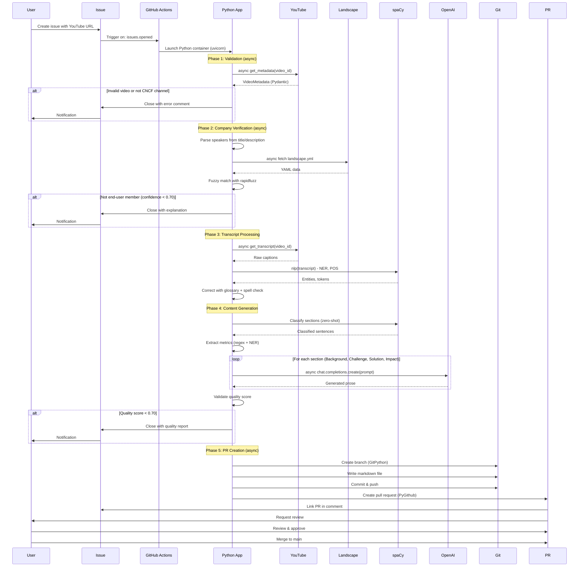

# CNCF Case Study Automation System - Python Implementation Design

**Date:** February 9, 2026  
**Status:** Planning Complete - Ready for Implementation  
**Version:** 2.0 (Python Edition)  
**Language:** Python 3.11+  
**Development Time Estimate:** 15-20 days

---

## Document Structure

This design document is organized into milestones for easier navigation:

1. **[Milestone 1: Executive Summary & Architecture](#milestone-1-executive-summary--architecture)** (This File)
2. **[Milestone 2: Component Specifications](./2026-02-09-python-design-m2-components.md)**
3. **[Milestone 3: Implementation Roadmap & Testing](./2026-02-09-python-design-m3-implementation.md)**
4. **[Milestone 4: Deployment & Operations](./2026-02-09-python-design-m4-deployment.md)**

---

# Milestone 1: Executive Summary & Architecture

## Table of Contents

1. [Executive Summary](#executive-summary)
2. [Strategic Decisions](#strategic-decisions)
3. [System Overview](#system-overview)
4. [Architecture](#architecture)
5. [Technology Stack](#technology-stack)
6. [Data Models](#data-models)
7. [References](#references)

---

## Executive Summary

### Purpose

This system automates the transformation of KubeCon conference talks into professional CNCF end-user case studies. It operates within the CNCF content ecosystem, leveraging GitHub Actions to create an end-to-end pipeline from YouTube video submission to publication-ready case study generation.

**This is a Python implementation** that leverages Python's mature NLP/AI ecosystem for production-grade natural language processing and content generation.

### Key Objectives

1. ✅ Accept YouTube video URLs via GitHub issues as input triggers
2. ✅ Retrieve and validate video metadata from CNCF's YouTube channel
3. ✅ Verify speaker affiliation with CNCF end-user member companies
4. ✅ Extract and correct closed captions/transcripts from videos
5. ✅ Perform intelligent transcript correction using CNCF glossary and spaCy NLP
6. ✅ Generate publication-ready case studies following CNCF's official guidelines
7. ✅ **Implement using Python 3.11+ for rapid development and rich ecosystem**
8. ✅ **Leverage production-grade NLP libraries (spaCy, Transformers)**
9. ✅ **Integrate AI content generation via OpenAI/Anthropic APIs**
10. ✅ Achieve 80%+ test coverage with comprehensive pytest suite

### Strategic Value

- **Efficiency:** Reduces manual effort in case study creation from days to minutes
- **Consistency:** Ensures all case studies follow CNCF format and style guidelines
- **Quality:** Maintains high editorial standards through automated validation
- **Scalability:** Can process multiple videos concurrently with async/await
- **Opportunity:** No existing automation exists in CNCF ecosystem (first-mover advantage)
- **Maintainability:** Python's rich ecosystem enables faster iteration and easier hiring
- **Development Speed:** 15-20 days vs 55+ days for Go implementation

### Test Video

Throughout development, validation uses: https://www.youtube.com/watch?v=V6L-xOUdoRQ

- **Title:** "How Intuit Manages Cloud Resources Via GitOps"
- **Speakers:** Jerome Kuptz & Ameen Radwan, Intuit
- **Projects:** Kubernetes, Argo CD, Helm
- **Expected Metrics:** 3+ quantitative improvements
- **Expected Quality Score:** ≥ 0.75

---

## Strategic Decisions

### Why Python Over Go?

**Decision:** Implement entire system in Python 3.11+

**Rationale:**

| Factor | Python Advantage | Impact Level |
|--------|-----------------|--------------|
| **NLP Ecosystem** | spaCy (33k stars), Transformers (156k stars) vs archived Go prose | 🔴 CRITICAL |
| **AI Integration** | Native OpenAI/Anthropic SDKs vs manual HTTP | 🔴 CRITICAL |
| **Development Speed** | 15-20 days vs 55+ days (3-4x faster) | 🔴 CRITICAL |
| **Team Scalability** | 10x larger Python ML talent pool | 🟡 HIGH |
| **Research Access** | All ML research is Python-first | 🟡 HIGH |
| **Library Maturity** | 10-20 years more mature NLP tools | 🟡 HIGH |
| **Prototyping** | Rapid iteration cycles | 🟡 HIGH |
| **Pre-trained Models** | 1M+ models on Hugging Face (Python) | 🟡 HIGH |

**Trade-offs Accepted:**

| Factor | Go Advantage | Python Mitigation Strategy |
|--------|--------------|----------------------------|
| Container Size | 10-15MB vs 250-350MB | Multi-stage Docker builds, Alpine base, layer caching (acceptable for GitHub Actions) |
| Cold Start | 100ms vs 500ms-1s | Pre-built images in GHCR, dependency caching, lazy imports (negligible in 2-3 min workflows) |
| Type Safety | Compile-time checking | MyPy strict mode + Pydantic runtime validation + CI enforcement |
| Performance | 5-10x faster text processing | Use compiled extensions (orjson, rapidfuzz via Rust), async/await, uvloop event loop |
| Memory Footprint | 20-50MB vs 150-300MB | Acceptable for GitHub Actions runners (7GB RAM available) |
| Deployment | Single static binary | Poetry + Docker = reproducible builds, no significant operational burden |

**Conclusion:** Python's 3-4x faster development time and superior NLP/AI ecosystem significantly outweigh Go's operational advantages for this use case. The trade-offs are acceptable given:
- GitHub Actions has ample resources (7GB RAM, fast network)
- Development speed is critical for iteration
- NLP quality is non-negotiable (requires mature libraries)
- Team scalability matters (easier to hire Python ML engineers)

---

## System Overview

### High-Level Architecture

```mermaid
graph TB
    subgraph "GitHub Repository"
        Issues[GitHub Issues]
        PR[Pull Requests]
        CaseStudies[/case-studies/ Directory]
    end
    
    subgraph "GitHub Actions Runner - Python Container"
        Trigger[Issue Trigger Workflow]
        
        subgraph "Python Application"
            Orchestrator[Main Orchestrator<br/>Python async/await]
            
            subgraph "Processing Pipeline"
                VideoClient[YouTube API Client<br/>google-api-python-client]
                TranscriptProcessor[Transcript Processor<br/>pyspellchecker]
                CompanyVerifier[Company Verifier<br/>rapidfuzz]
                NLPEngine[NLP Engine<br/>spaCy 3.7+]
                AIGenerator[AI Content Generator<br/>OpenAI SDK]
            end
        end
    end
    
    subgraph "External APIs"
        YouTubeAPI[YouTube Data API v3]
        OpenAIAPI[OpenAI GPT-4 API]
        LandscapeData[CNCF Landscape YAML<br/>GitHub Raw]
        GlossaryData[CNCF Glossary<br/>glossary.cncf.io]
    end
    
    Issues -->|1. New Issue| Trigger
    Trigger -->|2. Parse URL| Orchestrator
    
    Orchestrator -->|3. async fetch| VideoClient
    VideoClient -->|4. API Call| YouTubeAPI
    
    Orchestrator -->|5. async verify| CompanyVerifier
    CompanyVerifier -->|6. Parse YAML| LandscapeData
    
    Orchestrator -->|7. async correct| TranscriptProcessor
    TranscriptProcessor -->|8. NLP Process| NLPEngine
    NLPEngine -->|9. Reference| GlossaryData
    
    Orchestrator -->|10. async generate| AIGenerator
    AIGenerator -->|11. GPT-4 Call| OpenAIAPI
    
    Orchestrator -->|12. Create PR| PR
    PR -->|13. Review & Merge| CaseStudies
```

### Design Principles

1. **Type Safety First:** Pydantic for all data models, MyPy strict mode enforced in CI
2. **Async by Default:** All I/O operations use async/await for maximum concurrency
3. **Fail-Fast Validation:** Early validation prevents wasted processing and API costs
4. **Composability:** Each component has a single, well-defined responsibility (SRP)
5. **Observability:** Structured logging (structlog) at every stage with rich context
6. **Testability:** Dependency injection, comprehensive mocking, 80%+ coverage requirement
7. **Idempotency:** Operations can be safely retried without side effects
8. **Explicit > Implicit:** Python philosophy - clear over clever

### Workflow Sequence



---

## Architecture

### Project Structure

```
casestudypilot/
├── .github/
│   ├── workflows/
│   │   ├── ci.yml                      # CI: lint, type-check, test
│   │   ├── process-case-study.yml      # Main automation workflow
│   │   └── docker-build.yml            # Build and push Docker images
│   └── dependabot.yml                  # Automated dependency updates
│
├── casestudypilot/                     # Main Python package
│   ├── __init__.py
│   ├── __main__.py                     # Entry point: python -m casestudypilot
│   ├── cli.py                          # Typer CLI interface
│   ├── config.py                       # Pydantic Settings
│   │
│   ├── models/                         # Pydantic data models
│   │   ├── __init__.py
│   │   ├── video.py                    # VideoMetadata, Transcript, CaptionTrack
│   │   ├── company.py                  # CompanyInfo, VerificationResult
│   │   ├── correction.py               # CorrectionResult, Correction, Stats
│   │   ├── casestudy.py                # CaseStudy, Section, Metadata
│   │   └── project.py                  # Project, ProjectMention
│   │
│   ├── youtube/                        # YouTube API integration
│   │   ├── __init__.py
│   │   ├── client.py                   # Async YouTube client
│   │   ├── metadata_extractor.py       # Video metadata parsing
│   │   ├── transcript_fetcher.py       # Caption/transcript extraction
│   │   └── speaker_parser.py           # Speaker name extraction
│   │
│   ├── landscape/                      # CNCF Landscape parsing
│   │   ├── __init__.py
│   │   ├── client.py                   # Async YAML fetcher
│   │   ├── parser.py                   # YAML parsing logic
│   │   ├── cache.py                    # In-memory cache with TTL
│   │   └── matcher.py                  # Fuzzy company matching (rapidfuzz)
│   │
│   ├── glossary/                       # CNCF Glossary
│   │   ├── __init__.py
│   │   ├── client.py                   # Async glossary scraper
│   │   └── terms.py                    # Term storage and lookup
│   │
│   ├── transcript/                     # Transcript processing
│   │   ├── __init__.py
│   │   ├── corrector.py                # Main correction orchestrator
│   │   ├── glossary_corrector.py       # CNCF term correction
│   │   ├── spell_corrector.py          # pyspellchecker integration
│   │   ├── pattern_corrector.py        # Regex-based known errors
│   │   └── context_analyzer.py         # Preserve code blocks, quotes
│   │
│   ├── nlp/                            # NLP processing with spaCy
│   │   ├── __init__.py
│   │   ├── engine.py                   # spaCy pipeline manager
│   │   ├── entity_recognizer.py        # NER for companies, people
│   │   ├── section_classifier.py       # Classify transcript sentences
│   │   └── metric_extractor.py         # Extract quantitative metrics
│   │
│   ├── ai/                             # AI content generation
│   │   ├── __init__.py
│   │   ├── client.py                   # OpenAI/Anthropic client
│   │   ├── summarizer.py               # Section-based summarization
│   │   ├── prompt_builder.py           # Context-aware prompts
│   │   └── content_validator.py        # Post-generation validation
│   │
│   ├── generator/                      # Case study assembly
│   │   ├── __init__.py
│   │   ├── engine.py                   # Main generation orchestrator
│   │   ├── template_renderer.py        # Jinja2 templates
│   │   ├── style_matcher.py            # Style analysis
│   │   ├── project_recognizer.py       # CNCF project detection
│   │   └── validator.py                # Quality scoring
│   │
│   ├── github/                         # GitHub integration
│   │   ├── __init__.py
│   │   ├── client.py                   # PyGithub wrapper
│   │   ├── issue_parser.py             # Parse issue body
│   │   ├── git_operations.py           # GitPython operations
│   │   └── pr_creator.py               # Pull request creation
│   │
│   └── utils/                          # Shared utilities
│       ├── __init__.py
│       ├── http.py                     # HTTPX client with retry
│       ├── logging.py                  # Structlog setup
│       ├── errors.py                   # Custom exceptions
│       └── cache.py                    # Generic caching
│
├── tests/                              # Pytest test suite
│   ├── unit/                           # Unit tests (90%+ coverage)
│   ├── integration/                    # Integration tests
│   ├── e2e/                           # End-to-end tests
│   ├── fixtures/                      # Test data
│   ├── __snapshots__/                 # Syrupy snapshots
│   └── conftest.py                    # Shared fixtures
│
├── docs/
│   ├── plans/                         # Design documents
│   │   ├── 2026-02-09-python-design-m1-overview.md     # This file
│   │   ├── 2026-02-09-python-design-m2-components.md
│   │   ├── 2026-02-09-python-design-m3-implementation.md
│   │   └── 2026-02-09-python-design-m4-deployment.md
│   ├── ARCHITECTURE.md
│   ├── SETUP.md
│   └── USAGE.md
│
├── templates/                         # Jinja2 templates
│   ├── case_study.md.j2
│   └── pr_description.md.j2
│
├── scripts/
│   ├── setup.sh
│   ├── download_spacy_model.sh
│   └── test.sh
│
├── .env.example
├── .gitignore
├── .dockerignore
├── Dockerfile                         # Multi-stage build
├── docker-compose.yml
├── pyproject.toml                     # Poetry + tool configs
├── poetry.lock                        # Locked dependencies
├── Makefile
└── README.md
```

---

## Technology Stack

### Core Language & Runtime

| Component | Version | Rationale |
|-----------|---------|-----------|
| **Python** | **3.11+** | **Required for performance, modern type hints, faster asyncio** |
| Event Loop | uvloop 0.19+ | 2-4x faster than default asyncio (libuv-based) |
| Package Manager | Poetry 1.7+ | Modern dependency management with lock files |

### Web & API Framework

| Component | Library | Version | License | Purpose |
|-----------|---------|---------|---------|---------|
| HTTP Client | **httpx** | **0.26+** | **BSD** | **Async/sync HTTP client (replaces requests)** |
| API Server | FastAPI | 0.109+ | MIT | Optional: REST API for testing |
| ASGI Server | Uvicorn | 0.27+ | BSD | Production ASGI server |

### NLP & Text Processing

| Component | Library | Version | License | Purpose | Performance |
|-----------|---------|---------|---------|---------|-------------|
| **NLP Core** | **spaCy** | **3.7+** | **MIT** | **NER, POS, tokenization** | **10k-50k words/sec** |
| **spaCy Model** | **en_core_web_lg** | **3.7+** | **MIT** | **Large English (780k vocab)** | **85-90% NER accuracy** |
| Spell Check | pyspellchecker | 0.8+ | MIT | Levenshtein correction | <1ms per word |
| Fuzzy Match | **rapidfuzz** | **3.6+** | **MIT** | **Rust-based string matching** | **100x faster than Python** |

**Why spaCy:**
- Production-ready (used by Apple, Meta, Microsoft)
- Cython-optimized: 10-100x faster than NLTK
- High accuracy: 85-95% NER vs 70-80% NLTK
- Modern, active development
- Easy pipeline customization

### AI & Machine Learning

| Component | Library | Version | License | Purpose |
|-----------|---------|---------|---------|---------|
| **OpenAI SDK** | **openai** | **1.10+** | **Apache 2.0** | **GPT-4 content generation** |
| Anthropic | anthropic | 0.18+ | MIT | Claude API (backup) |
| Transformers | transformers | 4.37+ | Apache 2.0 | Optional: zero-shot classification |

### Data & Configuration

| Component | Library | Version | License | Purpose |
|-----------|---------|---------|---------|---------|
| YAML | PyYAML | 6.0+ | MIT | Landscape parsing |
| **Fast JSON** | **orjson** | **3.9+** | **Apache 2.0** | **2-5x faster than stdlib** |
| **Validation** | **pydantic** | **2.6+** | **MIT** | **Runtime type validation** |
| Settings | pydantic-settings | 2.1+ | MIT | Environment variables |
| Templates | jinja2 | 3.1+ | BSD | Markdown templates |

### GitHub & Git

| Component | Library | Version | License | Purpose |
|-----------|---------|---------|---------|---------|
| **GitHub API** | **PyGithub** | **2.1+** | **LGPL-3.0** | **REST API v3 client** |
| Git Operations | GitPython | 3.1+ | BSD | Pure Python git |

### YouTube

| Component | Library | Version | License | Purpose |
|-----------|---------|---------|---------|---------|
| **YouTube API** | **google-api-python-client** | **2.117+** | **Apache 2.0** | **Official Google SDK** |
| Transcripts | youtube-transcript-api | 0.6+ | MIT | No-quota transcript fetch |

### CLI & UI

| Component | Library | Version | License | Purpose |
|-----------|---------|---------|---------|---------|
| CLI | **typer** | **0.9+** | **MIT** | **Modern CLI with type hints** |
| UI | rich | 13.7+ | MIT | Beautiful terminal output |

### Testing & Quality

| Component | Library | Version | License | Purpose |
|-----------|---------|---------|---------|---------|
| **Test Framework** | **pytest** | **8.0+** | **MIT** | **Industry standard** |
| Async Tests | pytest-asyncio | 0.23+ | Apache 2.0 | Async/await support |
| Coverage | pytest-cov | 4.1+ | MIT | Coverage reporting |
| Mocking | pytest-mock | 3.12+ | MIT | Fixture-based mocking |
| HTTP Mocking | respx | 0.20+ | BSD | HTTPX mocking |
| Snapshots | syrupy | 4.6+ | Apache 2.0 | Golden file testing |

### Type Checking & Linting

| Component | Library | Version | License | Purpose |
|-----------|---------|---------|---------|---------|
| **Type Checker** | **mypy** | **1.8+** | **MIT** | **Static type checking** |
| **Linter** | **ruff** | **0.2+** | **MIT** | **Rust-based (10-100x faster)** |
| Type Stubs | types-PyYAML | 6.0+ | Apache 2.0 | PyYAML type hints |

### pyproject.toml

```toml
[tool.poetry]
name = "casestudypilot"
version = "0.1.0"
description = "Automate CNCF case study generation from KubeCon talks"
authors = ["CNCF Community"]
license = "Apache-2.0"
readme = "README.md"
packages = [{include = "casestudypilot"}]
python = "^3.11"

[tool.poetry.dependencies]
python = "^3.11"

# Web & API
httpx = "^0.26.0"
fastapi = "^0.109.0"
uvicorn = {extras = ["standard"], version = "^0.27.0"}

# NLP & Text
spacy = "^3.7.0"
pyspellchecker = "^0.8.0"
rapidfuzz = "^3.6.0"

# AI
openai = "^1.10.0"
anthropic = "^0.18.0"

# Data
pyyaml = "^6.0"
orjson = "^3.9.0"
pydantic = "^2.6.0"
pydantic-settings = "^2.1.0"
jinja2 = "^3.1.0"

# GitHub
PyGithub = "^2.1.0"
GitPython = "^3.1.0"

# YouTube
google-api-python-client = "^2.117.0"
youtube-transcript-api = "^0.6.0"

# CLI
typer = "^0.9.0"
rich = "^13.7.0"

# Utils
python-dotenv = "^1.0.0"
structlog = "^24.1.0"
uvloop = "^0.19.0"

[tool.poetry.group.dev.dependencies]
pytest = "^8.0.0"
pytest-asyncio = "^0.23.0"
pytest-cov = "^4.1.0"
pytest-mock = "^3.12.0"
respx = "^0.20.0"
syrupy = "^4.6.0"
mypy = "^1.8.0"
ruff = "^0.2.0"
types-PyYAML = "^6.0.0"

[tool.poetry.scripts]
casestudy = "casestudypilot.cli:app"

[build-system]
requires = ["poetry-core"]
build-backend = "poetry.core.masonry.api"

[tool.mypy]
python_version = "3.11"
strict = true
warn_return_any = true
warn_unused_configs = true
disallow_untyped_defs = true

[[tool.mypy.overrides]]
module = ["youtube_transcript_api.*", "googleapiclient.*"]
ignore_missing_imports = true

[tool.ruff]
line-length = 100
target-version = "py311"
select = ["E", "F", "I", "N", "UP", "ASYNC", "S", "B", "PIE", "PT", "SIM"]
ignore = ["S101"]  # Allow assert in tests

[tool.ruff.per-file-ignores]
"tests/*" = ["S101"]

[tool.pytest.ini_options]
asyncio_mode = "auto"
testpaths = ["tests"]
addopts = ["--cov=casestudypilot", "--cov-report=html", "--cov-fail-under=80", "-v"]
markers = [
    "slow: slow tests",
    "integration: integration tests",
    "e2e: end-to-end tests"
]

[tool.coverage.run]
branch = true
source = ["casestudypilot"]
omit = ["*/tests/*", "*/__init__.py"]

[tool.coverage.report]
exclude_lines = [
    "pragma: no cover",
    "if TYPE_CHECKING:",
    "@abstractmethod"
]
```

---

## Data Models

All data models use **Pydantic v2** for:
- Runtime validation
- Type safety with MyPy
- Automatic JSON serialization
- OpenAPI schema generation

### Video Models

```python
# casestudypilot/models/video.py
from datetime import datetime
from enum import Enum
from typing import Optional

from pydantic import BaseModel, Field, HttpUrl, field_validator


class CaptionType(str, Enum):
    """Type of caption track."""
    MANUAL = "manual"
    AUTO_GENERATED = "auto_generated"


class CaptionTrack(BaseModel):
    """YouTube caption track metadata."""
    language: str = Field(..., description="Language code (e.g., 'en')")
    language_name: str = Field(..., description="Human-readable language name")
    is_auto_generated: bool
    track_url: Optional[HttpUrl] = None


class Transcript(BaseModel):
    """Extracted video transcript."""
    video_id: str = Field(..., min_length=11, max_length=11)
    content: str = Field(..., min_length=100)
    language: str = "en"
    caption_type: CaptionType
    word_count: int = Field(..., gt=0)
    
    @field_validator("video_id")
    @classmethod
    def validate_video_id(cls, v: str) -> str:
        if not v.replace("-", "").replace("_", "").isalnum():
            raise ValueError("Invalid YouTube video ID")
        return v


class VideoMetadata(BaseModel):
    """YouTube video metadata."""
    video_id: str = Field(..., min_length=11, max_length=11)
    url: HttpUrl
    title: str = Field(..., min_length=5, max_length=500)
    description: str = ""
    channel_id: str
    channel_name: str
    published_at: datetime
    duration_seconds: int = Field(..., gt=0)
    speakers: list[str] = Field(default_factory=list)
    company: Optional[str] = None
    caption_tracks: list[CaptionTrack] = Field(default_factory=list)
```

### Company Models

```python
# casestudypilot/models/company.py
from enum import Enum
from typing import Optional

from pydantic import BaseModel, Field, HttpUrl


class MembershipTier(str, Enum):
    """CNCF membership tier."""
    END_USER = "end_user"
    PLATINUM = "platinum"
    GOLD = "gold"
    SILVER = "silver"


class CompanyInfo(BaseModel):
    """CNCF company from Landscape."""
    name: str
    aliases: list[str] = Field(default_factory=list)
    membership_tier: MembershipTier
    homepage_url: Optional[HttpUrl] = None
    country: Optional[str] = None


class VerificationResult(BaseModel):
    """Company verification result."""
    query_name: str
    is_end_user_member: bool
    matched_company: Optional[CompanyInfo] = None
    confidence_score: float = Field(..., ge=0.0, le=1.0)
    match_method: str  # exact|fuzzy|alias
```

### Correction Models

```python
# casestudypilot/models/correction.py
from enum import Enum

from pydantic import BaseModel, Field


class CorrectionMethod(str, Enum):
    """Correction method used."""
    GLOSSARY = "glossary"
    PATTERN = "pattern"
    SPELL_CHECK = "spell_check"
    CONTEXT = "context"


class Correction(BaseModel):
    """Single correction."""
    position: int = Field(..., ge=0)
    original: str
    corrected: str
    method: CorrectionMethod
    confidence: float = Field(..., ge=0.0, le=1.0)
    context: str = ""


class CorrectionStats(BaseModel):
    """Correction statistics."""
    total_words: int = Field(..., ge=0)
    corrected_words: int = Field(..., ge=0)
    high_confidence: int = Field(..., ge=0)  # >= 0.80
    medium_confidence: int = Field(..., ge=0)  # 0.50-0.79
    low_confidence: int = Field(..., ge=0)  # < 0.50


class CorrectionResult(BaseModel):
    """Transcript correction result."""
    original: str
    corrected: str
    corrections: list[Correction] = Field(default_factory=list)
    overall_confidence: float = Field(..., ge=0.0, le=1.0)
    stats: CorrectionStats
```

### Case Study Models

```python
# casestudypilot/models/casestudy.py
from datetime import datetime
from enum import Enum
from typing import Optional

from pydantic import BaseModel, Field, HttpUrl


class ProjectCategory(str, Enum):
    """CNCF project maturity."""
    GRADUATED = "graduated"
    INCUBATING = "incubating"
    SANDBOX = "sandbox"


class Project(BaseModel):
    """CNCF project."""
    name: str
    category: ProjectCategory
    url: HttpUrl
    description: str = ""


class MetricType(str, Enum):
    """Metric type."""
    PERCENTAGE = "percentage"
    MULTIPLIER = "multiplier"
    TIME_REDUCTION = "time_reduction"
    COST_SAVINGS = "cost_savings"
    SCALE = "scale"


class ExtractedMetric(BaseModel):
    """Quantitative metric."""
    value: str
    unit: str
    metric_type: MetricType
    context: str = Field(..., max_length=500)
    confidence: float = Field(..., ge=0.0, le=1.0)


class Section(BaseModel):
    """Case study section."""
    heading: str
    content: list[str] = Field(default_factory=list)  # Paragraphs
    bullet_points: list[str] = Field(default_factory=list)
    metrics: list[ExtractedMetric] = Field(default_factory=list)
    word_count: int = 0


class CaseStudyMetadata(BaseModel):
    """Case study metadata."""
    company: str
    published_date: datetime = Field(default_factory=datetime.utcnow)
    video_url: HttpUrl
    video_id: str
    speakers: list[str] = Field(default_factory=list)
    projects: list[str] = Field(default_factory=list)


class CaseStudy(BaseModel):
    """Complete case study."""
    title: str = Field(..., min_length=10, max_length=200)
    subtitle: str = ""
    metadata: CaseStudyMetadata
    background: Section
    challenge: Section
    solution: Section
    impact: Section
    future_plans: Optional[Section] = None
    quality_score: float = Field(..., ge=0.0, le=1.0)
    validation_warnings: list[str] = Field(default_factory=list)
```

---

## References

### CNCF Resources

- **YouTube Channel:** https://www.youtube.com/@cncf/videos
- **Landscape:** https://landscape.cncf.io
- **Landscape GitHub:** https://github.com/cncf/landscape
- **Case Studies:** https://www.cncf.io/case-studies/
- **Glossary:** https://glossary.cncf.io
- **Guidelines:** https://github.com/cncf/foundation/blob/main/policies-guidance/case-study-guidelines.md

### Technical Documentation

- **Python 3.11:** https://docs.python.org/3.11/
- **spaCy:** https://spacy.io/
- **Pydantic:** https://docs.pydantic.dev/
- **FastAPI:** https://fastapi.tiangolo.com/
- **OpenAI API:** https://platform.openai.com/docs
- **GitHub Actions:** https://docs.github.com/en/actions
- **Poetry:** https://python-poetry.org/

### Test Video

**URL:** https://www.youtube.com/watch?v=V6L-xOUdoRQ  
**Title:** "How Intuit Manages Cloud Resources Via GitOps"  
**Company:** Intuit (CNCF end-user member)  
**Projects:** Kubernetes, Argo CD, Helm  
**Expected:** 3+ metrics, quality score ≥ 0.75

---

**End of Milestone 1: Executive Summary & Architecture**

**Next:** [Milestone 2: Component Specifications](./2026-02-09-python-design-m2-components.md)
