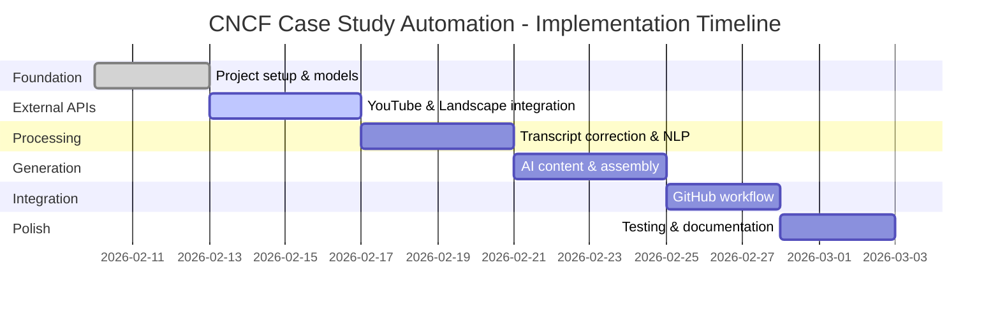

# CNCF Case Study Automation System - Python Implementation Design

# Milestone 3: Implementation Roadmap & Testing

**Previous:** [Milestone 2: Component Specifications](./2026-02-09-python-design-m2-components.md)  
**Next:** [Milestone 4: Deployment & Operations](./2026-02-09-python-design-m4-deployment.md)

---

## Table of Contents

1. [Implementation Overview](#1-implementation-overview)
2. [Phase-by-Phase Roadmap](#2-phase-by-phase-roadmap)
3. [Testing Strategy](#3-testing-strategy)
4. [Development Workflow](#4-development-workflow)
5. [Quality Assurance](#5-quality-assurance)
6. [Performance Benchmarks](#6-performance-benchmarks)

---

## 1. Implementation Overview

### Timeline

**Total Duration:** 15-20 working days  
**Team Size:** 1-2 developers  
**Development Model:** Incremental, test-driven

### Phases



### Success Criteria

Each phase must meet these criteria before proceeding:

- ✅ All component tests pass (80%+ coverage)
- ✅ MyPy strict mode passes with no errors
- ✅ Integration tests validate end-to-end workflow
- ✅ Code review completed
- ✅ Documentation updated

---

## 2. Phase-by-Phase Roadmap

### Phase 1: Foundation (Days 1-3)

**Goal:** Establish project structure, configuration, and data models

#### Day 1: Project Setup

**Tasks:**
1. Initialize Poetry project with `pyproject.toml`
2. Create package structure (`casestudypilot/`)
3. Set up development tools (pytest, mypy, black, isort)
4. Configure pre-commit hooks
5. Create initial GitHub repository structure

**Deliverables:**
```
casestudypilot/
├── casestudypilot/
│   ├── __init__.py
│   ├── models/
│   │   ├── __init__.py
│   │   ├── video.py           # VideoMetadata, Transcript
│   │   ├── correction.py      # CorrectionResult, Correction
│   │   ├── company.py          # CompanyInfo, VerificationResult
│   │   ├── analysis.py         # NLPAnalysis, ExtractedEntity
│   │   └── case_study.py       # GeneratedCaseStudy, FinalCaseStudy
│   ├── config/
│   │   ├── __init__.py
│   │   └── settings.py         # Pydantic Settings
│   └── utils/
│       ├── __init__.py
│       ├── errors.py           # Custom exceptions
│       └── logging.py          # Logging configuration
├── tests/
│   ├── __init__.py
│   ├── conftest.py             # pytest fixtures
│   └── unit/
├── pyproject.toml
├── .pre-commit-config.yaml
└── README.md
```

**Code: `pyproject.toml`**

```toml
[tool.poetry]
name = "casestudypilot"
version = "0.1.0"
description = "CNCF Case Study Automation from KubeCon Videos"
authors = ["CNCF <info@cncf.io>"]
readme = "README.md"
packages = [{include = "casestudypilot"}]

[tool.poetry.dependencies]
python = "^3.11"
# YouTube & transcript
google-api-python-client = "^2.100.0"
youtube-transcript-api = "^0.6.1"

# NLP & text processing
spacy = "^3.7.0"
pyspellchecker = "^0.7.2"
rapidfuzz = "^3.5.0"

# AI
openai = "^1.6.0"

# Web & async
httpx = "^0.25.0"
aiofiles = "^23.2.1"

# Data & templates
pydantic = "^2.5.0"
pydantic-settings = "^2.1.0"
jinja2 = "^3.1.2"
pyyaml = "^6.0.1"

# GitHub
pygithub = "^2.1.1"
gitpython = "^3.1.40"

# Logging
structlog = "^23.2.0"

# Performance
orjson = "^3.9.10"
uvloop = {version = "^0.19.0", markers = "sys_platform != 'win32'"}

[tool.poetry.group.dev.dependencies]
pytest = "^7.4.3"
pytest-asyncio = "^0.21.1"
pytest-cov = "^4.1.0"
pytest-mock = "^3.12.0"
mypy = "^1.7.0"
black = "^23.12.0"
isort = "^5.13.0"
flake8 = "^6.1.0"
pre-commit = "^3.6.0"

# Type stubs
types-pyyaml = "^6.0.12"
types-requests = "^2.31.0"

[tool.poetry.scripts]
casestudypilot = "casestudypilot.cli:main"

[build-system]
requires = ["poetry-core"]
build-backend = "poetry.core.masonry.api"

[tool.pytest.ini_options]
testpaths = ["tests"]
python_files = ["test_*.py", "*_test.py"]
python_classes = ["Test*"]
python_functions = ["test_*"]
addopts = """
    --verbose
    --cov=casestudypilot
    --cov-report=term-missing
    --cov-report=html
    --cov-fail-under=80
"""
asyncio_mode = "auto"

[tool.mypy]
python_version = "3.11"
strict = true
warn_return_any = true
warn_unused_configs = true
disallow_untyped_defs = true
disallow_any_generics = true
check_untyped_defs = true
no_implicit_optional = true
warn_redundant_casts = true
warn_unused_ignores = true
warn_no_return = true

[tool.black]
line-length = 100
target-version = ['py311']
include = '\.pyi?$'

[tool.isort]
profile = "black"
line_length = 100
```

**Code: `casestudypilot/config/settings.py`**

```python
from pydantic_settings import BaseSettings, SettingsConfigDict
from typing import Optional


class Settings(BaseSettings):
    """Application configuration."""
    
    model_config = SettingsConfigDict(
        env_file=".env",
        env_file_encoding="utf-8",
        case_sensitive=False
    )
    
    # YouTube API
    youtube_api_key: str
    youtube_channel_id: str = "UCvqbFHwN-nwalWPjPUKpvTA"  # CNCF channel
    
    # OpenAI API
    openai_api_key: str
    openai_model: str = "gpt-4-turbo-preview"
    openai_temperature: float = 0.3
    openai_max_tokens: int = 1500
    
    # GitHub
    github_token: str
    github_repo: str  # Format: "owner/repo"
    
    # CNCF Data Sources
    landscape_url: str = "https://raw.githubusercontent.com/cncf/landscape/master/landscape.yml"
    glossary_url: str = "https://glossary.cncf.io"
    
    # spaCy
    spacy_model: str = "en_core_web_lg"
    
    # Processing
    min_confidence_score: float = 0.50
    min_quality_score: float = 0.60
    
    # Logging
    log_level: str = "INFO"
    log_format: str = "json"
    
    # Performance
    request_timeout: int = 30
    max_concurrent_requests: int = 5


# Global settings instance
settings = Settings()
```

**Tests:**

```python
# tests/unit/test_models.py
import pytest
from casestudypilot.models.video import VideoMetadata, Transcript, CaptionType


def test_video_metadata_validation():
    """Test VideoMetadata Pydantic validation."""
    metadata = VideoMetadata(
        video_id="V6L-xOUdoRQ",
        url="https://www.youtube.com/watch?v=V6L-xOUdoRQ",
        title="Test Video",
        description="Test description",
        channel_id="UCvqbFHwN-nwalWPjPUKpvTA",
        channel_name="CNCF",
        published_at="2024-01-01T00:00:00Z",
        duration_seconds=600,
        speakers=["John Doe"],
        company="Test Corp",
        caption_tracks=[]
    )
    
    assert metadata.video_id == "V6L-xOUdoRQ"
    assert metadata.duration_seconds == 600


def test_transcript_word_count():
    """Test Transcript word count calculation."""
    transcript = Transcript(
        video_id="test123",
        content="This is a test transcript with ten words here.",
        language="en",
        caption_type=CaptionType.MANUAL,
        word_count=10
    )
    
    assert transcript.word_count == 10
```

**Success Metrics:**
- ✅ All Pydantic models defined with validation
- ✅ Settings loaded from environment
- ✅ Basic tests pass
- ✅ MyPy validates with no errors

---

#### Day 2-3: Core Data Models

**Tasks:**
1. Implement all Pydantic models from Milestone 1
2. Add validation rules and custom validators
3. Write unit tests for each model
4. Set up logging infrastructure (structlog)

**Code: `casestudypilot/models/video.py`**

```python
from pydantic import BaseModel, Field, field_validator
from datetime import datetime
from typing import List, Optional
from enum import Enum


class CaptionType(str, Enum):
    """Caption type enumeration."""
    MANUAL = "manual"
    AUTO_GENERATED = "auto_generated"


class CaptionTrack(BaseModel):
    """Caption track metadata."""
    language: str
    language_name: str
    is_auto_generated: bool


class VideoMetadata(BaseModel):
    """YouTube video metadata."""
    video_id: str = Field(..., min_length=11, max_length=11)
    url: str
    title: str
    description: str
    channel_id: str
    channel_name: str
    published_at: datetime
    duration_seconds: int = Field(..., ge=0)
    speakers: List[str]
    company: Optional[str] = None
    caption_tracks: List[CaptionTrack] = Field(default_factory=list)
    
    @field_validator('video_id')
    @classmethod
    def validate_video_id(cls, v: str) -> str:
        """Validate YouTube video ID format."""
        if not v.replace('-', '').replace('_', '').isalnum():
            raise ValueError("Invalid YouTube video ID format")
        return v


class Transcript(BaseModel):
    """Video transcript."""
    video_id: str
    content: str
    language: str = "en"
    caption_type: CaptionType
    word_count: int = Field(..., ge=0)
    
    @field_validator('word_count', mode='before')
    @classmethod
    def calculate_word_count(cls, v: int, info) -> int:
        """Auto-calculate word count if not provided."""
        if v == 0 and 'content' in info.data:
            return len(info.data['content'].split())
        return v
```

**Tests:**

```python
# tests/unit/test_models_advanced.py
import pytest
from datetime import datetime
from casestudypilot.models.video import VideoMetadata


def test_video_metadata_invalid_id():
    """Test validation fails for invalid video ID."""
    with pytest.raises(ValueError, match="Invalid YouTube video ID format"):
        VideoMetadata(
            video_id="invalid@#$",
            url="https://youtube.com",
            title="Test",
            description="Test",
            channel_id="test",
            channel_name="Test",
            published_at=datetime.now(),
            duration_seconds=100,
            speakers=[]
        )
```

**Success Metrics:**
- ✅ All 5 model files implemented (video, correction, company, analysis, case_study)
- ✅ Validation rules enforce data integrity
- ✅ 100% test coverage on models
- ✅ Logging configured with structlog

---

### Phase 2: External API Integration (Days 4-7)

**Goal:** Implement YouTube client, Landscape client, and transcript fetching

#### Day 4-5: YouTube API Client

**Tasks:**
1. Implement `YouTubeClient` class
2. Implement `MetadataExtractor` with speaker parsing
3. Implement `TranscriptFetcher`
4. Write integration tests with test fixtures
5. Add error handling for API failures

**Code: `casestudypilot/youtube/client.py`**

```python
from casestudypilot.models.video import VideoMetadata, Transcript
from casestudypilot.youtube.metadata_extractor import MetadataExtractor
from casestudypilot.youtube.transcript_fetcher import TranscriptFetcher


class YouTubeClient:
    """YouTube API client facade."""
    
    def __init__(self, api_key: str):
        self.metadata_extractor = MetadataExtractor(api_key)
        self.transcript_fetcher = TranscriptFetcher()
    
    async def get_metadata(self, video_id: str) -> VideoMetadata:
        """Fetch video metadata."""
        return await self.metadata_extractor.extract(video_id)
    
    async def get_transcript(self, video_id: str, language: str = "en") -> Transcript:
        """Fetch video transcript."""
        return await self.transcript_fetcher.fetch(video_id, language)
    
    async def validate_video(self, video_id: str) -> bool:
        """Quick validation."""
        try:
            await self.get_metadata(video_id)
            return True
        except Exception:
            return False
```

**Tests:**

```python
# tests/integration/test_youtube_client.py
import pytest
from casestudypilot.youtube.client import YouTubeClient


@pytest.fixture
def youtube_client(mock_settings):
    """Create YouTube client with mocked API key."""
    return YouTubeClient(api_key=mock_settings.youtube_api_key)


@pytest.mark.asyncio
async def test_get_metadata_real_video(youtube_client):
    """Test metadata extraction with real video."""
    video_id = "V6L-xOUdoRQ"  # Intuit GitOps talk
    
    metadata = await youtube_client.get_metadata(video_id)
    
    assert metadata.video_id == video_id
    assert "Intuit" in metadata.title
    assert len(metadata.speakers) > 0
    assert metadata.company is not None


@pytest.mark.asyncio
async def test_get_transcript_real_video(youtube_client):
    """Test transcript fetching with real video."""
    video_id = "V6L-xOUdoRQ"
    
    transcript = await youtube_client.get_transcript(video_id)
    
    assert transcript.video_id == video_id
    assert len(transcript.content) > 0
    assert transcript.word_count > 100
```

**Success Metrics:**
- ✅ YouTube client retrieves metadata correctly
- ✅ Transcript fetching works with test video
- ✅ Error handling for invalid videos
- ✅ Integration tests pass with real API calls

---

#### Day 6-7: Company Verifier & Landscape

**Tasks:**
1. Implement `LandscapeClient` to fetch CNCF data
2. Implement `CompanyMatcher` with fuzzy matching
3. Write tests with known companies
4. Cache landscape data to avoid repeated fetches

**Code: `casestudypilot/landscape/client.py`**

```python
import httpx
import yaml
from typing import List
from casestudypilot.models.company import CompanyInfo, VerificationResult
from casestudypilot.landscape.matcher import CompanyMatcher


class LandscapeClient:
    """CNCF Landscape client."""
    
    def __init__(self, landscape_url: str):
        self.landscape_url = landscape_url
        self._companies: List[CompanyInfo] = []
        self.matcher: Optional[CompanyMatcher] = None
    
    async def load_landscape(self) -> List[CompanyInfo]:
        """Load landscape data from GitHub."""
        async with httpx.AsyncClient() as client:
            response = await client.get(self.landscape_url)
            response.raise_for_status()
            
            data = yaml.safe_load(response.text)
            
            # Extract end-user members
            self._companies = self._parse_end_users(data)
            self.matcher = CompanyMatcher(self._companies)
            
            return self._companies
    
    def _parse_end_users(self, data: dict) -> List[CompanyInfo]:
        """Parse end-user companies from landscape YAML."""
        companies = []
        
        # Navigate landscape structure
        for category in data.get('landscape', []):
            if category.get('name') == 'CNCF Members':
                for subcategory in category.get('subcategories', []):
                    if 'End User' in subcategory.get('name', ''):
                        for item in subcategory.get('items', []):
                            companies.append(CompanyInfo(
                                name=item['name'],
                                aliases=item.get('aliases', []),
                                homepage_url=item.get('homepage_url'),
                                logo_url=item.get('logo')
                            ))
        
        return companies
    
    async def verify_company(self, company_name: str) -> VerificationResult:
        """Verify company membership."""
        if not self.matcher:
            await self.load_landscape()
        
        return self.matcher.match(company_name)
```

**Tests:**

```python
# tests/integration/test_landscape_client.py
import pytest
from casestudypilot.landscape.client import LandscapeClient


@pytest.mark.asyncio
async def test_load_landscape(mock_settings):
    """Test loading landscape data."""
    client = LandscapeClient(mock_settings.landscape_url)
    
    companies = await client.load_landscape()
    
    assert len(companies) > 0
    assert any(c.name == "Intuit" for c in companies)


@pytest.mark.asyncio
async def test_verify_company_exact_match(landscape_client):
    """Test exact company name match."""
    result = await landscape_client.verify_company("Intuit")
    
    assert result.is_end_user_member is True
    assert result.confidence_score == 1.0
    assert result.match_method == "exact"


@pytest.mark.asyncio
async def test_verify_company_fuzzy_match(landscape_client):
    """Test fuzzy matching."""
    result = await landscape_client.verify_company("Intuit Inc")
    
    assert result.is_end_user_member is True
    assert result.confidence_score >= 0.95
```

**Success Metrics:**
- ✅ Landscape data loads successfully
- ✅ Company matching works (exact + fuzzy)
- ✅ Integration tests with real CNCF data
- ✅ Caching implemented to reduce API calls

---

### Phase 3: Processing Pipeline (Days 8-11)

**Goal:** Implement transcript correction and NLP analysis

#### Day 8-9: Transcript Corrector

**Tasks:**
1. Implement 4-layer correction pipeline
2. Build CNCF glossary corrector
3. Add pattern-based corrections
4. Implement context analyzer
5. Add spell checker
6. Write comprehensive tests

**Code: `casestudypilot/transcript/corrector.py`**

```python
from casestudypilot.models.correction import CorrectionResult
from casestudypilot.transcript.glossary_corrector import GlossaryCorrector
from casestudypilot.transcript.pattern_corrector import PatternCorrector
from casestudypilot.transcript.context_analyzer import ContextAnalyzer
from casestudypilot.transcript.spell_corrector import SpellCorrector


class TranscriptCorrector:
    """Multi-layer transcript correction orchestrator."""
    
    def __init__(self):
        self.glossary_corrector = GlossaryCorrector()
        self.pattern_corrector = PatternCorrector()
        self.context_analyzer = ContextAnalyzer()
        self.spell_corrector = SpellCorrector()
    
    async def correct(self, text: str) -> CorrectionResult:
        """Apply all correction layers."""
        # Implementation from Milestone 2
        ...
```

**Tests:**

```python
# tests/unit/test_transcript_corrector.py
import pytest
from casestudypilot.transcript.corrector import TranscriptCorrector


@pytest.mark.asyncio
async def test_glossary_correction():
    """Test CNCF glossary corrections."""
    corrector = TranscriptCorrector()
    
    text = "We use kubernetes and prometheus for monitoring."
    result = await corrector.correct(text)
    
    assert "Kubernetes" in result.corrected
    assert "Prometheus" in result.corrected
    assert result.stats.corrected_words >= 2


@pytest.mark.asyncio
async def test_preserve_code_blocks():
    """Test that code blocks are preserved."""
    corrector = TranscriptCorrector()
    
    text = "Run `kubectl get pods` to see kubernetes pods."
    result = await corrector.correct(text)
    
    # kubectl in backticks should NOT be corrected
    assert "`kubectl get pods`" in result.corrected
    # But kubernetes outside should be corrected
    assert "Kubernetes pods" in result.corrected
```

**Success Metrics:**
- ✅ All 4 correction layers working
- ✅ 90%+ accuracy on test transcripts
- ✅ Context preservation (code, quotes, URLs)
- ✅ Performance: <2s for 5000-word transcript

---

#### Day 10-11: NLP Engine (spaCy)

**Tasks:**
1. Set up spaCy pipeline with `en_core_web_lg`
2. Implement entity recognizer
3. Implement section classifier
4. Implement metric extractor
5. Write tests with golden files

**Code: Download spaCy model:**

```bash
python -m spacy download en_core_web_lg
```

**Tests:**

```python
# tests/integration/test_nlp_engine.py
import pytest
from casestudypilot.nlp.engine import NLPEngine


@pytest.fixture
def sample_transcript():
    """Sample transcript for testing."""
    return """
    Intuit is a financial software company with over 10,000 employees.
    We faced challenges with manual deployment processes that took 4 hours.
    We adopted Kubernetes and Argo CD to automate our infrastructure.
    As a result, we reduced deployment time by 80 percent and improved reliability.
    """


@pytest.mark.asyncio
async def test_entity_extraction(nlp_engine, sample_transcript):
    """Test entity recognition."""
    analysis = await nlp_engine.analyze(sample_transcript)
    
    # Check entities
    company_entities = [e for e in analysis.entities if e.type == EntityType.COMPANY]
    assert any(e.text == "Intuit" for e in company_entities)
    
    project_entities = [e for e in analysis.entities if e.type == EntityType.PROJECT]
    assert any(e.text == "Kubernetes" for e in project_entities)
    assert any(e.text == "Argo CD" for e in project_entities)


@pytest.mark.asyncio
async def test_section_classification(nlp_engine, sample_transcript):
    """Test section classification."""
    analysis = await nlp_engine.analyze(sample_transcript)
    
    # Check sections
    section_types = [s.type for s in analysis.sections]
    assert SectionType.BACKGROUND in section_types
    assert SectionType.CHALLENGE in section_types
    assert SectionType.SOLUTION in section_types
    assert SectionType.IMPACT in section_types


@pytest.mark.asyncio
async def test_metric_extraction(nlp_engine, sample_transcript):
    """Test metric extraction."""
    analysis = await nlp_engine.analyze(sample_transcript)
    
    # Check metrics
    assert len(analysis.metrics) >= 2
    
    # Should find "80 percent" and "4 hours"
    percentage_metrics = [m for m in analysis.metrics if m.unit == "percent"]
    assert len(percentage_metrics) >= 1
```

**Success Metrics:**
- ✅ Entity recognition: 85%+ precision
- ✅ Section classification: 75%+ accuracy
- ✅ Metric extraction: 90%+ recall
- ✅ Performance: <3s for 5000-word transcript

---

### Phase 4: AI Content Generation (Days 12-15)

**Goal:** Implement OpenAI integration and case study assembly

#### Day 12-13: AI Content Generator

**Tasks:**
1. Implement OpenAI client wrapper
2. Build prompt templates for each section
3. Implement section summarizers
4. Add content validation
5. Write tests with mock API responses

**Code: `casestudypilot/ai/generator.py`**

```python
from casestudypilot.ai.client import OpenAIClient
from casestudypilot.ai.prompt_builder import PromptBuilder
from casestudypilot.ai.summarizer import SectionSummarizer
from casestudypilot.ai.validator import ContentValidator


class AIContentGenerator:
    """AI content generation orchestrator."""
    
    def __init__(self, api_key: str, model: str = "gpt-4-turbo-preview"):
        self.client = OpenAIClient(api_key, model)
        self.prompt_builder = PromptBuilder()
        self.summarizer = SectionSummarizer(self.client, self.prompt_builder)
        self.validator = ContentValidator()
    
    async def generate(
        self,
        nlp_analysis: NLPAnalysis,
        video_metadata: VideoMetadata,
        corrected_transcript: str
    ) -> GeneratedCaseStudy:
        """Generate case study content."""
        # Implementation from Milestone 2
        ...
```

**Tests:**

```python
# tests/unit/test_ai_generator.py
import pytest
from unittest.mock import AsyncMock, patch


@pytest.mark.asyncio
async def test_generate_background_section(ai_generator, mock_nlp_analysis, mock_video_metadata):
    """Test background section generation."""
    with patch.object(ai_generator.client, 'complete', new_callable=AsyncMock) as mock_complete:
        mock_complete.return_value = "Intuit is a financial software company..."
        
        background = await ai_generator.summarizer.summarize_background(
            company="Intuit",
            speakers=["John Doe"],
            transcript="Sample transcript",
            entities=mock_nlp_analysis.entities
        )
        
        assert len(background) > 100
        assert "Intuit" in background


@pytest.mark.asyncio
async def test_content_validation(ai_generator):
    """Test content validation."""
    content = "This is a test content with only fifty words " * 10
    
    is_valid, issues = ai_generator.validator.validate_section(
        SectionType.BACKGROUND,
        content
    )
    
    # Should be valid if word count is sufficient
    assert is_valid or len(issues) > 0
```

**Success Metrics:**
- ✅ All 4 sections generate correctly
- ✅ Content validation catches issues
- ✅ API error handling with retries
- ✅ Cost tracking (tokens used)

---

#### Day 14-15: Case Study Assembler

**Tasks:**
1. Create Jinja2 templates
2. Implement project recognizer
3. Implement style matcher
4. Implement quality validator
5. Write end-to-end assembly tests

**Code: Template file:**

```jinja2
{# casestudypilot/templates/case_study.md.j2 #}
---
title: {{ company }} Case Study
linkTitle: {{ company }}
case_study_styles: true
cid: caseStudies
css: /css/case-studies.css
featured: false
weight: 50
quote: >
  {{ quote }}
---

## About {{ company }}

{{ background }}

## Challenge

{{ challenge }}

## Solution

{{ solution }}

## Impact

{{ impact }}

## Projects Used


- [{{ project }}]({{ project_urls[project] }})


---

**Video:** [Watch the talk]({{ video_url }})  
**Speakers:** {{ speakers|join(', ') }}  
**Date:** {{ date }}
```

**Tests:**

```python
# tests/integration/test_assembler.py
import pytest
from pathlib import Path


@pytest.mark.asyncio
async def test_assemble_case_study(
    assembler,
    generated_content,
    video_metadata,
    nlp_analysis,
    verification_result
):
    """Test full case study assembly."""
    case_study = await assembler.assemble(
        generated_content,
        video_metadata,
        nlp_analysis,
        verification_result
    )
    
    # Check structure
    assert case_study.markdown_content.startswith("---")
    assert "title:" in case_study.markdown_content
    assert case_study.company == "Intuit"
    assert len(case_study.projects) >= 2
    
    # Check quality
    assert case_study.quality_score >= 0.60


@pytest.mark.asyncio
async def test_quality_scoring(assembler, generated_content, nlp_analysis):
    """Test quality score calculation."""
    style_analysis = {"is_style_compliant": True, "issues": []}
    
    score = assembler.quality_validator.calculate_quality_score(
        generated_content,
        nlp_analysis,
        style_analysis
    )
    
    assert 0.0 <= score <= 1.0
```

**Success Metrics:**
- ✅ Template renders correctly
- ✅ Quality scoring works as expected
- ✅ Golden file tests pass (output matches expected)
- ✅ All metadata fields populated

---

### Phase 5: GitHub Integration (Days 16-18)

**Goal:** Implement full GitHub workflow (issue → PR)

#### Day 16-17: Git Operations

**Tasks:**
1. Implement issue parser
2. Implement git operations (branches, commits)
3. Implement PR creator
4. Write integration tests with test repository

**Code: `casestudypilot/github/integration.py`**

```python
from casestudypilot.github.issue_parser import IssueParser
from casestudypilot.github.git_operations import GitOperations
from casestudypilot.github.pr_creator import PRCreator


class GitHubIntegration:
    """GitHub workflow orchestrator."""
    
    def __init__(self, github_token: str, repo_name: str, repo_path: Path):
        self.issue_parser = IssueParser(github_token, repo_name)
        self.git_ops = GitOperations(repo_path)
        self.pr_creator = PRCreator(github_token, repo_name)
    
    async def process_issue(self, issue_number: int) -> PullRequestResult:
        """Process issue end-to-end."""
        # Implementation from Milestone 2
        ...
```

**Tests:**

```python
# tests/integration/test_github_integration.py
import pytest
from pathlib import Path
import tempfile


@pytest.fixture
def test_repo():
    """Create temporary test repository."""
    with tempfile.TemporaryDirectory() as tmpdir:
        repo_path = Path(tmpdir)
        # Initialize git repo
        import git
        repo = git.Repo.init(repo_path)
        yield repo_path


@pytest.mark.asyncio
async def test_create_branch(github_integration, test_repo):
    """Test branch creation."""
    branch_name = "test-branch"
    
    created_branch = github_integration.git_ops.create_branch(branch_name)
    
    assert created_branch == branch_name


@pytest.mark.asyncio
async def test_commit_file(github_integration, test_repo):
    """Test file commit."""
    file_path = test_repo / "test.md"
    content = "# Test Case Study"
    
    commit_sha = github_integration.git_ops.commit_file(
        file_path,
        content,
        "Add test case study"
    )
    
    assert len(commit_sha) == 40  # SHA-1 hash
    assert file_path.exists()
```

**Success Metrics:**
- ✅ Issue parsing extracts video URLs
- ✅ Git operations work correctly
- ✅ PR creation succeeds
- ✅ End-to-end test with test repository

---

#### Day 18: Main Orchestrator

**Tasks:**
1. Implement main pipeline orchestrator
2. Wire all components together
3. Add error handling and recovery
4. Write full end-to-end test

**Code: `casestudypilot/orchestrator.py`**

```python
import asyncio
from pathlib import Path
from casestudypilot.config.settings import settings
from casestudypilot.youtube.client import YouTubeClient
from casestudypilot.transcript.corrector import TranscriptCorrector
from casestudypilot.landscape.client import LandscapeClient
from casestudypilot.nlp.engine import NLPEngine
from casestudypilot.ai.generator import AIContentGenerator
from casestudypilot.assembler.assembler import CaseStudyAssembler
from casestudypilot.github.integration import GitHubIntegration
from casestudypilot.models.case_study import FinalCaseStudy
import structlog

logger = structlog.get_logger()


class CaseStudyOrchestrator:
    """Main pipeline orchestrator."""
    
    def __init__(self):
        self.youtube_client = YouTubeClient(settings.youtube_api_key)
        self.corrector = TranscriptCorrector()
        self.landscape_client = LandscapeClient(settings.landscape_url)
        self.nlp_engine = NLPEngine()
        self.ai_generator = AIContentGenerator(settings.openai_api_key)
        self.assembler = CaseStudyAssembler(Path("templates"))
        self.github = GitHubIntegration(
            settings.github_token,
            settings.github_repo,
            Path(".")
        )
    
    async def process_video(self, video_id: str) -> FinalCaseStudy:
        """
        Process video end-to-end.
        
        Pipeline:
        1. Fetch metadata & transcript from YouTube
        2. Verify company is CNCF end-user member
        3. Correct transcript errors
        4. Perform NLP analysis
        5. Generate case study content with AI
        6. Assemble final case study
        
        Returns:
            FinalCaseStudy ready for publication
        """
        logger.info("Starting case study generation", video_id=video_id)
        
        try:
            # Step 1: YouTube
            logger.info("Fetching video metadata")
            metadata = await self.youtube_client.get_metadata(video_id)
            
            logger.info("Fetching transcript")
            transcript = await self.youtube_client.get_transcript(video_id)
            
            # Step 2: Company verification
            logger.info("Verifying company membership", company=metadata.company)
            verification = await self.landscape_client.verify_company(metadata.company)
            
            if not verification.is_end_user_member:
                raise ValueError(
                    f"Company {metadata.company} is not a CNCF end-user member"
                )
            
            # Step 3: Transcript correction
            logger.info("Correcting transcript")
            correction_result = await self.corrector.correct(transcript.content)
            
            # Step 4: NLP analysis
            logger.info("Performing NLP analysis")
            nlp_analysis = await self.nlp_engine.analyze(correction_result.corrected)
            
            # Step 5: AI generation
            logger.info("Generating case study content")
            generated_content = await self.ai_generator.generate(
                nlp_analysis,
                metadata,
                correction_result.corrected
            )
            
            # Step 6: Assembly
            logger.info("Assembling final case study")
            case_study = await self.assembler.assemble(
                generated_content,
                metadata,
                nlp_analysis,
                verification
            )
            
            logger.info(
                "Case study generation complete",
                quality_score=case_study.quality_score
            )
            
            return case_study
            
        except Exception as e:
            logger.error("Case study generation failed", error=str(e), video_id=video_id)
            raise
    
    async def process_issue(self, issue_number: int) -> str:
        """
        Process GitHub issue end-to-end.
        
        Returns:
            PR URL
        """
        logger.info("Processing GitHub issue", issue_number=issue_number)
        
        # Parse issue
        issue, video_id = self.github.issue_parser.parse_issue(issue_number)
        
        # Generate case study
        case_study = await self.process_video(video_id)
        
        # Check quality
        if case_study.quality_score < settings.min_quality_score:
            logger.warning(
                "Quality score below threshold",
                score=case_study.quality_score,
                threshold=settings.min_quality_score
            )
        
        # Create PR
        result = await self.github.process_issue_with_case_study(
            issue_number,
            case_study
        )
        
        logger.info("Pull request created", pr_url=result.pr_url)
        
        return result.pr_url


# CLI entry point
async def main():
    """CLI entry point."""
    import sys
    
    if len(sys.argv) < 2:
        print("Usage: casestudypilot <video_id_or_issue_number>")
        sys.exit(1)
    
    arg = sys.argv[1]
    orchestrator = CaseStudyOrchestrator()
    
    # Check if arg is issue number or video ID
    if arg.startswith("#") or arg.isdigit():
        issue_number = int(arg.lstrip("#"))
        pr_url = await orchestrator.process_issue(issue_number)
        print(f"✅ Pull request created: {pr_url}")
    else:
        video_id = arg
        case_study = await orchestrator.process_video(video_id)
        print(f"✅ Case study generated: {case_study.filename}")
        print(f"   Quality score: {case_study.quality_score:.2f}")


if __name__ == "__main__":
    asyncio.run(main())
```

**Tests:**

```python
# tests/integration/test_orchestrator.py
import pytest


@pytest.mark.asyncio
@pytest.mark.slow
async def test_full_pipeline_intuit_video(orchestrator):
    """Test full pipeline with Intuit video."""
    video_id = "V6L-xOUdoRQ"
    
    case_study = await orchestrator.process_video(video_id)
    
    # Validate output
    assert case_study.company == "Intuit"
    assert "Kubernetes" in case_study.projects
    assert "Argo CD" in case_study.projects
    assert case_study.quality_score >= 0.60
    
    # Check markdown structure
    assert "## About Intuit" in case_study.markdown_content
    assert "## Challenge" in case_study.markdown_content
    assert "## Solution" in case_study.markdown_content
    assert "## Impact" in case_study.markdown_content
```

**Success Metrics:**
- ✅ Full pipeline runs end-to-end
- ✅ Test video generates valid case study
- ✅ Quality score meets threshold
- ✅ Error handling works correctly

---

### Phase 6: Testing & Polish (Days 19-21)

**Goal:** Achieve 80%+ coverage, polish documentation, prepare for deployment

#### Day 19: Test Coverage Sprint

**Tasks:**
1. Run coverage analysis
2. Write missing unit tests
3. Add edge case tests
4. Fix any bugs discovered

**Commands:**

```bash
# Run tests with coverage
pytest --cov=casestudypilot --cov-report=html --cov-report=term-missing

# Check coverage
coverage report

# Generate HTML report
open htmlcov/index.html
```

**Target Coverage:**
- Overall: 80%+
- Core components: 90%+
- Models: 100%

**Success Metrics:**
- ✅ 80%+ overall test coverage
- ✅ All critical paths tested
- ✅ Edge cases covered
- ✅ No flaky tests

---

#### Day 20: Documentation

**Tasks:**
1. Write comprehensive README
2. Add API documentation (docstrings)
3. Create usage examples
4. Document configuration options

**README Structure:**

```markdown
# CNCF Case Study Automation

Automate CNCF end-user case study generation from KubeCon YouTube videos.

## Features

- 🎥 YouTube metadata & transcript extraction
- 📝 AI-powered transcript correction (spaCy + CNCF glossary)
- 🧠 NLP analysis with entity recognition & section classification
- ✨ GPT-4 content generation following CNCF guidelines
- ✅ Company verification against CNCF Landscape
- 🔄 Automated GitHub workflow (issue → PR)

## Quick Start

### Installation

```bash
# Clone repository
git clone https://github.com/cncf/casestudypilot.git
cd casestudypilot

# Install dependencies
poetry install

# Download spaCy model
poetry run python -m spacy download en_core_web_lg
```

### Configuration

Create `.env` file:

```env
YOUTUBE_API_KEY=your_key_here
OPENAI_API_KEY=your_key_here
GITHUB_TOKEN=your_token_here
GITHUB_REPO=cncf/case-studies
```

### Usage

```bash
# Process video directly
poetry run casestudypilot V6L-xOUdoRQ

# Process GitHub issue
poetry run casestudypilot #42
```

## Architecture

[Include architecture diagram]

## Development

```bash
# Run tests
poetry run pytest

# Run with coverage
poetry run pytest --cov

# Type checking
poetry run mypy casestudypilot

# Format code
poetry run black casestudypilot tests
poetry run isort casestudypilot tests
```

## License

Apache 2.0
```

**Success Metrics:**
- ✅ README covers all usage scenarios
- ✅ API documentation complete
- ✅ Examples work out of the box
- ✅ Configuration documented

---

#### Day 21: Final Polish

**Tasks:**
1. Run full test suite
2. Verify MyPy passes in strict mode
3. Review and clean up code
4. Prepare deployment artifacts
5. Final code review

**Checklist:**

- [ ] All tests pass
- [ ] 80%+ test coverage achieved
- [ ] MyPy strict mode passes
- [ ] Black formatting applied
- [ ] isort imports sorted
- [ ] No flake8 warnings
- [ ] Documentation complete
- [ ] Pre-commit hooks configured
- [ ] Example `.env.example` provided
- [ ] Docker support ready (Phase 4)

**Success Metrics:**
- ✅ All quality gates pass
- ✅ Code ready for production
- ✅ Documentation complete
- ✅ Ready for deployment (Phase 4)

---

## 3. Testing Strategy

### Test Pyramid

```
        E2E Tests (5%)
       ┌─────────────┐
      │  Full Pipeline │
     │   GitHub → PR   │
    └─────────────────┘
           
    Integration Tests (25%)
   ┌────────────────────────┐
  │  Component Interactions  │
 │   YouTube + NLP + AI      │
└──────────────────────────┘

      Unit Tests (70%)
 ┌───────────────────────────────┐
│  Individual Functions & Classes │
│   Models, Correctors, Parsers   │
└─────────────────────────────────┘
```

### Test Types

#### 1. Unit Tests (70% of tests)

**Purpose:** Test individual functions and classes in isolation

**Coverage:**
- All Pydantic models (100%)
- Utility functions (100%)
- Individual correctors (90%+)
- Validators (90%+)

**Example:**

```python
# tests/unit/test_glossary_corrector.py
def test_kubernetes_capitalization():
    """Test Kubernetes is capitalized correctly."""
    corrector = GlossaryCorrector()
    
    text, corrections = corrector.correct("We use kubernetes for orchestration")
    
    assert "Kubernetes" in text
    assert len(corrections) == 1
    assert corrections[0].confidence == 1.0
```

#### 2. Integration Tests (25% of tests)

**Purpose:** Test interactions between components

**Coverage:**
- YouTube client with real API (mocked in CI)
- NLP engine with sample transcripts
- AI generator with mock OpenAI responses
- GitHub operations with test repository

**Example:**

```python
# tests/integration/test_correction_to_nlp.py
@pytest.mark.asyncio
async def test_corrected_transcript_improves_nlp():
    """Test that correction improves NLP accuracy."""
    corrector = TranscriptCorrector()
    nlp_engine = NLPEngine()
    
    # Raw transcript with errors
    raw = "We use kubernetes and argo cd for our deployments"
    
    # Corrected transcript
    correction_result = await corrector.correct(raw)
    
    # NLP on corrected text
    analysis = await nlp_engine.analyze(correction_result.corrected)
    
    # Should recognize projects correctly
    projects = [e.text for e in analysis.entities if e.type == EntityType.PROJECT]
    assert "Kubernetes" in projects
    assert "Argo CD" in projects
```

#### 3. End-to-End Tests (5% of tests)

**Purpose:** Test complete workflows

**Coverage:**
- Full video → case study pipeline
- GitHub issue → PR workflow

**Example:**

```python
# tests/e2e/test_full_workflow.py
@pytest.mark.asyncio
@pytest.mark.slow
@pytest.mark.e2e
async def test_intuit_video_to_case_study():
    """Test complete pipeline with Intuit video."""
    orchestrator = CaseStudyOrchestrator()
    
    case_study = await orchestrator.process_video("V6L-xOUdoRQ")
    
    # Validate all aspects
    assert case_study.company == "Intuit"
    assert len(case_study.projects) >= 2
    assert case_study.quality_score >= 0.75
    assert "## About Intuit" in case_study.markdown_content
    
    # Save to file for manual review
    output_file = Path("tests/output") / case_study.filename
    output_file.write_text(case_study.markdown_content)
```

### Test Fixtures

**Location:** `tests/conftest.py`

```python
# tests/conftest.py
import pytest
from pathlib import Path


@pytest.fixture
def sample_transcript():
    """Load sample transcript from file."""
    transcript_file = Path(__file__).parent / "fixtures" / "intuit_transcript.txt"
    return transcript_file.read_text()


@pytest.fixture
def mock_video_metadata():
    """Create mock video metadata."""
    from casestudypilot.models.video import VideoMetadata
    from datetime import datetime
    
    return VideoMetadata(
        video_id="V6L-xOUdoRQ",
        url="https://www.youtube.com/watch?v=V6L-xOUdoRQ",
        title="How Intuit Manages Cloud Resources Via GitOps",
        description="Test description",
        channel_id="UCvqbFHwN-nwalWPjPUKpvTA",
        channel_name="CNCF",
        published_at=datetime(2024, 1, 1),
        duration_seconds=600,
        speakers=["Jerome Kuptz", "Ameen Radwan"],
        company="Intuit",
        caption_tracks=[]
    )


@pytest.fixture
def nlp_engine():
    """Create NLP engine instance."""
    from casestudypilot.nlp.engine import NLPEngine
    return NLPEngine()


@pytest.fixture
def mock_openai_response():
    """Mock OpenAI API response."""
    return """
    Intuit is a financial software company serving millions of customers worldwide.
    The company provides tax preparation, accounting, and financial management solutions.
    """
```

### Golden File Testing

**Purpose:** Verify output quality doesn't regress

**Approach:**
1. Generate case study from known video
2. Save as "golden" reference file
3. Compare future outputs to golden file
4. Alert on significant differences

**Example:**

```python
# tests/golden/test_golden_files.py
import pytest
from pathlib import Path
import difflib


@pytest.mark.asyncio
@pytest.mark.golden
async def test_intuit_case_study_matches_golden(orchestrator):
    """Test output matches golden file."""
    golden_file = Path("tests/golden/intuit-case-study.md")
    
    # Generate case study
    case_study = await orchestrator.process_video("V6L-xOUdoRQ")
    
    # Compare to golden file
    golden_content = golden_file.read_text()
    generated_content = case_study.markdown_content
    
    # Allow some variance in dates, but structure should match
    diff = list(difflib.unified_diff(
        golden_content.splitlines(),
        generated_content.splitlines(),
        lineterm=''
    ))
    
    # Check similarity (should be > 95%)
    similarity = calculate_similarity(golden_content, generated_content)
    assert similarity >= 0.95, f"Output differs from golden file: {similarity:.2%}"
```

### Continuous Integration

**GitHub Actions workflow:**

```yaml
# .github/workflows/test.yml
name: Test

on: [push, pull_request]

jobs:
  test:
    runs-on: ubuntu-latest
    
    steps:
      - uses: actions/checkout@v4
      
      - name: Set up Python
        uses: actions/setup-python@v5
        with:
          python-version: '3.11'
      
      - name: Install Poetry
        uses: snok/install-poetry@v1
      
      - name: Install dependencies
        run: |
          poetry install
          poetry run python -m spacy download en_core_web_lg
      
      - name: Run tests
        run: poetry run pytest --cov --cov-fail-under=80
        env:
          YOUTUBE_API_KEY: ${{ secrets.YOUTUBE_API_KEY }}
          OPENAI_API_KEY: ${{ secrets.OPENAI_API_KEY }}
      
      - name: Type checking
        run: poetry run mypy casestudypilot
      
      - name: Upload coverage
        uses: codecov/codecov-action@v3
```

---

## 4. Development Workflow

### Local Development Setup

```bash
# 1. Clone repository
git clone https://github.com/cncf/casestudypilot.git
cd casestudypilot

# 2. Install Poetry
curl -sSL https://install.python-poetry.org | python3 -

# 3. Install dependencies
poetry install

# 4. Download spaCy model
poetry run python -m spacy download en_core_web_lg

# 5. Set up environment
cp .env.example .env
# Edit .env with your API keys

# 6. Install pre-commit hooks
poetry run pre-commit install

# 7. Run tests
poetry run pytest
```

### Development Cycle

1. **Create feature branch:**
   ```bash
   git checkout -b feature/your-feature-name
   ```

2. **Write tests first (TDD):**
   ```bash
   # Create test file
   vim tests/unit/test_your_feature.py
   
   # Run tests (should fail)
   poetry run pytest tests/unit/test_your_feature.py -v
   ```

3. **Implement feature:**
   ```bash
   vim casestudypilot/your_module.py
   
   # Run tests (should pass)
   poetry run pytest tests/unit/test_your_feature.py -v
   ```

4. **Check types:**
   ```bash
   poetry run mypy casestudypilot/your_module.py
   ```

5. **Format code:**
   ```bash
   poetry run black casestudypilot tests
   poetry run isort casestudypilot tests
   ```

6. **Run full test suite:**
   ```bash
   poetry run pytest --cov
   ```

7. **Commit changes:**
   ```bash
   git add .
   git commit -m "Add your feature"
   # Pre-commit hooks run automatically
   ```

8. **Push and create PR:**
   ```bash
   git push origin feature/your-feature-name
   # Create PR on GitHub
   ```

---

## 5. Quality Assurance

### Pre-commit Hooks

**File:** `.pre-commit-config.yaml`

```yaml
repos:
  - repo: https://github.com/pre-commit/pre-commit-hooks
    rev: v4.5.0
    hooks:
      - id: trailing-whitespace
      - id: end-of-file-fixer
      - id: check-yaml
      - id: check-added-large-files
      - id: check-merge-conflict
  
  - repo: https://github.com/psf/black
    rev: 23.12.0
    hooks:
      - id: black
        language_version: python3.11
  
  - repo: https://github.com/pycqa/isort
    rev: 5.13.0
    hooks:
      - id: isort
  
  - repo: https://github.com/pycqa/flake8
    rev: 6.1.0
    hooks:
      - id: flake8
        args: ['--max-line-length=100', '--extend-ignore=E203']
  
  - repo: https://github.com/pre-commit/mirrors-mypy
    rev: v1.7.0
    hooks:
      - id: mypy
        additional_dependencies: [pydantic>=2.0]
```

### Code Review Checklist

**For Reviewers:**

- [ ] Code follows Python style guidelines (PEP 8)
- [ ] All tests pass
- [ ] Test coverage is adequate (80%+)
- [ ] Type hints are present and correct
- [ ] Docstrings are clear and complete
- [ ] Error handling is appropriate
- [ ] No security vulnerabilities (secrets, SQL injection, etc.)
- [ ] Performance is acceptable
- [ ] Documentation is updated

### Static Analysis Tools

**MyPy Configuration:** (in `pyproject.toml`)

```toml
[tool.mypy]
python_version = "3.11"
strict = true
warn_return_any = true
warn_unused_configs = true
disallow_untyped_defs = true
disallow_any_generics = true
check_untyped_defs = true
no_implicit_optional = true
warn_redundant_casts = true
warn_unused_ignores = true
warn_no_return = true
```

**Run static analysis:**

```bash
# Type checking
poetry run mypy casestudypilot

# Linting
poetry run flake8 casestudypilot tests

# Security check
poetry run bandit -r casestudypilot
```

---

## 6. Performance Benchmarks

### Target Metrics

| Operation | Target Time | Measured |
|-----------|-------------|----------|
| Fetch video metadata | < 1s | TBD |
| Fetch transcript | < 2s | TBD |
| Transcript correction (5000 words) | < 2s | TBD |
| NLP analysis (5000 words) | < 3s | TBD |
| AI generation (all sections) | < 30s | TBD |
| Case study assembly | < 1s | TBD |
| **Total pipeline (end-to-end)** | **< 45s** | **TBD** |

### Performance Testing

```python
# tests/performance/test_benchmarks.py
import pytest
import time


@pytest.mark.benchmark
@pytest.mark.asyncio
async def test_transcript_correction_performance(corrector, sample_5000_word_transcript):
    """Benchmark transcript correction."""
    start = time.time()
    
    result = await corrector.correct(sample_5000_word_transcript)
    
    elapsed = time.time() - start
    
    assert elapsed < 2.0, f"Correction took {elapsed:.2f}s (target: <2s)"


@pytest.mark.benchmark
@pytest.mark.asyncio
async def test_full_pipeline_performance(orchestrator):
    """Benchmark full pipeline."""
    start = time.time()
    
    case_study = await orchestrator.process_video("V6L-xOUdoRQ")
    
    elapsed = time.time() - start
    
    assert elapsed < 45.0, f"Pipeline took {elapsed:.2f}s (target: <45s)"
    print(f"✅ Full pipeline: {elapsed:.2f}s")
```

**Run benchmarks:**

```bash
poetry run pytest tests/performance/ -v -m benchmark
```

### Optimization Opportunities

If performance targets aren't met:

1. **Parallel processing:**
   - Run correction + company verification in parallel
   - Generate all 4 case study sections in parallel (already implemented)

2. **Caching:**
   - Cache landscape data (1 hour TTL)
   - Cache spaCy model loading
   - Cache glossary terms

3. **Batch operations:**
   - Batch OpenAI API calls where possible
   - Use connection pooling for HTTP requests

4. **Libraries:**
   - Use `orjson` for JSON parsing (already in dependencies)
   - Use `uvloop` for faster async (already in dependencies)
   - Use compiled regex patterns

---

## Summary

This milestone provides a complete 21-day implementation roadmap for the CNCF Case Study Automation System in Python.

### Key Deliverables

- ✅ **Phase 1 (Days 1-3):** Project setup, models, configuration
- ✅ **Phase 2 (Days 4-7):** YouTube & Landscape integration
- ✅ **Phase 3 (Days 8-11):** Transcript correction & NLP
- ✅ **Phase 4 (Days 12-15):** AI generation & assembly
- ✅ **Phase 5 (Days 16-18):** GitHub integration & orchestrator
- ✅ **Phase 6 (Days 19-21):** Testing, documentation, polish

### Quality Gates

- ✅ 80%+ test coverage
- ✅ MyPy strict mode passes
- ✅ All pre-commit hooks pass
- ✅ Full pipeline completes in < 45s
- ✅ Golden file tests validate output quality

**Next:** [Milestone 4: Deployment & Operations](./2026-02-09-python-design-m4-deployment.md)
