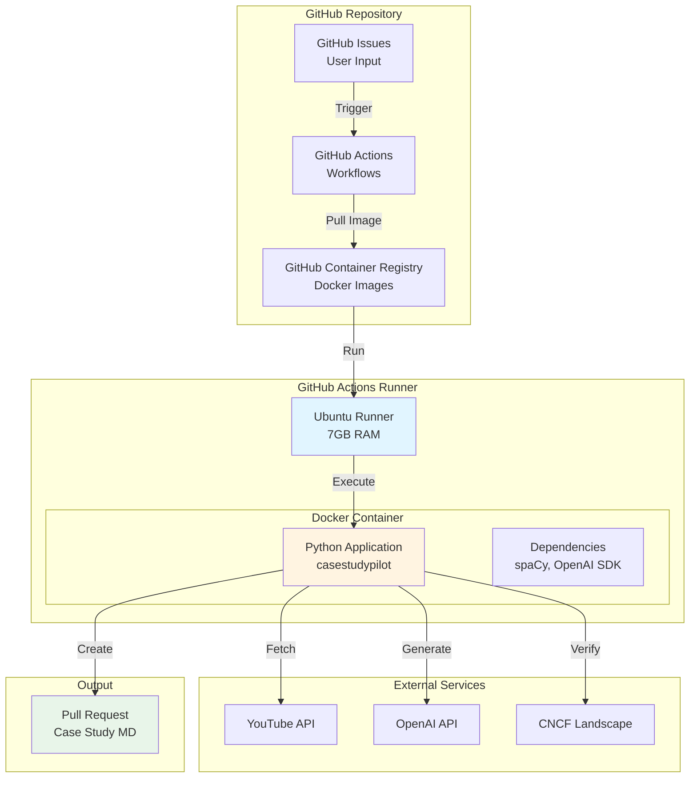

# CNCF Case Study Automation System - Python Implementation Design

# Milestone 4: Deployment & Operations

**Previous:** [Milestone 3: Implementation Roadmap & Testing](./2026-02-09-python-design-m3-implementation.md)

---

## Table of Contents

1. [Deployment Overview](#1-deployment-overview)
2. [Docker Configuration](#2-docker-configuration)
3. [GitHub Actions Workflows](#3-github-actions-workflows)
4. [Environment & Secrets Management](#4-environment--secrets-management)
5. [Monitoring & Logging](#5-monitoring--logging)
6. [Troubleshooting Guide](#6-troubleshooting-guide)
7. [Operational Runbooks](#7-operational-runbooks)

---

## 1. Deployment Overview

### Deployment Architecture



### Deployment Strategy

**Approach:** Containerized GitHub Actions workflow

**Why GitHub Actions?**
- ✅ Native integration with GitHub issues & PRs
- ✅ No external infrastructure needed
- ✅ Secrets management built-in
- ✅ Free for public repositories
- ✅ Abundant resources (7GB RAM, 14GB disk)
- ✅ Fast network for model downloads

**Key Components:**
1. **Docker Image:** Pre-built container with all dependencies
2. **Workflow:** Triggered by issue creation with specific label
3. **Artifacts:** Case study markdown files
4. **Outputs:** Pull requests for review

---

## 2. Docker Configuration

### Multi-Stage Dockerfile

**Goal:** Minimize image size while including all dependencies

**File:** `Dockerfile`

```dockerfile
# ============================================================================
# Stage 1: Builder - Install dependencies and download models
# ============================================================================
FROM python:3.11-slim as builder

# Set environment variables
ENV PYTHONUNBUFFERED=1 \
    PYTHONDONTWRITEBYTECODE=1 \
    PIP_NO_CACHE_DIR=1 \
    PIP_DISABLE_PIP_VERSION_CHECK=1 \
    POETRY_VERSION=1.7.1 \
    POETRY_HOME=/opt/poetry \
    POETRY_NO_INTERACTION=1 \
    POETRY_VIRTUALENVS_CREATE=false

# Install system dependencies
RUN apt-get update && apt-get install -y \
    build-essential \
    curl \
    git \
    && rm -rf /var/lib/apt/lists/*

# Install Poetry
RUN curl -sSL https://install.python-poetry.org | python3 - && \
    ln -s /opt/poetry/bin/poetry /usr/local/bin/poetry

# Set working directory
WORKDIR /app

# Copy dependency files
COPY pyproject.toml poetry.lock ./

# Install Python dependencies
RUN poetry install --only main --no-root

# Download spaCy model
RUN python -m spacy download en_core_web_lg

# Copy application code
COPY casestudypilot/ ./casestudypilot/
COPY templates/ ./templates/

# Install the package
RUN poetry install --only main

# ============================================================================
# Stage 2: Runtime - Minimal production image
# ============================================================================
FROM python:3.11-slim

# Set environment variables
ENV PYTHONUNBUFFERED=1 \
    PYTHONDONTWRITEBYTECODE=1 \
    PATH=/usr/local/bin:$PATH

# Install runtime dependencies only
RUN apt-get update && apt-get install -y \
    git \
    && rm -rf /var/lib/apt/lists/*

# Create non-root user
RUN useradd -m -u 1000 appuser && \
    mkdir -p /app /data && \
    chown -R appuser:appuser /app /data

# Set working directory
WORKDIR /app

# Copy Python environment from builder
COPY --from=builder /usr/local/lib/python3.11/site-packages /usr/local/lib/python3.11/site-packages
COPY --from=builder /usr/local/bin /usr/local/bin

# Copy application from builder
COPY --from=builder /app/casestudypilot /app/casestudypilot
COPY --from=builder /app/templates /app/templates

# Switch to non-root user
USER appuser

# Health check
HEALTHCHECK --interval=30s --timeout=10s --start-period=5s --retries=3 \
    CMD python -c "import casestudypilot; print('OK')" || exit 1

# Default command
ENTRYPOINT ["python", "-m", "casestudypilot.cli"]
CMD ["--help"]
```

### Docker Compose (Local Development)

**File:** `docker-compose.yml`

```yaml
version: '3.8'

services:
  casestudypilot:
    build:
      context: .
      dockerfile: Dockerfile
    image: casestudypilot:latest
    container_name: casestudypilot
    
    environment:
      - YOUTUBE_API_KEY=${YOUTUBE_API_KEY}
      - OPENAI_API_KEY=${OPENAI_API_KEY}
      - GITHUB_TOKEN=${GITHUB_TOKEN}
      - GITHUB_REPO=${GITHUB_REPO}
      - LOG_LEVEL=${LOG_LEVEL:-INFO}
    
    volumes:
      - ./output:/data/output
      - ./logs:/data/logs
    
    command: ["V6L-xOUdoRQ"]
    
    networks:
      - casestudypilot-network

networks:
  casestudypilot-network:
    driver: bridge
```

### Build & Push to GHCR

**File:** `.github/workflows/build-image.yml`

```yaml
name: Build Docker Image

on:
  push:
    branches: [main]
    tags: ['v*']
  pull_request:
    branches: [main]

env:
  REGISTRY: ghcr.io
  IMAGE_NAME: ${{ github.repository }}

jobs:
  build:
    runs-on: ubuntu-latest
    permissions:
      contents: read
      packages: write
    
    steps:
      - name: Checkout code
        uses: actions/checkout@v4
      
      - name: Set up Docker Buildx
        uses: docker/setup-buildx-action@v3
      
      - name: Log in to GitHub Container Registry
        uses: docker/login-action@v3
        with:
          registry: ${{ env.REGISTRY }}
          username: ${{ github.actor }}
          password: ${{ secrets.GITHUB_TOKEN }}
      
      - name: Extract metadata
        id: meta
        uses: docker/metadata-action@v5
        with:
          images: ${{ env.REGISTRY }}/${{ env.IMAGE_NAME }}
          tags: |
            type=ref,event=branch
            type=ref,event=pr
            type=semver,pattern={{version}}
            type=semver,pattern={{major}}.{{minor}}
            type=sha,prefix={{branch}}-
            type=raw,value=latest,enable={{is_default_branch}}
      
      - name: Build and push Docker image
        uses: docker/build-push-action@v5
        with:
          context: .
          push: ${{ github.event_name != 'pull_request' }}
          tags: ${{ steps.meta.outputs.tags }}
          labels: ${{ steps.meta.outputs.labels }}
          cache-from: type=gha
          cache-to: type=gha,mode=max
          platforms: linux/amd64,linux/arm64
      
      - name: Image digest
        run: echo ${{ steps.meta.outputs.digest }}
```

### Local Docker Usage

```bash
# Build image
docker build -t casestudypilot:latest .

# Run with environment variables
docker run --rm \
  -e YOUTUBE_API_KEY="your_key" \
  -e OPENAI_API_KEY="your_key" \
  -e GITHUB_TOKEN="your_token" \
  -e GITHUB_REPO="cncf/case-studies" \
  casestudypilot:latest V6L-xOUdoRQ

# Use docker-compose
docker-compose up

# Shell into container
docker run --rm -it casestudypilot:latest /bin/bash
```

---

## 3. GitHub Actions Workflows

### Main Workflow: Process Case Study

**File:** `.github/workflows/process-case-study.yml`

```yaml
name: Process Case Study

on:
  issues:
    types: [opened, labeled]

permissions:
  contents: write
  issues: write
  pull-requests: write

jobs:
  validate:
    name: Validate Issue
    runs-on: ubuntu-latest
    if: contains(github.event.issue.labels.*.name, 'case-study')
    
    outputs:
      video_id: ${{ steps.extract.outputs.video_id }}
      valid: ${{ steps.extract.outputs.valid }}
    
    steps:
      - name: Extract YouTube URL
        id: extract
        uses: actions/github-script@v7
        with:
          script: |
            const issueBody = context.payload.issue.body;
            const urlPattern = /(?:https?:\/\/)?(?:www\.)?(?:youtube\.com\/watch\?v=|youtu\.be\/)([a-zA-Z0-9_-]{11})/;
            const match = issueBody.match(urlPattern);
            
            if (match) {
              core.setOutput('video_id', match[1]);
              core.setOutput('valid', 'true');
              
              // Add comment to issue
              github.rest.issues.createComment({
                owner: context.repo.owner,
                repo: context.repo.repo,
                issue_number: context.issue.number,
                body: `✅ Valid YouTube URL detected: \`${match[1]}\`\n\nStarting case study generation...`
              });
            } else {
              core.setOutput('valid', 'false');
              
              github.rest.issues.createComment({
                owner: context.repo.owner,
                repo: context.repo.repo,
                issue_number: context.issue.number,
                body: '❌ No valid YouTube URL found in issue body.\n\nPlease include a YouTube URL in the format:\n`https://www.youtube.com/watch?v=VIDEO_ID`'
              });
            }
  
  process:
    name: Generate Case Study
    runs-on: ubuntu-latest
    needs: validate
    if: needs.validate.outputs.valid == 'true'
    
    steps:
      - name: Checkout repository
        uses: actions/checkout@v4
        with:
          fetch-depth: 0
      
      - name: Set up Python
        uses: actions/setup-python@v5
        with:
          python-version: '3.11'
          cache: 'pip'
      
      - name: Install Poetry
        uses: snok/install-poetry@v1
        with:
          version: 1.7.1
          virtualenvs-create: true
          virtualenvs-in-project: true
      
      - name: Load cached dependencies
        uses: actions/cache@v3
        with:
          path: .venv
          key: venv-${{ runner.os }}-${{ hashFiles('**/poetry.lock') }}
      
      - name: Install dependencies
        run: |
          poetry install --only main
          poetry run python -m spacy download en_core_web_lg
      
      - name: Generate case study
        id: generate
        run: |
          poetry run casestudypilot --issue ${{ github.event.issue.number }}
        env:
          YOUTUBE_API_KEY: ${{ secrets.YOUTUBE_API_KEY }}
          OPENAI_API_KEY: ${{ secrets.OPENAI_API_KEY }}
          GITHUB_TOKEN: ${{ secrets.GITHUB_TOKEN }}
          GITHUB_REPO: ${{ github.repository }}
          LOG_LEVEL: INFO
      
      - name: Create Pull Request
        id: create_pr
        uses: peter-evans/create-pull-request@v5
        with:
          token: ${{ secrets.GITHUB_TOKEN }}
          commit-message: |
            Add case study from issue #${{ github.event.issue.number }}
            
            Auto-generated from YouTube video: ${{ needs.validate.outputs.video_id }}
          branch: case-study/${{ needs.validate.outputs.video_id }}
          delete-branch: true
          title: 'Case Study: ${{ steps.generate.outputs.company }}'
          body: |
            ## Case Study: ${{ steps.generate.outputs.company }}
            
            **Auto-generated from issue #${{ github.event.issue.number }}**
            
            ### Video Information
            - **Video ID:** `${{ needs.validate.outputs.video_id }}`
            - **Speakers:** ${{ steps.generate.outputs.speakers }}
            - **Company:** ${{ steps.generate.outputs.company }}
            
            ### Quality Metrics
            - **Quality Score:** ${{ steps.generate.outputs.quality_score }}
            - **CNCF Projects:** ${{ steps.generate.outputs.projects }}
            - **Metrics Extracted:** ${{ steps.generate.outputs.metric_count }}
            
            ### Review Checklist
            - [ ] Verify company information is accurate
            - [ ] Check CNCF project usage is correct
            - [ ] Validate metrics and claims
            - [ ] Review tone and style
            - [ ] Confirm speaker names and affiliations
            
            ---
            
            Closes #${{ github.event.issue.number }}
          labels: |
            case-study
            automated
          reviewers: content-team
      
      - name: Comment on issue
        if: success()
        uses: actions/github-script@v7
        with:
          script: |
            github.rest.issues.createComment({
              owner: context.repo.owner,
              repo: context.repo.repo,
              issue_number: context.issue.number,
              body: `✅ Case study generated successfully!\n\n**Pull Request:** ${{ steps.create_pr.outputs.pull-request-url }}\n**Quality Score:** ${{ steps.generate.outputs.quality_score }}\n\nPlease review the generated content for accuracy.`
            });
      
      - name: Handle failure
        if: failure()
        uses: actions/github-script@v7
        with:
          script: |
            github.rest.issues.createComment({
              owner: context.repo.owner,
              repo: context.repo.repo,
              issue_number: context.issue.number,
              body: `❌ Case study generation failed.\n\nPlease check the [workflow logs](${{ github.server_url }}/${{ github.repository }}/actions/runs/${{ github.run_id }}) for details.\n\nCommon issues:\n- Invalid video URL\n- Video not from CNCF channel\n- Company not a CNCF end-user member\n- API rate limits exceeded`
            });
            
            // Add 'error' label
            github.rest.issues.addLabels({
              owner: context.repo.owner,
              repo: context.repo.repo,
              issue_number: context.issue.number,
              labels: ['error']
            });
```

### CI Workflow: Continuous Integration

**File:** `.github/workflows/ci.yml`

```yaml
name: CI

on:
  push:
    branches: [main, develop]
  pull_request:
    branches: [main]

jobs:
  test:
    name: Test Python ${{ matrix.python-version }}
    runs-on: ubuntu-latest
    
    strategy:
      matrix:
        python-version: ['3.11', '3.12']
    
    steps:
      - name: Checkout code
        uses: actions/checkout@v4
      
      - name: Set up Python
        uses: actions/setup-python@v5
        with:
          python-version: ${{ matrix.python-version }}
      
      - name: Install Poetry
        uses: snok/install-poetry@v1
      
      - name: Load cached dependencies
        uses: actions/cache@v3
        with:
          path: .venv
          key: venv-${{ runner.os }}-${{ matrix.python-version }}-${{ hashFiles('**/poetry.lock') }}
      
      - name: Install dependencies
        run: |
          poetry install
          poetry run python -m spacy download en_core_web_lg
      
      - name: Run tests
        run: poetry run pytest --cov --cov-report=xml --cov-report=term-missing
        env:
          YOUTUBE_API_KEY: ${{ secrets.YOUTUBE_API_KEY }}
          OPENAI_API_KEY: ${{ secrets.OPENAI_API_KEY }}
      
      - name: Upload coverage to Codecov
        uses: codecov/codecov-action@v3
        with:
          files: ./coverage.xml
          flags: unittests
          name: codecov-${{ matrix.python-version }}
  
  lint:
    name: Lint & Type Check
    runs-on: ubuntu-latest
    
    steps:
      - name: Checkout code
        uses: actions/checkout@v4
      
      - name: Set up Python
        uses: actions/setup-python@v5
        with:
          python-version: '3.11'
      
      - name: Install Poetry
        uses: snok/install-poetry@v1
      
      - name: Install dependencies
        run: poetry install
      
      - name: Run MyPy
        run: poetry run mypy casestudypilot
      
      - name: Run Black
        run: poetry run black --check casestudypilot tests
      
      - name: Run isort
        run: poetry run isort --check casestudypilot tests
      
      - name: Run flake8
        run: poetry run flake8 casestudypilot tests
```

### Release Workflow

**File:** `.github/workflows/release.yml`

```yaml
name: Release

on:
  push:
    tags:
      - 'v*'

jobs:
  release:
    name: Create Release
    runs-on: ubuntu-latest
    
    permissions:
      contents: write
    
    steps:
      - name: Checkout code
        uses: actions/checkout@v4
        with:
          fetch-depth: 0
      
      - name: Generate changelog
        id: changelog
        uses: mikepenz/release-changelog-builder-action@v4
        with:
          configuration: ".github/changelog-config.json"
        env:
          GITHUB_TOKEN: ${{ secrets.GITHUB_TOKEN }}
      
      - name: Create Release
        uses: softprops/action-gh-release@v1
        with:
          body: ${{ steps.changelog.outputs.changelog }}
          draft: false
          prerelease: false
        env:
          GITHUB_TOKEN: ${{ secrets.GITHUB_TOKEN }}
```

---

## 4. Environment & Secrets Management

### Required Secrets

**Configure in GitHub Settings → Secrets and variables → Actions:**

| Secret Name | Description | How to Obtain |
|-------------|-------------|---------------|
| `YOUTUBE_API_KEY` | YouTube Data API v3 key | [Google Cloud Console](https://console.cloud.google.com/) → APIs & Services → Credentials |
| `OPENAI_API_KEY` | OpenAI API key | [OpenAI Platform](https://platform.openai.com/api-keys) |
| `GITHUB_TOKEN` | GitHub PAT (auto-provided) | Automatically available in workflows |

### Environment Variables

**File:** `.env.example`

```bash
# YouTube Configuration
YOUTUBE_API_KEY=your_youtube_api_key_here
YOUTUBE_CHANNEL_ID=UCvqbFHwN-nwalWPjPUKpvTA

# OpenAI Configuration
OPENAI_API_KEY=your_openai_api_key_here
OPENAI_MODEL=gpt-4-turbo-preview
OPENAI_TEMPERATURE=0.3
OPENAI_MAX_TOKENS=1500

# GitHub Configuration
GITHUB_TOKEN=your_github_token_here
GITHUB_REPO=cncf/case-studies

# CNCF Data Sources
LANDSCAPE_URL=https://raw.githubusercontent.com/cncf/landscape/master/landscape.yml
GLOSSARY_URL=https://glossary.cncf.io

# Processing Configuration
MIN_CONFIDENCE_SCORE=0.50
MIN_QUALITY_SCORE=0.60

# Logging
LOG_LEVEL=INFO
LOG_FORMAT=json

# Performance
REQUEST_TIMEOUT=30
MAX_CONCURRENT_REQUESTS=5
```

### API Key Setup Instructions

#### 1. YouTube Data API v3

```bash
# 1. Go to Google Cloud Console
https://console.cloud.google.com/

# 2. Create new project (or select existing)

# 3. Enable YouTube Data API v3
APIs & Services → Library → Search "YouTube Data API v3" → Enable

# 4. Create credentials
APIs & Services → Credentials → Create Credentials → API Key

# 5. Restrict API key (recommended)
Edit API Key → Application restrictions → HTTP referrers
              → API restrictions → Restrict key → YouTube Data API v3

# 6. Copy API key to GitHub Secrets
Settings → Secrets and variables → Actions → New repository secret
Name: YOUTUBE_API_KEY
Value: [paste your key]
```

#### 2. OpenAI API Key

```bash
# 1. Go to OpenAI Platform
https://platform.openai.com/

# 2. Sign in or create account

# 3. Create API key
API keys → Create new secret key

# 4. Set usage limits (recommended)
Organization settings → Billing → Usage limits

# 5. Copy API key to GitHub Secrets
Settings → Secrets and variables → Actions → New repository secret
Name: OPENAI_API_KEY
Value: [paste your key]
```

### Security Best Practices

1. **Never commit secrets to repository**
   - Use `.env` for local development
   - Add `.env` to `.gitignore`
   - Use GitHub Secrets for CI/CD

2. **Rotate keys regularly**
   - YouTube API key: Every 90 days
   - OpenAI API key: Every 90 days

3. **Set usage limits**
   - OpenAI: Set monthly spending limit
   - YouTube: Monitor quota usage (default: 10,000 units/day)

4. **Use least privilege**
   - GitHub Token: Only required permissions
   - API keys: Restrict to specific APIs

5. **Monitor usage**
   - Check API usage dashboards regularly
   - Set up billing alerts
   - Review access logs

---

## 5. Monitoring & Logging

### Structured Logging with structlog

**Configuration:** `casestudypilot/utils/logging.py`

```python
import structlog
import logging
import sys
from casestudypilot.config.settings import settings


def configure_logging():
    """Configure structured logging."""
    
    # Determine processors based on format
    if settings.log_format == "json":
        processors = [
            structlog.contextvars.merge_contextvars,
            structlog.stdlib.filter_by_level,
            structlog.stdlib.add_logger_name,
            structlog.stdlib.add_log_level,
            structlog.stdlib.PositionalArgumentsFormatter(),
            structlog.processors.TimeStamper(fmt="iso"),
            structlog.processors.StackInfoRenderer(),
            structlog.processors.format_exc_info,
            structlog.processors.UnicodeDecoder(),
            structlog.processors.JSONRenderer()
        ]
    else:
        processors = [
            structlog.contextvars.merge_contextvars,
            structlog.stdlib.filter_by_level,
            structlog.stdlib.add_logger_name,
            structlog.stdlib.add_log_level,
            structlog.stdlib.PositionalArgumentsFormatter(),
            structlog.processors.TimeStamper(fmt="%Y-%m-%d %H:%M:%S"),
            structlog.processors.StackInfoRenderer(),
            structlog.processors.format_exc_info,
            structlog.dev.ConsoleRenderer()
        ]
    
    structlog.configure(
        processors=processors,
        context_class=dict,
        logger_factory=structlog.stdlib.LoggerFactory(),
        cache_logger_on_first_use=True,
    )
    
    # Configure standard logging
    logging.basicConfig(
        format="%(message)s",
        stream=sys.stdout,
        level=getattr(logging, settings.log_level.upper())
    )


# Initialize logging
configure_logging()
```

### Logging Usage

```python
import structlog

logger = structlog.get_logger()

# Simple log
logger.info("Processing video", video_id="V6L-xOUdoRQ")

# With context
logger.info(
    "Transcript corrected",
    video_id="V6L-xOUdoRQ",
    word_count=1500,
    corrections=42,
    confidence=0.95
)

# Error with exception
try:
    result = await process_video(video_id)
except Exception as e:
    logger.error("Processing failed", video_id=video_id, error=str(e), exc_info=True)
    raise
```

### Log Aggregation

**JSON logs in GitHub Actions:**

```yaml
- name: Generate case study
  run: |
    poetry run casestudypilot --issue ${{ github.event.issue.number }} > output.log 2>&1
  env:
    LOG_FORMAT: json

- name: Upload logs
  if: always()
  uses: actions/upload-artifact@v3
  with:
    name: logs
    path: output.log
```

### Metrics Tracking

**Key Metrics to Track:**

| Metric | Description | Target |
|--------|-------------|--------|
| Pipeline Success Rate | % of successful completions | > 95% |
| Processing Time | End-to-end duration | < 45s |
| Quality Score | Average case study quality | > 0.75 |
| API Error Rate | % of API call failures | < 2% |
| YouTube API Quota | Daily quota usage | < 8,000 units/day |
| OpenAI Token Usage | Monthly token consumption | Track for cost |

**Implementation:**

```python
# casestudypilot/utils/metrics.py
import structlog
import time
from typing import Any, Callable
from functools import wraps

logger = structlog.get_logger()


def track_duration(operation: str):
    """Decorator to track operation duration."""
    def decorator(func: Callable) -> Callable:
        @wraps(func)
        async def wrapper(*args: Any, **kwargs: Any) -> Any:
            start_time = time.time()
            try:
                result = await func(*args, **kwargs)
                duration = (time.time() - start_time) * 1000  # ms
                logger.info(
                    f"{operation} completed",
                    operation=operation,
                    duration_ms=duration,
                    success=True
                )
                return result
            except Exception as e:
                duration = (time.time() - start_time) * 1000  # ms
                logger.error(
                    f"{operation} failed",
                    operation=operation,
                    duration_ms=duration,
                    success=False,
                    error=str(e)
                )
                raise
        return wrapper
    return decorator


# Usage
@track_duration("youtube_fetch")
async def get_metadata(video_id: str):
    ...
```

---

## 6. Troubleshooting Guide

### Common Issues

#### 1. YouTube API Quota Exceeded

**Symptom:**
```
Error: YouTube API quota exceeded (403)
```

**Cause:** Daily quota limit reached (10,000 units)

**Solution:**
```bash
# Check quota usage
# Go to: https://console.cloud.google.com/apis/api/youtube.googleapis.com/quotas

# Temporary: Wait for daily reset (midnight Pacific Time)
# Permanent: Request quota increase from Google
```

**Prevention:**
- Cache video metadata
- Use `youtube-transcript-api` for transcripts (no quota)
- Monitor usage in logs

---

#### 2. OpenAI API Rate Limit

**Symptom:**
```
Error: Rate limit exceeded (429)
```

**Cause:** Too many requests per minute

**Solution:**
```python
# Implement retry with exponential backoff
from tenacity import retry, wait_exponential, stop_after_attempt

@retry(
    wait=wait_exponential(multiplier=1, min=4, max=60),
    stop=stop_after_attempt(3)
)
async def call_openai_api(...):
    ...
```

**Prevention:**
- Use tier-appropriate rate limits
- Add delays between sections (already implemented)
- Monitor token usage

---

#### 3. spaCy Model Not Found

**Symptom:**
```
OSError: [E050] Can't find model 'en_core_web_lg'
```

**Cause:** spaCy model not downloaded

**Solution:**
```bash
# Download model
python -m spacy download en_core_web_lg

# Verify
python -c "import spacy; spacy.load('en_core_web_lg')"
```

**Prevention:**
- Ensure model download in CI/CD
- Check in Dockerfile
- Add to post-install script

---

#### 4. Company Not in Landscape

**Symptom:**
```
Error: Company "XYZ Corp" is not a CNCF end-user member
```

**Cause:** Company not in CNCF landscape or name mismatch

**Solution:**
```python
# Check fuzzy match results
result = await landscape_client.verify_company("XYZ Corp")
print(f"Confidence: {result.confidence_score}")
print(f"Matched: {result.matched_company.name if result.matched_company else 'None'}")

# Manual override (if legitimate member)
# Add to aliases in landscape.yml
```

**Prevention:**
- Improve fuzzy matching threshold
- Add common company aliases
- Manual verification step in PR review

---

#### 5. Low Quality Score

**Symptom:**
```
Warning: Quality score 0.54 below threshold 0.60
```

**Cause:** Missing metrics, poor section classification, or validation issues

**Solution:**
```python
# Inspect quality breakdown
logger.info(
    "Quality breakdown",
    content_validation=0.85,
    metrics=0.33,  # Low!
    projects=0.80,
    style=0.90,
    length=0.70
)

# Check which component is low
# - metrics: Improve metric extraction patterns
# - content_validation: Check AI generation quality
# - projects: Verify project recognition
```

**Prevention:**
- Improve NLP accuracy
- Enhance metric extraction patterns
- Better prompt engineering

---

#### 6. Git Push Failed

**Symptom:**
```
Error: Failed to push branch to origin (403)
```

**Cause:** GitHub token lacks write permissions

**Solution:**
```yaml
# Update workflow permissions
permissions:
  contents: write  # Required for git push
  pull-requests: write  # Required for PR creation
```

**Prevention:**
- Verify token permissions in workflow
- Use fine-grained PAT with specific permissions
- Test in staging environment first

---

### Debugging Steps

#### 1. Local Debugging

```bash
# Enable debug logging
export LOG_LEVEL=DEBUG

# Run with specific video
poetry run casestudypilot V6L-xOUdoRQ

# Check output
cat logs/casestudypilot.log | jq .

# Test individual components
poetry run python -c "
from casestudypilot.youtube.client import YouTubeClient
import asyncio

async def test():
    client = YouTubeClient('YOUR_KEY')
    metadata = await client.get_metadata('V6L-xOUdoRQ')
    print(metadata)

asyncio.run(test())
"
```

#### 2. GitHub Actions Debugging

```yaml
# Add debug step
- name: Debug environment
  run: |
    echo "Python version: $(python --version)"
    echo "Poetry version: $(poetry --version)"
    echo "spaCy models: $(python -m spacy info)"
    pip list

# Enable Actions debug logging
# Repository Settings → Secrets → ACTIONS_STEP_DEBUG = true
```

#### 3. Container Debugging

```bash
# Run container interactively
docker run --rm -it \
  -e YOUTUBE_API_KEY="$YOUTUBE_API_KEY" \
  -e OPENAI_API_KEY="$OPENAI_API_KEY" \
  casestudypilot:latest /bin/bash

# Inside container
python -c "import casestudypilot; print(casestudypilot.__version__)"
python -m spacy info en_core_web_lg
poetry run pytest tests/integration/ -v
```

---

## 7. Operational Runbooks

### Runbook 1: Processing New Case Study

**Trigger:** User creates GitHub issue with `case-study` label

**Steps:**
1. ✅ **Automatic:** GitHub Actions workflow triggers
2. ✅ **Automatic:** Issue is parsed for YouTube URL
3. ✅ **Automatic:** Pipeline processes video
4. ✅ **Automatic:** PR is created
5. 👤 **Manual:** Review PR content
6. 👤 **Manual:** Request changes if needed
7. 👤 **Manual:** Merge PR when approved

**Expected Duration:** 2-3 minutes (automatic) + 10-20 minutes (review)

**Monitoring:**
- Check workflow status in Actions tab
- Review logs if failed
- Verify PR quality score

---

### Runbook 2: Handling Failed Generation

**Trigger:** Workflow fails, issue tagged with `error` label

**Steps:**
1. Check workflow logs:
   ```
   Actions → Failed workflow → View logs
   ```

2. Identify error category:
   - **YouTube API error:** Check quota, video access
   - **OpenAI API error:** Check rate limits, billing
   - **Landscape error:** Check company name matching
   - **Quality score:** Review NLP analysis results

3. Fix issue:
   - Update configuration
   - Fix code bug
   - Request API quota increase
   - Add company alias

4. Re-trigger workflow:
   ```
   Re-run failed jobs → Re-run all jobs
   ```

5. Comment on issue with resolution

**Expected Duration:** 15-30 minutes

---

### Runbook 3: Monthly Maintenance

**Schedule:** First Monday of each month

**Tasks:**

1. **Review API usage:**
   ```bash
   # YouTube API quota
   # Check: https://console.cloud.google.com/apis/api/youtube.googleapis.com/quotas
   
   # OpenAI API costs
   # Check: https://platform.openai.com/usage
   ```

2. **Update dependencies:**
   ```bash
   poetry update
   poetry run pytest
   git commit -am "Update dependencies"
   ```

3. **Review metrics:**
   ```bash
   # Success rate
   # Average quality score
   # Processing time trends
   # API error rates
   ```

4. **Clean up old branches:**
   ```bash
   git fetch --prune
   git branch -r | grep 'case-study/' | sed 's/origin\///' | xargs -I {} git push origin --delete {}
   ```

5. **Update documentation:**
   - Review README for accuracy
   - Update API key rotation dates
   - Document any new issues

**Expected Duration:** 1-2 hours

---

### Runbook 4: Emergency Shutdown

**Trigger:** Critical issue (security breach, cost overrun)

**Steps:**

1. **Disable workflow:**
   ```bash
   # Go to: .github/workflows/process-case-study.yml
   # Add at top:
   on:
     workflow_dispatch:  # Manual only
   
   # Commit and push
   git commit -am "Disable automatic processing"
   git push
   ```

2. **Revoke API keys:**
   - YouTube: Google Cloud Console → Credentials → Delete key
   - OpenAI: Platform → API keys → Revoke key

3. **Investigate issue:**
   - Review logs
   - Check for unauthorized access
   - Audit API usage

4. **Fix and re-enable:**
   - Generate new API keys
   - Update GitHub secrets
   - Re-enable workflow
   - Test with known good video

**Expected Duration:** 30-60 minutes

---

### Runbook 5: Quarterly Review

**Schedule:** End of each quarter

**Tasks:**

1. **Performance analysis:**
   - Success rate trends
   - Quality score distribution
   - Processing time percentiles
   - Cost per case study

2. **Quality audit:**
   - Sample 5-10 generated case studies
   - Manual review for accuracy
   - Compare to human-written case studies
   - Identify improvement areas

3. **Update training data:**
   - Add new CNCF projects to glossary
   - Update correction patterns
   - Refresh landscape data

4. **Cost optimization:**
   - Review OpenAI token usage
   - Evaluate model alternatives (GPT-4o, Claude)
   - Optimize prompts to reduce tokens

5. **Documentation:**
   - Update design docs
   - Document lessons learned
   - Update troubleshooting guide

**Expected Duration:** 4-8 hours

---

## Summary

This milestone provides complete deployment and operational documentation for the CNCF Case Study Automation System.

### Key Deliverables

- ✅ **Docker Configuration:** Multi-stage Dockerfile, docker-compose, GHCR integration
- ✅ **GitHub Actions Workflows:** Main processing, CI, build, release
- ✅ **Environment Management:** Secrets, API keys, security best practices
- ✅ **Monitoring & Logging:** Structured logging, metrics tracking
- ✅ **Troubleshooting:** Common issues, debugging steps, solutions
- ✅ **Operational Runbooks:** Processing, maintenance, emergency procedures

### Production Readiness Checklist

- [ ] Docker image builds successfully
- [ ] All secrets configured in GitHub
- [ ] Workflows tested in staging
- [ ] API keys have usage limits set
- [ ] Monitoring dashboards configured
- [ ] Team trained on runbooks
- [ ] Documentation reviewed and approved
- [ ] Backup/recovery plan in place

### Next Steps

1. **Set up infrastructure:**
   - Configure GitHub repository
   - Add required secrets
   - Enable GitHub Actions

2. **Deploy workflows:**
   - Build and push Docker image
   - Test with known good video
   - Monitor first few runs

3. **Establish operations:**
   - Set up on-call rotation
   - Configure alerting
   - Schedule maintenance windows

**Status:** Ready for production deployment! 🚀

---

**End of Design Documentation**

**Complete Document Set:**
1. ✅ [Milestone 1: Executive Summary & Architecture](./2026-02-09-python-design-m1-overview.md)
2. ✅ [Milestone 2: Component Specifications](./2026-02-09-python-design-m2-components.md)
3. ✅ [Milestone 3: Implementation Roadmap & Testing](./2026-02-09-python-design-m3-implementation.md)
4. ✅ [Milestone 4: Deployment & Operations](./2026-02-09-python-design-m4-deployment.md) (This File)
