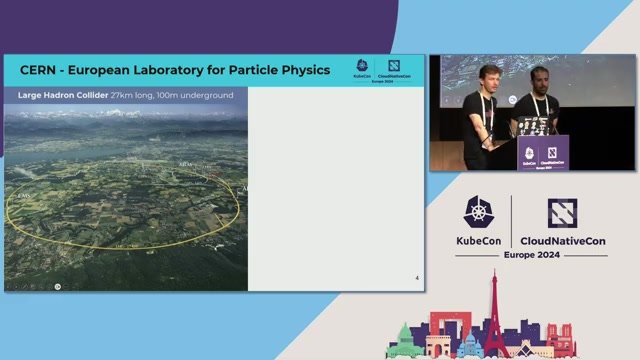
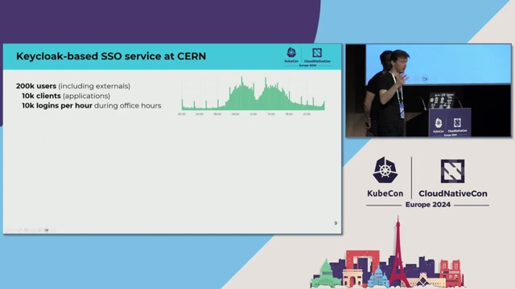
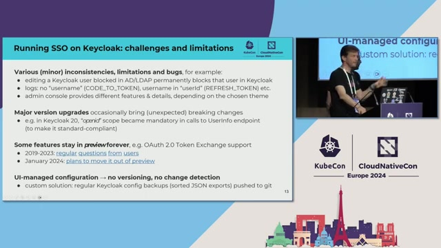
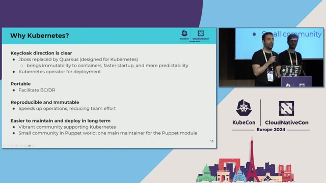
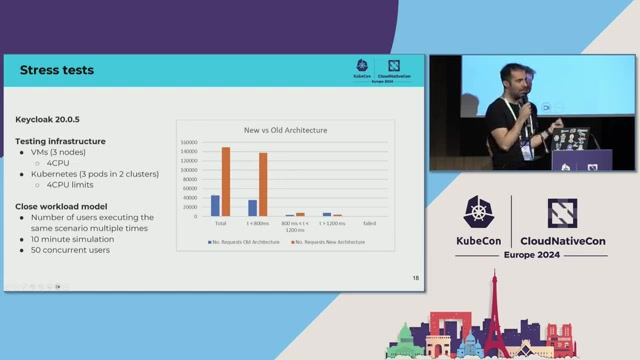
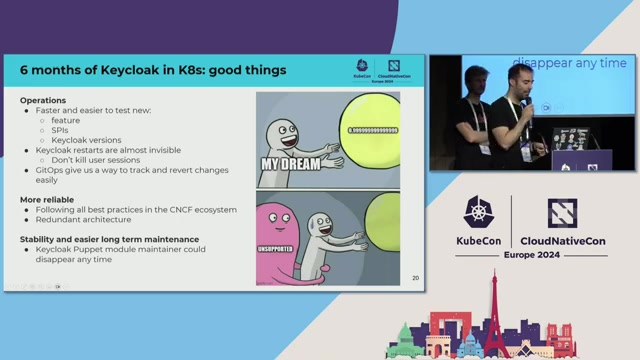
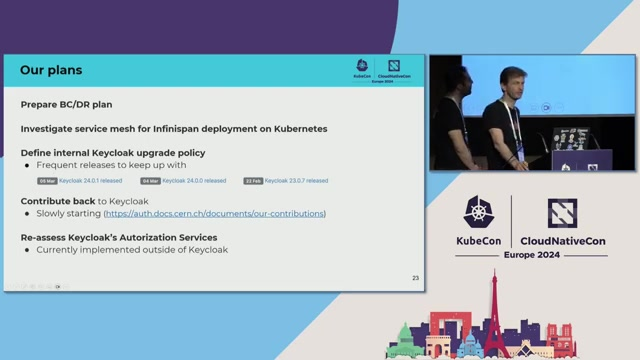

# [CERN](https://home.cern) Reference Architecture

> **Source:** [The Hard Life of Securing a Particle Accelerator - Antonio Nappi & Sebastian Lopienski, CERN](https://www.youtube.com/watch?v=rqDrrTKzNd8)  
> **Duration:** 38:51  
> **Speakers:** Antonio Nappi & Sebastian Lopienski

---

## Executive Summary

[CERN](https://home.cern), the European Organization for Nuclear Research, operates the Large Hadron Collider and provides computing infrastructure for over 15,000 scientists from around the world. The organization's single sign-on service, built on **[Keycloak](https://www.keycloak.org)**, serves 200,000 users, 10,000 OIDC clients, and handles 10,000 logins per hour during office hours. The SSO service is one of CERN's most critical IT systems — as the speakers stated, "if it goes down the whole CERN activities will be basically stopped."

The team migrated the SSO infrastructure from Puppet-managed virtual machines to a multi-cluster **[Kubernetes](https://kubernetes.io)** architecture with **[Argo CD](https://argoproj.github.io/cd/)** for [GitOps](https://glossary.cncf.io/gitops/)-based deployments. A key design decision was separating **[Keycloak](https://www.keycloak.org)** from its Infinispan cache into independent deployment units, making Keycloak effectively stateless. The observability stack was modernized with **[Prometheus](https://prometheus.io)** for monitoring and **[Fluent Bit](https://fluentbit.io)** for log collection.

Load testing demonstrated the new infrastructure was four times more efficient than the previous VM-based deployment. The load balancer failover time was reduced from 10-15 minutes to near-invisible, and Keycloak pod restarts now complete in 30-40 seconds with no user impact. In the six months following migration, the team reported zero incidents, compared to more frequent issues previously. Operational burden was reduced from consuming a substantial portion of the SSO team's time to "basically just a small fracture."

This reference architecture demonstrates how to operate a critical identity service on Kubernetes at scale for an international research organization with strict requirements for on-premises control, open-source tooling, and uninterrupted availability.

---

## Background

[CERN](https://home.cern) is a European laboratory for particle physics located near Geneva, Switzerland. The organization operates a number of particle accelerators, including the Large Hadron Collider (LHC) — a 27-kilometer ring located 100 meters underground where the Higgs boson was discovered in 2012, leading to a Nobel Prize in Physics in 2013. [CERN](https://home.cern) is also the birthplace of the World Wide Web, invented by Tim Berners-Lee in 1989.

*CERN's Large Hadron Collider, the 27-kilometer particle accelerator located 100 meters underground near Geneva, Switzerland (2:00)*

[CERN](https://home.cern) is an international organization with over 15,000 scientists from all around the world working together in what the speakers described as "peaceful collaboration for science." This international diversity creates specific requirements for their identity infrastructure — scientists come from all possible nationalities, and the organization cannot be subject to sanctions or export laws that might prevent certain users from authenticating.

The organization chose on-premises **[Keycloak](https://www.keycloak.org)** for several reasons. The technical infrastructure supporting particle accelerators "must not be interrupted" and computing systems including single sign-on "must really work while the machine is turning." The speakers explained that [CERN](https://home.cern) needs "full control over configuration of the system but also however release and patching cycle." The SSO service must also be available from CERN's internal industrial control systems network, described as "a private network with non-routable IP addresses" where machines "could not go to the cloud."

Open source is described as being "in our DNA" at [CERN](https://home.cern), compatible with initiatives such as open science and open access. The team wanted to avoid vendor lock-in and chose Keycloak because it "has a lot of big adopters which proves it works at scale," has "very strong user base," is "actively developed with many frequent releases," and is extensible to adapt to CERN-specific needs. [CERN](https://home.cern) began using Keycloak in 2018 starting with version 4.

*CERN SSO service scale: 200,000 users, 10,000 OIDC clients, and 10,000 logins per hour during office hours (8:00)*

---

## Technical Challenge

In late 2022, Antonio's team was asked to review the infrastructure of [CERN](https://home.cern)'s single sign-on service because there were performance issues. The existing deployment was entirely VM-based, managed with Puppet.

*Legacy VM-based SSO infrastructure: Puppet-managed VMs with coupled Keycloak and Infinispan, and HAProxy with 15-minute failover (18:00)*

The infrastructure consisted of a frontend layer with two HAProxy machines, one active and one passive. The speakers described the failover problem: "the switch between the two was almost taking 15 minutes, this means that if the active machine was going down there was 10-15 minutes where basically the Keycloak itself was not giving any, an error." This represented a significant availability gap for a service that must be running continuously.

Behind the load balancer sat multiple VMs across availability zones running **[Keycloak](https://www.keycloak.org)** processes coupled together with Infinispan in the same Java process. This coupling created several operational problems. When Keycloak needed SPI changes or upgrades, the team had to carefully coordinate to avoid losing user sessions — starting nodes one at a time, waiting for cache replication to complete before proceeding to the next. Since Keycloak and Infinispan shared a single JVM, it was "almost impossible to understand which process was using more CPU or more memory" when issues arose.

The entire infrastructure was maintained by Puppet, and as the speakers noted, "there was probably only one maintainer at that time that was constantly updating the Puppet module to the new version of Keycloak." The operational burden was significant — maintaining the infrastructure was described as consuming a substantial portion of the SSO team's time, with "more effort done to maintain this infrastructure up and running more than actually focus on needs of the end user of Keycloak."

Convincing management to invest in a migration was itself a challenge. The speakers noted that "the teams at CERN are extremely small and sometimes people don't see a reason to change if something works, even if there is a clear gain." The team needed to demonstrate that adding **[Kubernetes](https://kubernetes.io)** as a new layer would not degrade performance before receiving approval to proceed.

---

## Architecture Overview

The team proposed migrating from VMs to **[Kubernetes](https://kubernetes.io)**, and the choice was described as "quite easy" for several reasons. Keycloak's direction was clear: JBoss, the previous application server, was replaced by Quarkus, a Java framework designed for Kubernetes. **[Keycloak](https://www.keycloak.org)** also began providing a Kubernetes operator for deployment, making the transition significantly easier. Kubernetes made Keycloak more portable across multiple clouds and on-premises environments, and enabled reproducible, immutable deployments.

*New Kubernetes-based SSO architecture: GitOps with Argo CD, separated Keycloak/Infinispan, floating IP failover, and multi-cluster deployment (21:00)*

### Infrastructure Layer

The infrastructure layer consists of multiple **[Kubernetes](https://kubernetes.io)** clusters, each in a different availability zone. The speakers described following the "Kubernetes cattle service model" where Keycloak pods are disposable and replaceable. The load balancing layer was redesigned from a two-node HAProxy active/passive setup to a three-machine cluster using floating IPs, where failover is "almost invisible to end users." Infinispan runs separately on VMs as containers in Podman, with Puppet retained only to spawn the Podman process. The Infinispan cluster uses DNS aliases so three IPs sit behind a single DNS name.

### Platform Layer

Git serves as the single source of truth for all configuration. All settings — logging, monitoring, Keycloak operator configuration, and Keycloak CRDs — are stored in Git. **[Argo CD](https://argoproj.github.io/cd/)** automatically synchronizes these definitions to multiple Kubernetes clusters. Changes require merge requests with peer review, and rollbacks are performed by reverting to a previous Git commit. **[Prometheus](https://prometheus.io)**, which was already partially in use, was fully containerized as part of the migration. **[Fluent Bit](https://fluentbit.io)** replaced the previous Flume-based logging system, requiring all log parsing rules to be rewritten.

### Application Layer

The application layer centers on the Keycloak SSO service serving 200,000 users and 10,000 OIDC clients with 10,000 logins per hour during office hours. Keycloak is deployed via the Keycloak Operator using Custom Resource Definitions (CRDs). A critical design decision was separating Keycloak from Infinispan into independent deployment units. This makes Keycloak effectively stateless — pods can restart without losing user sessions because sessions are stored in the external Infinispan cluster. The CERN Authorization Service, a separate system managing identities, accounts, roles, levels of assurance, and approximately 80,000 groups, integrates with Keycloak via custom SPIs.

---

## Architecture Diagrams

This reference architecture includes two diagrams that illustrate the system from complementary perspectives: a component diagram showing the infrastructure after migration, and a data flow diagram showing how authentication requests traverse the system.

### Diagram 1: CERN SSO Infrastructure with Separated Keycloak and Infinispan

This component diagram shows the three-layer architecture of [CERN](https://home.cern)'s SSO infrastructure after migration to Kubernetes. At the infrastructure layer, the diagram shows the multi-availability-zone Kubernetes clusters hosting Keycloak pods, the HAProxy load balancer cluster with floating IPs, and the Infinispan cache running on VMs via Podman. The platform layer shows Git as the source of truth feeding into Argo CD, which synchronizes configuration to multiple Kubernetes clusters. Prometheus and Fluent Bit provide observability. At the application layer, the Keycloak SSO service connects to custom SPIs that integrate with the CERN Authorization Service managing approximately 80,000 groups.

The key relationship highlighted in this diagram is the deliberate separation between Keycloak (on Kubernetes) and Infinispan (on VMs with Podman), connected via a ConfigMap specifying remote server addresses with three IPs behind a DNS alias.

### Diagram 2: CERN SSO Authentication Request Flow

This data flow diagram traces the path of an authentication request from one of 200,000 end users through the system. A user accessing one of 10,000 OIDC client applications is redirected to the HAProxy load balancer cluster, which forwards the request to a Keycloak pod running on Kubernetes. The Keycloak pod reads and writes session data to the external Infinispan distributed cache, and fetches authorization data (roles, groups, levels of assurance) from the CERN Authorization Service via custom SPIs. The diagram also shows the parallel GitOps deployment pipeline where configuration changes flow from Git through Argo CD to the Kubernetes clusters, and the observability data flows from Keycloak to Prometheus and Fluent Bit.

---

## CNCF Projects

[CERN](https://home.cern)'s SSO architecture uses five CNCF projects, each serving a specific role in the overall system.

### Kubernetes (Container Orchestration)

**[Kubernetes](https://kubernetes.io)** (CNCF Graduated) serves as the primary [container orchestration](https://glossary.cncf.io/container-orchestration/) platform, hosting Keycloak pods across multiple clusters in different availability zones. Antonio described moving [CERN](https://home.cern)'s Java application infrastructure from VMs to Kubernetes starting in 2016, with the Keycloak deployment migrating to Kubernetes in September 2023.

The migration to Kubernetes was motivated by Keycloak's own evolution: JBoss was replaced by Quarkus, a Java framework designed for Kubernetes, and a Kubernetes operator was provided for deployment. Kubernetes makes Keycloak "much more portable" across clouds and on-premises environments, and enables "reproducible and immutable" deployments.

The multi-cluster architecture follows what Antonio described as the "Kubernetes cattle service model" where Keycloak pods are disposable. Pods can be killed and restarted in 30-40 seconds without user impact, because sessions are stored externally in Infinispan.

### Keycloak (Identity and Access Management)

**[Keycloak](https://www.keycloak.org)** (CNCF Incubating) provides the core single sign-on service for [CERN](https://home.cern). The speakers noted that Keycloak entered CNCF incubation in spring 2023. [CERN](https://home.cern) has used Keycloak since 2018 starting with version 4.

Keycloak supports the full range of CERN's authentication needs: multi-factor authentication (OTP and WebAuthn tokens), Kerberos authentication, identity federation with eduGAIN, social logins (Google, Facebook, GitHub, LinkedIn), and guest accounts. It serves 200,000 users and 10,000 OIDC clients.

The Keycloak Operator manages deployment on Kubernetes using Custom Resource Definitions (CRDs) that are stored in Git and synchronized by Argo CD. [CERN](https://home.cern) extends Keycloak with custom SPIs for integration with the CERN Authorization Service, custom login page theming, environment-aware admin console banners, an OTP validation endpoint for SSH 2FA, compromised password detection, and a custom CAPTCHA.

### Argo CD (Continuous Delivery)

**[Argo CD](https://argoproj.github.io/cd/)** (CNCF Graduated) provides [GitOps](https://glossary.cncf.io/gitops/)-based deployment synchronization. Git is the source of truth for all configuration — logging, monitoring, Keycloak operator settings, and Keycloak CRDs — and Argo CD automatically synchronizes these definitions to multiple Kubernetes clusters.

This approach replaced the previous Puppet-managed deployment model and introduced proper change tracking. Changes require merge requests with peer review, and rollbacks are performed by reverting to a previous Git commit. Antonio described himself as "a huge fan" of this approach.

### Prometheus (Monitoring)

**[Prometheus](https://prometheus.io)** (CNCF Graduated) provides monitoring for the Kubernetes-based infrastructure. It was already partially in use before the migration but was fully containerized as part of the move to Kubernetes. The speakers did not describe the specific Prometheus configuration in detail.

### Fluent Bit (Log Collection)

**[Fluent Bit](https://fluentbit.io)** (CNCF Graduated) replaced the previous Flume-based logging pipeline. Antonio mentioned that migrating to Fluent Bit required rewriting all the log parsing rules. The speakers did not describe the specific Fluent Bit configuration in detail.

### Project Summary

| Project | Category | Usage |
|---------|----------|-------|
| Kubernetes | Orchestration & Management | Multi-cluster container orchestration for Keycloak pods across availability zones |
| Keycloak | Security | Core SSO service for 200,000 users with custom SPIs and multi-factor authentication |
| Argo CD | Continuous Integration & Delivery | GitOps synchronization of Keycloak CRDs and config to multiple clusters |
| Prometheus | Observability and Analysis | Fully containerized monitoring for the Kubernetes-based infrastructure |
| Fluent Bit | Observability and Analysis | Log collection replacing Flume-based pipeline with rewritten parsing rules |

---

## Integration Patterns

The architecture's design relies on three primary integration patterns that were explicitly discussed by the speakers.

### Pattern 1: Cache Separation (Keycloak and Infinispan Split)

**Projects Involved:** [Kubernetes](https://kubernetes.io), [Keycloak](https://www.keycloak.org)

The most significant architectural decision was separating **[Keycloak](https://www.keycloak.org)** from Infinispan into independent deployment units. Previously, they shared the same Java process on VMs, making it impossible to determine which component was consuming CPU or memory. Antonio described this as "the real breakthrough of the infrastructure."

*Cache separation pattern: splitting Keycloak from Infinispan enables independent scaling, better resource visibility, and 30-40 second pod restarts (27:30)*

After separation, Keycloak becomes effectively stateless and can scale independently. Infinispan runs on VMs with Podman (not on Kubernetes, because as Antonio explained, "multi-cluster approaches with stateful workloads are not best friends"). A ConfigMap containing the Infinispan remote server configuration is mounted into Keycloak pods via Kubernetes volumes, with three Infinispan IPs behind a DNS alias. The speakers noted that Keycloak and Infinispan scale differently — "Keycloak can be almost stateless, it can scale from zero to whatever, while Infinispan depending on how much times you replicate a cache, it has performance issues" past a certain threshold.

### Pattern 2: GitOps Multi-Cluster Deployment

**Projects Involved:** [Argo CD](https://argoproj.github.io/cd/), [Kubernetes](https://kubernetes.io), [Keycloak](https://www.keycloak.org)

Git serves as the single source of truth for all Keycloak infrastructure configuration. **[Argo CD](https://argoproj.github.io/cd/)** automatically synchronizes CRDs, operator settings, logging configuration, and monitoring configuration across multiple [Kubernetes](https://kubernetes.io) clusters in different availability zones. Changes require merge requests with peer review, and rollbacks are performed by reverting to a previous Git commit.

This pattern replaced the Puppet-managed deployment model where configuration tracking was limited. Sebastian also described a complementary approach for database-stored configuration: regularly dumping Keycloak realm configuration as JSON with sorted fields for comparability, then pushing to Git for change tracking.

### Pattern 3: Floating IP Failover for Load Balancing

**Projects Involved:** [Kubernetes](https://kubernetes.io)

The previous infrastructure used two HAProxy machines (one active, one passive) where failover took 10-15 minutes, during which Keycloak returned errors. The new architecture uses a cluster of three machines with floating IPs — when the active machine goes down, the IP is moved to a passive node. Antonio stated they "don't have basically down time for that," making failover nearly invisible to end users.

---

## Implementation Details

[CERN](https://home.cern) deployed Keycloak to **[Kubernetes](https://kubernetes.io)** in September 2023. Before proceeding with the migration, the team needed to demonstrate to management that adding a virtualization layer (Kubernetes) would not degrade performance, because "the teams at CERN are extremely small and sometimes people don't see a reason to change if something works."

### Performance Validation

The team upgraded to **[Keycloak](https://www.keycloak.org)** version 20 and conducted stress tests using a closed workload model with approximately 550 concurrent users executing the same scenario repeatedly for 10 minutes. The results showed that "the new infrastructure based on Kubernetes and separation of Keycloak from Infinispan was four times more efficient than the previous one and we were able to handle much more requests than before." This was described as "a way to get the green light from management to go forward."

*Load test results: Kubernetes infrastructure with separated Keycloak/Infinispan delivers 4x efficiency improvement over VM-based deployment (25:00)*

### Keycloak-Infinispan Separation Configuration

The Keycloak-Infinispan separation required specific Kubernetes configuration. The team created a ConfigMap from the Infinispan configuration specifying remote server addresses. The Infinispan cluster was set up with DNS aliases so three IPs sat behind a single DNS name. This ConfigMap was mounted into Keycloak pods as a volume, and the "cache config file" option told Keycloak where to find it.

*Kubernetes ConfigMap configuration connecting Keycloak pods to the external Infinispan cluster via DNS aliases (30:00)*

Antonio noted that in early 2023, this approach was not well documented — "I had to dig a lot in GitHub issues to find some examples, people that were trying the same, but it was not well documented." The documentation was later updated with the multi-site setup.

### Infinispan Deployment Decision

The team chose to keep Infinispan on VMs with Podman rather than moving it to Kubernetes. As Antonio explained, "multi-cluster approaches with stateful workloads are not best friends." Puppet was retained in a minimal role, only to spawn the Podman container.

### Post-Migration Resilience Incident

During the first week after the Kubernetes migration, the team encountered an issue with Java settings being too low, causing all pods to restart every 3 hours for 3 days. Despite this, there were no user complaints. Antonio described this as a demonstration of the architecture's resilience: the SSO service "is fully utilized basically every day because of course we have people at CERN that work from 8 to 6 PM but there are also people in the states, in Asia that are connecting through the SSO at any time, even in the night."

### Observability Migration

The observability infrastructure was also overhauled as part of the migration. The Flume-based logging pipeline was replaced with **[Fluent Bit](https://fluentbit.io)**, requiring all parsing rules to be rewritten. **[Prometheus](https://prometheus.io)**, which was already partially in use, was fully containerized. The speakers did not describe additional details about the observability migration process.

---

## Deployment Architecture

### Multi-Cluster Kubernetes Deployment

[CERN](https://home.cern)'s Keycloak deployment runs across multiple **[Kubernetes](https://kubernetes.io)** clusters, each in a different availability zone. The speakers described this as following the "Kubernetes cattle service model" where clusters and pods are disposable and replaceable. The exact number of Kubernetes clusters was not specified in the presentation.

### Load Balancer Architecture

The load balancing layer consists of a three-machine HAProxy cluster using floating IP addresses. When the active machine goes down, the IP is moved to one of the passive nodes, providing near-invisible failover. This replaced the previous two-node active/passive HAProxy setup where failover took 10-15 minutes.

### Infinispan Deployment

Infinispan runs separately from Kubernetes on VMs, deployed as containers in Podman. Puppet is retained only to spawn the Podman container. The Infinispan cluster uses DNS aliases so three IPs sit behind a single DNS name. The decision to keep Infinispan outside Kubernetes was intentional — Antonio explained that "multi-cluster approaches with stateful workloads are not best friends."

### GitOps Deployment Pipeline

All configuration is stored in Git and synchronized to clusters by **[Argo CD](https://argoproj.github.io/cd/)**. This includes Keycloak CRDs, operator configuration, logging settings, and monitoring definitions. Changes go through merge requests with peer review. Rollbacks are performed by reverting to a previous Git commit.

Sebastian described a complementary approach for tracking configuration that lives in the Keycloak database rather than in Git: a custom solution regularly dumps realm configuration as JSON, sorts the fields and objects so they are comparable, and pushes the result to Git. This provides change tracking for database-stored configuration, creating a new Git commit whenever something changes.

The presentation did not cover details about staging environments, deployment promotion strategies, or CI/CD pipeline specifics beyond the Argo CD GitOps synchronization.

---

## Security Considerations

This presentation is specifically about securing a particle accelerator, and security is a central topic. [CERN](https://home.cern)'s **[Keycloak](https://www.keycloak.org)** deployment implements comprehensive identity and access management security measures.

### Authentication Methods

[CERN](https://home.cern) supports multiple authentication mechanisms through Keycloak: multi-factor authentication with time-based one-time passwords (OTP) and WebAuthn tokens (including hardware tokens and biometric devices such as fingerprint readers), Kerberos authentication, identity federation with eduGAIN (allowing users to log in with their university credentials), social logins (Google, Facebook, GitHub, LinkedIn), and guest accounts for users without other identity options. The service supports standard protocols: OAuth 2.0, OIDC, SAML, and Kerberos.

### Custom Security Extensions

[CERN](https://home.cern) developed several security-focused Keycloak extensions using custom SPIs:

- **OTP validation endpoint:** Exposes an endpoint that confirms if a given one-time password code is currently valid for a given user. This is used by a custom PAM module in SSH servers to enforce 2FA on SSH access to sensitive machines and bastion hosts, providing the same OTP for both web access and SSH access.

- **Compromised password detection:** When a user logs in, the password hash is compared against a database of compromised passwords sourced from Have I Been Pwned and other security sources. This detects if a password has appeared in known data breaches.

- **Custom CAPTCHA:** Replaces the default Google reCAPTCHA for guest account registration. This was implemented for privacy reasons and for availability reasons — ensuring that "people could register their guest accounts from countries where Google is perhaps blocked or not available."

### Security Event Monitoring

The computer security team analyzes Keycloak login logs for suspicious activities, including connections from unknown or suspicious locations. Users receive notifications when connections are detected from locations they have not used before. The team also monitors for users sending an unreasonable volume of login requests (described as 10,000 logins in less than 10 minutes) and would like more autonomous mechanisms to react to this kind of abuse.

---

## Observability and Operations

### Monitoring and Logging Stack

The migration to **[Kubernetes](https://kubernetes.io)** included a complete overhaul of the observability infrastructure. **[Prometheus](https://prometheus.io)** was already partially in use but was fully containerized as part of the move. **[Fluent Bit](https://fluentbit.io)** replaced the previous Flume-based logging pipeline, and Antonio noted that they "had to rewrite all the parsing" rules when making this switch.

The observability configuration is stored in Git alongside other infrastructure configuration and synchronized to clusters by **[Argo CD](https://argoproj.github.io/cd/)**. The presentation did not cover specific details about Prometheus alerting rules, Fluent Bit parsing configurations, dashboards, or log storage backends.

### Operational Improvements

The migration significantly reduced operational burden. The speakers described the change as dramatic: "the time that we are spending on the operation and on the infrastructure is much less than it was before. Before was basically impacting the time of the SSO team. Now is basically just a small fracture that they have to do from time to time, for example like upgrade Keycloak."

Operations became faster and easier due to the cache separation pattern. Previously, upgrading Keycloak SPIs required careful coordination — starting nodes one at a time, waiting for cache replication to complete. After separation, the team can simply restart Keycloak pods, which come back up in 30-40 seconds without any loss of user sessions.

### Configuration Change Tracking

The [GitOps](https://glossary.cncf.io/gitops/) approach with Argo CD introduced proper change tracking through merge requests with peer review. Sebastian also described a custom solution for tracking Keycloak's database-stored configuration: regularly dumping realm exports and other settings, sorting the JSON fields and objects so they are comparable, and pushing to Git. This creates a commit whenever configuration changes, providing traceability that the admin console alone does not offer. Sebastian recommended this approach to other Keycloak administrators.

*Migration results: faster operations, GitOps change tracking, six months incident-free, and reduced operational burden for the SSO team (32:30)*

### Admin Console Challenges

The speakers noted several challenges with managing Keycloak via the admin console: no versioning of configuration, no change detection, and limited traceability of who changed what. These limitations are partially addressed by the custom realm export approach and by storing CRD-based configuration in Git. Sebastian noted that managing Keycloak primarily through the admin console means "there's no really way to track changes" for database-stored settings without supplementary tooling.

---

## Results and Impact

The migration from VMs to **[Kubernetes](https://kubernetes.io)** delivered measurable improvements across performance, reliability, and operational efficiency.

### Performance

| Metric | Before | After | Source |
|--------|--------|-------|--------|
| Load test efficiency | Baseline (VM-based, coupled Keycloak/Infinispan) | 4x more efficient | "the new infrastructure based on Kubernetes and separation of Keycloak from Infinispan was four times more efficient than the previous one" |
| Pod restart time | Coordinated multi-node restart with cache replication waits | 30-40 seconds | "now is just you kill the pod, it's up in 30, in 40 seconds and that's it and you are happy and no one sees anything" |
| Load balancer failover | 10-15 minutes | Near-invisible | "the switch between the two was almost taking 15 minutes" vs. current floating IP approach |

The load test used a closed workload model with 550 concurrent users executing the same scenario for 10 minutes. The results showed that the Kubernetes-based infrastructure with separated Keycloak and Infinispan handled significantly more requests than the previous VM-based setup.

### Reliability

Antonio reported that in the six months since the September 2023 migration, the team "never had any issue, while before was happening a bit more often." The architecture provides redundancy across multiple availability zones.

The resilience of the new architecture was demonstrated during the first week when misconfigured Java settings caused pods to restart every 3 hours for 3 days. Despite this, "there was no complaint" from users — sessions survived pod restarts because they were stored externally in Infinispan.

### Operational Efficiency

Operational burden was substantially reduced. The speakers described the change: "the time that we are spending on the operation and on the infrastructure is much less than it was before. Before was basically impacting the time of the SSO team. Now is basically just a small fracture that they have to do from time to time." The GitOps approach with Argo CD introduced proper change tracking and easy rollbacks.

### Service Scale

The SSO service operates at the following scale, which has been maintained through and after the migration:

| Metric | Value | Source |
|--------|-------|--------|
| Total users | 200,000 | "we have 200,000 users including external people who connect to CERN" |
| OIDC clients | 10,000 | "we have 10,000 OIDC clients which is mostly web applications" |
| Logins per hour (office hours) | 10,000 | "we have 10,000 logins per hour during office hours" |

### Key Metrics

| Metric | Improvement | Business Impact |
|--------|-------------|-----------------|
| Load Test Performance | VM-based baseline → 4x more efficient on Kubernetes with separated Keycloak/Infinispan | Justified migration to management and demonstrated Kubernetes does not degrade performance |
| Load Balancer Failover Time | 10-15 minutes → near-invisible with floating IP | Eliminated extended SSO outages during load balancer failover events |
| Keycloak Pod Restart Time | Coordinated multi-node restart → 30-40 seconds with no user impact | Simplified operations and made SPI upgrades routine rather than high-risk |
| Post-Migration Reliability | Periodic issues → zero incidents in six months | Uninterrupted SSO availability for critical particle accelerator operations |
| Operational Burden | Consuming substantial SSO team time → "small fracture" of time spent on infrastructure | Team can focus on end-user needs instead of infrastructure maintenance |
| SSO Scale | 200,000 users, 10,000 OIDC clients, 10,000 logins/hour | Supports all CERN scientists and collaborators worldwide with high availability |

---

## Lessons Learned

The speakers identified several challenges, open questions, and future directions during the presentation.

### What Worked Well

**Cache separation pattern:** Separating Keycloak from Infinispan was described as "the real breakthrough of the infrastructure." It enabled independent scaling, clearer resource visibility, and dramatically simplified operations by making Keycloak effectively stateless. The speakers drew on their broader experience with Java applications and caching.

**[GitOps](https://glossary.cncf.io/gitops/) with Argo CD:** Moving to a Git-based source of truth with **[Argo CD](https://argoproj.github.io/cd/)** synchronization introduced proper change tracking, peer review through merge requests, and easy rollbacks by reverting Git commits. This was a significant improvement over Puppet-based configuration management.

**Performance validation:** Conducting load tests to demonstrate 4x efficiency improvement was critical for management approval.

### Challenges and Open Questions

**Keycloak CRD "unsupported" field:** Antonio described the difficulty of presenting to management when a useful and stable CRD field is labeled "unsupported" — "people are a bit scared when they see why there is unsupported in something that is running in production." The field has been there for years and is extremely useful, but the label creates concern.

**Infinispan as a required dependency:** The speakers raised what they described as a "provocative" question: "Keycloak is part of CNCF but Infinispan that is basically required to run is not, so what is the future of that?" When asked about Redis as an alternative, Antonio explained that Keycloak only supports Infinispan as its cache system.

**Keycloak upgrade strategy:** The team needs to define how far behind the latest Keycloak release they want to stay and whether to apply every minor version. They noted the rapid release cadence and that they would "never go with production for the .0 new major release."

### Future Plans

*CERN's SSO infrastructure roadmap: BCDR planning, service mesh for Infinispan, and community contributions (35:00)*

The team's planned work includes:

- **BCDR plan:** Preparing a Business Continuity and Disaster Recovery plan because, as the speakers stated, "if it goes down the whole CERN activities will be basically stopped."
- **Service mesh for Infinispan:** Investigating service mesh to run multiple Infinispan instances across clusters or to leverage Keycloak's multi-site deployment capability that was recently advertised on the Keycloak blog.
- **Contributing back:** The team wants to contribute CERN-developed extensions back to the Keycloak community. They described having "very slowly started" but believing "the community deserves more."
- **Reassessing authorization service:** Considering whether to adopt Keycloak's built-in authorization service instead of maintaining their separate CERN authorization service, which was originally built in 2018 when Keycloak "was still much less mature than now."

---

## Conclusion

Both speakers concluded with strong endorsements: they are "very happy with Keycloak" and "very happy with the move to Kubernetes hosting." [CERN](https://home.cern) has no plans to change from either technology. Keycloak was described as "great software with strong community behind" and Kubernetes as "obviously the mainstream supported approach to host Keycloak" that provides "much more reliable infrastructure."

The migration from Puppet-managed VMs to multi-cluster **[Kubernetes](https://kubernetes.io)** with **[Argo CD](https://argoproj.github.io/cd/)**-based [GitOps](https://glossary.cncf.io/gitops/) deployments transformed [CERN](https://home.cern)'s SSO operations. The cache separation pattern — running **[Keycloak](https://www.keycloak.org)** on Kubernetes and Infinispan on VMs with Podman — proved to be the most impactful design decision, delivering 4x efficiency improvement in load tests, 30-40 second pod restarts with no user impact, and six months of incident-free operation.

Looking forward, [CERN](https://home.cern) plans to develop a BCDR plan for this critical service, investigate service mesh for Infinispan deployment, contribute extensions back to the Keycloak community, and reassess whether to adopt Keycloak's built-in authorization capabilities. The architecture serves as a reference for other organizations operating critical identity infrastructure on Kubernetes at scale, particularly those with requirements for on-premises deployment, open-source tooling, and strict availability guarantees.

---

## About This Reference Architecture

**Company:** [CERN](https://home.cern)  
**Industry:** Research / Particle Physics  
**Publication Date:** 2026-02-12  
**Generated by:** [casestudypilot](https://github.com/cncf/casestudypilot) reference-architecture-agent v1.0.0  
**Source Video:** [https://www.youtube.com/watch?v=rqDrrTKzNd8](https://www.youtube.com/watch?v=rqDrrTKzNd8)  
**TAB Status:** Proposed (pending submission)  
**Architectural Significance:** Demonstrates migration of a critical SSO service from VMs to multi-cluster Kubernetes with cache separation pattern, serving 200,000 users at a major international research organization

### CNCF TAB Submission

This reference architecture is ready for submission to the CNCF Technical Advisory Board. To submit:

1. Review this reference architecture for technical accuracy
2. Create an issue at: https://github.com/cncf/tab/issues/new
3. Select "Reference Architecture Submission" template
4. Provide link to this reference architecture
5. TAB will review within 2-4 weeks

For more information on the TAB review process, see: https://github.com/cncf/tab/blob/main/process/reference-architectures.md

---

## License

This reference architecture is licensed under the Creative Commons Attribution 4.0 International License.  
© 2026-02-12 Cloud Native Computing Foundation