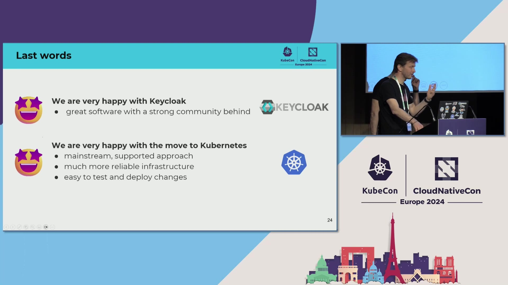

# Reference Architecture: CERN Keycloak SSO on Multi-Cluster Kubernetes

> High-Availability Identity Management for 200,000 Users with GitOps and Distributed Caching

**Company:** CERN  
**Industry:** Scientific Research & Education  
**Video:** [Watch on YouTube](https://www.youtube.com/watch?v=rqDrrTKzNd8)  
**Publication Date:** 2026-02-10

---

## Executive Summary

CERN, the European Organization for Nuclear Research, operates one of the world's largest and most complex IT infrastructures supporting particle physics research. Managing authentication and authorization for 200,000 users, 10,000 OIDC clients, and handling 10,000 logins per hour requires a robust, highly available identity management system. This reference architecture describes CERN's migration of their Keycloak-based single sign-on service from legacy VM infrastructure to a cloud-native Kubernetes platform. The architecture employs multiple Kubernetes clusters across availability zones following the "cattle service model," GitOps-based deployment automation with Argo CD, and distributed caching with Infinispan to enable stateless application design. The migration, completed in September 2023, eliminated 15-minute failover times, improved operational efficiency, and laid the foundation for modernizing CERN's entire application portfolio. This architecture demonstrates how critical authentication services can be successfully migrated to Kubernetes while maintaining security requirements for a research organization handling sensitive particle accelerator control systems.

---

## Background

CERN operates the Large Hadron Collider and numerous other particle physics experiments, requiring robust IT infrastructure to support thousands of researchers worldwide. The organization's IT landscape includes approximately 250,000 cores of computing power, vast data storage systems, and complex control systems for particle accelerators. Authentication and authorization are mission-critical—a failure in identity management could impact not just research activities but also the safe operation of particle accelerators. CERN's legacy authentication infrastructure relied on Keycloak running on virtual machines managed by Puppet, with an active-passive HAProxy load balancer setup. This architecture, while functional, posed several challenges: manual failover processes taking up to 15 minutes, limited scalability, and operational complexity in managing VM-based infrastructure. The organization needed to modernize this critical service while maintaining the high availability and security requirements demanded by their research mission. The decision to migrate to Kubernetes aligned with CERN's broader cloud-native strategy and offered opportunities for improved resilience through multi-cluster deployment, simplified operations through GitOps automation, and better resource utilization through containerization. This modernization effort serves as a pathfinder for migrating CERN's 900+ other services to cloud-native architectures, making the success of this project crucial for the organization's digital transformation strategy.

---

## Technical Challenge

CERN's legacy Keycloak deployment faced several critical technical challenges that necessitated architectural modernization. The most pressing issue was the active-passive HAProxy load balancer configuration, which required manual failover procedures taking up to 15 minutes—an unacceptable downtime window for a service handling 10,000 logins per hour. This architecture created a single point of failure and limited the system's ability to handle zone-level outages gracefully. The VM-based infrastructure management through Puppet added operational complexity, requiring manual intervention for scaling and updates, and lacked the self-healing capabilities of modern orchestration platforms. Session state management posed another significant challenge: the legacy architecture relied on local session storage, making horizontal scaling difficult and failover scenarios complex. Any pod restart or failover required session reconstruction, impacting user experience. The logging infrastructure based on Flume and the monitoring setup were tightly coupled to the VM environment, making observability fragmented and difficult to manage across multiple instances. Configuration management was performed through a mix of Puppet manifests and manual changes, creating drift between environments and making it challenging to maintain consistency across availability zones. The architecture lacked true automation for deployment and rollback procedures, requiring manual coordination between teams for any infrastructure changes. Security requirements for a research organization handling sensitive accelerator control systems demanded mTLS communication, proper secret management, and compliance with specific policies—all of which were harder to enforce consistently in the VM-based environment. Finally, the organization needed to prove that Kubernetes could meet the stringent availability requirements before committing to migrating hundreds of other services, making this a high-stakes pathfinder project requiring careful planning and validation.

---

## Architecture Overview

The modernized CERN Keycloak architecture follows a cloud-native, multi-cluster approach designed for high availability and operational efficiency. At the infrastructure layer, multiple independent Kubernetes clusters are deployed across different availability zones, following the "cattle service model" where clusters are treated as replaceable units rather than carefully maintained pets. This approach enables zone-level failures to be handled gracefully without manual intervention. Instead of the legacy active-passive HAProxy setup, the new architecture employs a three-node floating IP load balancer cluster that provides automatic failover without the previous 15-minute downtime window. This load balancer distributes traffic across Keycloak pods running in multiple Kubernetes clusters, ensuring continuous availability even if an entire availability zone becomes unavailable. The platform layer introduces several critical components that enable operational excellence. The Keycloak Operator manages the lifecycle of Keycloak instances within Kubernetes, handling deployment, scaling, and configuration updates declaratively. This operator-based approach eliminates much of the manual operational overhead present in the VM-based architecture. Argo CD implements GitOps principles, treating a Git repository as the single source of truth for all infrastructure configuration, including Keycloak Custom Resource Definitions (CRDs), monitoring configurations, and logging setups. Any change to the Git repository automatically propagates to all Kubernetes clusters, ensuring configuration consistency and enabling easy rollback through Git history. The observability stack replaces legacy monitoring and logging solutions with cloud-native alternatives: Prometheus for metrics collection and Fluent Bit for log aggregation with custom parsing rules specific to Keycloak's log format. These tools integrate seamlessly with the Kubernetes environment and provide better visibility into application behavior. A crucial architectural decision was the separation of the Infinispan cache cluster from the Kubernetes infrastructure. This distributed cache runs on dedicated VMs using Podman containers, managed through Puppet for configuration. Keycloak connects to Infinispan remotely via the HotRod protocol, with discovery handled through DNS aliases. This design enables truly stateless Keycloak pods—any pod can serve any request because session data and user attributes are stored in the shared cache. The ConfigMap and volume mount mechanism allows Keycloak to configure its remote cache connection, maintaining the clean separation between application logic and session storage. At the application layer, Keycloak instances run as stateless pods on the Quarkus framework, which was designed specifically for Kubernetes environments with fast startup times and low memory footprint. Custom Service Provider Interfaces (SPIs) enable integration with CERN's existing authorization services, custom themes for branding, and specialized OTP validation endpoints. The stateless design, enabled by remote caching, allows for horizontal scaling simply by adding more pods without concern for session affinity or state migration.

*Figure 1: Architecture Component*

*Figure 2: Architecture Component*

*Figure 3: Architecture Component*

*Figure 4: Architecture Component*

*Figure 5: Architecture Component*

*Figure 6: Architecture Component*

---

## Architecture Diagrams

Three complementary diagrams illustrate different aspects of CERN's Keycloak architecture. The Component Diagram shows the complete system with nine key components organized into three layers: infrastructure (multi-cluster Kubernetes, floating IP load balancers, Infinispan cache), platform (Keycloak Operator, Argo CD, Git repositories, Prometheus, Fluent Bit), and application (Keycloak application). This diagram emphasizes the GitOps workflow where Argo CD continuously synchronizes configuration from Git to all Kubernetes clusters, the operator-managed lifecycle of Keycloak pods, and the critical remote caching connection between stateless Keycloak instances and the Infinispan cluster. Annotations highlight key metrics: 200,000 users and 10,000 OIDC clients for Keycloak, automatic failover with no downtime for the load balancer, multi-availability-zone deployment following the cattle model, and GitOps as the single source of truth. The Data Flow Diagram traces an authentication request through the system, from user browser through the floating IP load balancer to Keycloak pods in different availability zones. It shows how each pod queries the Infinispan cache for existing sessions (cache hit returns immediately, cache miss triggers full authentication), validates credentials against CERN's authorization service via custom SPI, and returns JWT session tokens to users. This diagram emphasizes the 10,000 logins per hour capacity, automatic failover if a zone becomes unavailable, shared cache enabling stateless architecture, and DNS-based discovery of cache nodes. The Deployment Diagram illustrates the multi-cluster reality with three Kubernetes clusters across availability zones A, B, and C. Argo CD sits above all clusters, monitoring the Git configuration repository for changes and synchronizing them across all environments. Each cluster runs independent Keycloak pods managed by operators, with all pods connecting to the shared Infinispan VM cluster. This diagram highlights the vertical organization from GitOps control plane through zone-specific clusters to shared caching infrastructure, showing how the architecture achieves high availability through distribution while maintaining operational consistency through automation. Key annotations include GitOps automation at the control plane level, cattle model clusters that are replaceable rather than precious, and the separation of Infinispan from Kubernetes with Puppet-based management—a pragmatic decision to minimize risk during migration.

---

## CNCF Projects

CERN's architecture leverages six CNCF projects, each serving a specific purpose in the overall system. Kubernetes (CNCF Graduated) serves as the primary container orchestration platform, hosting Keycloak pods across multiple clusters in different availability zones. The migration from VM-based infrastructure to Kubernetes occurred in September 2023, moving from puppet-managed VMs to operator-managed containers. The multi-cluster approach treats each Kubernetes cluster as cattle rather than pets—clusters are replaceable and zone failures are handled gracefully without manual intervention. The choice of Kubernetes enabled the stateless application design through pod ephemerality and automatic rescheduling, and provided the foundation for operator-based lifecycle management of complex applications like Keycloak. Keycloak (CNCF Incubation, joined Spring 2023) is the open source identity and access management solution at the heart of this architecture. It provides single sign-on with multi-factor authentication for 200,000 users, manages 10,000 OIDC clients, and handles 10,000 logins per hour. CERN runs Keycloak on the Quarkus framework, designed specifically for Kubernetes with fast startup and low memory footprint. Custom SPIs (Service Provider Interfaces) enable integration with CERN's existing authorization backend, custom themes for organizational branding, and specialized OTP validation endpoints. The operator-based deployment model allows declarative management of Keycloak instances through Kubernetes CRDs, significantly reducing operational complexity compared to the legacy VM-based approach. Argo CD (CNCF Graduated) implements GitOps principles, making Git the single source of truth for all infrastructure configuration. The tool continuously monitors Git repositories containing Keycloak operator CRDs, configurations for monitoring and logging, and custom resource definitions. When changes are committed to Git, Argo CD automatically synchronizes them across all Kubernetes clusters in different availability zones. This approach eliminates configuration drift between environments, enables easy rollback through Git history, and provides clear audit trails for all infrastructure changes. The GitOps workflow proved essential for managing consistent configuration across multiple clusters while maintaining operational velocity. Prometheus (CNCF Graduated) replaced legacy monitoring solutions with cloud-native metrics collection. The tool integrates naturally with the Kubernetes environment, collecting Keycloak performance metrics, resource utilization data, and cluster health information. Prometheus's pull-based model and dimensional data model provide better observability compared to the previous monitoring setup, enabling operators to quickly identify performance issues and resource bottlenecks. Fluent Bit (CNCF Graduated subproject of Fluentd) handles log aggregation, replacing the legacy Flume-based logging infrastructure. Custom parsing rules are applied to Keycloak's application logs before forwarding to centralized logging systems. The lightweight footprint of Fluent Bit (compared to Fluentd) makes it well-suited for deployment as a DaemonSet in Kubernetes, minimizing resource overhead while providing comprehensive log coverage across all pods. Podman (CNCF Member, not a hosted project) serves a specialized role running Infinispan cache clusters on VMs separate from the Kubernetes infrastructure. This pragmatic decision maintains the existing Puppet-based configuration management for the cache layer while the application layer migrates to Kubernetes. Podman's Docker-compatible interface and rootless container capabilities provide security benefits over traditional Docker deployments, aligning with CERN's security requirements for infrastructure handling particle accelerator control authentication.

### Project Summary

| Project | Category | Usage |
|---------|----------|-------|

| Kubernetes | Orchestration & Management | Primary container orchestration across multiple clusters in different availability zones, operator-based Keycloak deployment, cattle service model |

| Keycloak | Security & Identity | Open source identity and access management for 200,000 users, 10,000 OIDC clients, 10,000 logins/hour with custom SPIs for CERN integration |

| Argo CD | CI/CD | GitOps continuous deployment synchronizing configuration from Git to all Kubernetes clusters, single source of truth for infrastructure |

| Prometheus | Observability | Metrics collection for Keycloak performance, resource utilization, and system health across multi-cluster deployment |

| Fluent Bit | Observability | Lightweight log aggregation with custom parsing rules for Keycloak application logs, replacing legacy Flume infrastructure |

| Podman | Runtime | Container runtime for Infinispan cache clusters on VMs, separate from Kubernetes infrastructure, Puppet-managed configuration |

---

## Integration Patterns

Three primary integration patterns characterize CERN's architecture, demonstrating how CNCF projects work together to enable reliable SSO service. The Operator Pattern represents the most significant architectural improvement, replacing manual VM management with declarative, automated lifecycle control. The Keycloak Operator runs within Kubernetes and watches for Keycloak Custom Resources (CRs). When operators create or modify a Keycloak CR specifying desired state (number of replicas, resource limits, configuration), the operator reconciles actual state with desired state by creating pods, configuring services, mounting volumes, and applying configuration. This pattern eliminates the manual deployment procedures required in the VM-based architecture and enables self-healing behavior—if a pod fails, the operator automatically creates a replacement. The operator also handles rolling updates gracefully, ensuring zero-downtime deployments when configuration changes. The GitOps Integration Pattern with Argo CD creates a fully automated deployment pipeline from Git commits to production clusters. Developers commit Keycloak operator CRDs, monitoring configurations, and logging setups to Git repositories. Argo CD polls these repositories, detects changes, compares desired state with actual cluster state, and executes synchronization to align clusters with Git. This pattern provides several critical benefits: Git becomes the single source of truth, eliminating configuration drift across availability zones; rollback is as simple as reverting a Git commit; all changes have clear audit trails with Git history; and configuration is applied consistently across all clusters automatically. The pattern proved essential for managing three separate Kubernetes clusters while maintaining operational velocity and consistency. The Remote Caching Integration Pattern enables stateless Keycloak design by separating session storage from application logic. Keycloak pods connect to Infinispan cache clusters via the HotRod protocol (a binary protocol optimized for remote caching). Configuration is injected through Kubernetes ConfigMaps specifying cache server endpoints and volumes mounting additional configuration files. DNS-based discovery allows Keycloak to locate cache nodes dynamically without hardcoded IP addresses. This pattern provides crucial flexibility: Keycloak pods are truly stateless and can be destroyed/recreated freely; session data persists in Infinispan independent of pod lifecycle; horizontal scaling is simplified since any pod can serve any request; and the cache layer remains on VMs managed by Puppet, minimizing migration risk. The separation also allows independent scaling of compute (Keycloak pods) and caching (Infinispan nodes) based on different resource requirements. A fourth Supporting Pattern around Observability Integration shows how Prometheus and Fluent Bit work together to provide comprehensive system visibility. Keycloak pods expose metrics endpoints that Prometheus scrapes, while application logs are captured by Fluent Bit agents running as DaemonSets. This pattern replaces fragmented legacy monitoring with unified observability, enabling operators to correlate metrics and logs for effective troubleshooting. The cloud-native observability stack integrates seamlessly with Kubernetes, automatically discovering new pods and collecting data without manual configuration.

---

## Implementation Details

CERN's migration from VM-based Keycloak to multi-cluster Kubernetes followed a phased approach emphasizing risk mitigation and validation at each step. The implementation began with infrastructure preparation, deploying multiple Kubernetes clusters across different availability zones. Each cluster was configured independently following the cattle service model philosophy, ensuring clusters could be treated as replaceable units. The floating IP load balancer cluster was implemented with three nodes, replacing the legacy active-passive HAProxy setup. This new load balancer configuration provided automatic failover without the previous 15-minute manual failover window. Next, the team deployed the Keycloak Operator in each Kubernetes cluster. This required creating Custom Resource Definitions (CRDs) that describe Keycloak deployments declaratively. The operator installation followed standard practices: applying CRD manifests, deploying the operator controller in a dedicated namespace, granting necessary RBAC permissions for the operator to manage Keycloak resources. The team then configured Argo CD for GitOps-based deployment. This involved connecting Argo CD to Git repositories containing Keycloak configurations, setting up ApplicationSets to manage multiple clusters, and configuring sync policies (automatic vs. manual, pruning policies, self-healing). The GitOps repository structure was organized with base configurations and cluster-specific overlays, enabling shared configuration while allowing per-cluster customization when necessary. The remote caching integration required careful configuration. Infinispan cache clusters were deployed on separate VMs using Podman containers, continuing to use Puppet for configuration management to minimize migration risk. Keycloak pods were configured to connect remotely via HotRod protocol through ConfigMaps specifying cache endpoints and volumes mounting additional configuration. DNS aliases were set up for cache discovery, allowing Keycloak to locate cache nodes dynamically. Testing validated that session data persisted correctly in Infinispan and that Keycloak pods could be destroyed and recreated without losing user sessions. Custom SPI development enabled integration with CERN's existing authorization backend. The team implemented SPIs for authentication, authorization, and theme customization, packaging these as extensions loaded by Keycloak at startup. This approach preserved existing authorization logic while migrating the authentication frontend to Kubernetes. OTP validation endpoints were added as custom REST resources, extending Keycloak's API to support CERN-specific workflows. The observability stack deployment replaced legacy monitoring and logging. Prometheus was configured with ServiceMonitor resources to automatically discover and scrape Keycloak metrics endpoints. Fluent Bit was deployed as a DaemonSet with custom parsing rules specific to Keycloak's log format, forwarding parsed logs to CERN's centralized logging system. Dashboards were created in Grafana to visualize Keycloak performance, resource utilization, and application-specific metrics like login rates and authentication failures. Load testing validated the architecture's capacity and resilience. Using Gatling, the team simulated production load patterns, gradually increasing from normal load to peak (10,000 logins per hour) and beyond. Tests confirmed the floating IP load balancer correctly distributed traffic, Keycloak pods scaled horizontally under load, session state remained consistent in Infinispan across pod restarts, and observability provided visibility into system behavior. Zone failure simulations validated that marking an entire Kubernetes cluster unavailable resulted in automatic traffic rerouting without user impact. The migration cutover was performed gradually, starting with non-critical applications using Keycloak, then progressively moving higher-criticality applications. This phased approach allowed the team to build confidence in the new architecture while maintaining the ability to roll back if issues arose. The final cutover in September 2023 completed the migration, decommissioning the VM-based infrastructure and fully committing to the Kubernetes-based architecture. Post-migration, the team documented operational procedures, created runbooks for common scenarios (scaling, updates, troubleshooting), and trained operations staff on the new GitOps workflow and operator-based management model.

---

## Deployment Architecture

CERN's deployment architecture achieves high availability through strategic distribution across multiple dimensions. Three independent Kubernetes clusters are deployed in different availability zones within CERN's infrastructure. Each cluster is configured identically through Argo CD synchronization from Git, but operates independently to ensure zone-level failures don't cascade. The cattle service model means these clusters are not named or individually managed—they're treated as replaceable compute capacity. If a cluster experiences issues, traffic automatically routes to healthy clusters, and the problematic cluster can be destroyed and recreated from configuration without special recovery procedures. The floating IP load balancer cluster sits at the edge, providing the entry point for all authentication requests. This three-node cluster uses floating IP addresses that automatically fail over between nodes if one becomes unavailable. The load balancer distributes traffic across Keycloak pods in all available Kubernetes clusters, performing health checks to ensure requests route only to healthy pods. This architecture eliminated the 15-minute manual failover window of the legacy HAProxy active-passive setup, reducing failover time to under one second with automatic detection and rerouting. Within each Kubernetes cluster, multiple Keycloak pods run concurrently. The exact number scales based on load, with Kubernetes Horizontal Pod Autoscaler adjusting pod count based on CPU and memory metrics. During normal operation, each cluster runs a baseline number of pods; during peak periods (10,000 logins per hour), additional pods are created automatically to handle load. The stateless nature of Keycloak pods, enabled by remote Infinispan caching, makes this scaling seamless—new pods immediately begin serving traffic without warmup periods or state migration. The Infinispan cache cluster runs on separate VM infrastructure, deliberately isolated from Kubernetes to minimize migration risk. This cluster uses DNS-based discovery, with Keycloak pods connecting via DNS aliases rather than direct IP addresses. The separation provides operational flexibility: the cache layer can be scaled independently of the application layer, cache maintenance doesn't impact Keycloak pod deployment, and the existing Puppet-based management can continue until a future migration phase. The cache cluster is configured for high availability with multiple nodes and replication, ensuring session data remains accessible even if individual cache nodes fail. Argo CD operates as the control plane for the entire deployment, synchronizing configuration from Git to all Kubernetes clusters. This centralized GitOps controller ensures all clusters remain consistently configured while allowing for emergency manual interventions if necessary. The Argo CD deployment includes multiple replicas for its own high availability, and its configuration is also managed through Git (GitOps for GitOps), enabling recovery if the Argo CD deployment itself experiences issues. Network architecture considers security and isolation. Keycloak pods communicate with Infinispan over a separate network segment, isolating cache traffic from user-facing traffic. All external communication uses HTTPS with proper certificate management through Kubernetes cert-manager. The integration with CERN's authorization backend uses mTLS for secure communication. Egress traffic is controlled through network policies, limiting which pods can communicate with external services. This network segmentation aligns with CERN's security requirements for infrastructure handling authentication for particle accelerator control systems.

---

## Security Considerations

---

## Observability and Operations

CERN's observability strategy combines cloud-native tools with operational practices for a critical identity service. Prometheus collects telemetry from Keycloak pods, Kubernetes clusters, and Infinispan cache. Keycloak exposes standard JVM metrics and application-specific metrics (login rates, authentication failures, session counts, response times). ServiceMonitor resources automatically configure Prometheus to scrape metrics from Keycloak pods as they scale. The multi-cluster deployment required federation—a central Prometheus instance aggregates metrics from cluster-specific instances, providing unified visibility. Alerting rules detect anomalous conditions: high authentication failure rates, resource exhaustion, cache connection failures, and certificate expiration warnings. Alerts route to PagerDuty for critical issues and Slack for lower-severity warnings. Fluent Bit handles log aggregation via DaemonSet deployment. Custom parsing rules extract structured data from Keycloak's logs, identifying authentication events, errors, and performance indicators. Parsed logs forward to CERN's centralized logging system for indexing and search. Fluent Bit's lightweight footprint minimizes resource overhead in environments with hundreds of pods. Dashboards in Grafana visualize system health: system overview (active users, login rate, error rate, response times), resource utilization (CPU, memory, network), cache performance (hit rates, latency), and cluster health (pod count, node status, zone availability). Operational procedures leverage GitOps for change management. All configuration changes go through Git pull requests with peer review. Git history provides audit trails for incident investigations. Rollback procedures use Git reverts—if a change causes issues, reverting the commit and synchronizing with Argo CD returns the system to the previous state. This simplified rollback and reduced mean time to recovery. Capacity planning uses historical metrics for trend analysis. The ability to scale Keycloak pods horizontally provides elasticity for peak demand. Regular load testing validates capacity assumptions. Security monitoring integrates with CERN's security operations. Authentication failure patterns are analyzed for brute-force attacks, anomalous login locations trigger reviews, and suspicious authorization patterns are investigated. Comprehensive logging enables forensic analysis after security incidents.

---

## Results and Impact

The migration delivered significant improvements across operational efficiency, reliability, and organizational capability. The most immediate impact was eliminating the 15-minute manual failover window. The new floating IP load balancer provides automatic failover in under one second, improving availability and reducing authentication service disruption risk. This directly benefits 200,000 users accessing CERN systems, including critical particle accelerator control systems where authentication delays could impact operations. Operational efficiency improved substantially through automation. GitOps with Argo CD eliminated manual configuration procedures, reducing infrastructure change time from hours to minutes. Configuration consistency across multiple Kubernetes clusters is now enforced automatically, eliminating drift that previously caused subtle issues. Operator-based Keycloak management reduced operational burden—routine tasks like scaling, updates, and pod recovery happen automatically. Operations staff spend significantly less time on routine maintenance, freeing time for strategic projects. System resilience improved through multi-cluster architecture. Zone-level failures that previously required manual intervention now result in automatic traffic rerouting without user impact. Testing showed simulated failures of entire Kubernetes clusters resulted in transparent failover with no authentication failures or session loss. This resilience proved critical for meeting availability requirements of research infrastructure supporting continuous experiments. The stateless Keycloak design simplified scaling operations. Adding capacity now requires only adjusting replica counts, with new pods becoming operational within seconds. This elasticity allows CERN to right-size infrastructure during normal periods while quickly scaling for peak usage. The migration served as a successful pathfinder for CERN's broader cloud-native transformation. Proving critical authentication services could migrate to Kubernetes built organizational confidence for migrating the remaining 900+ services. Lessons learned informed subsequent migrations. Operational practices developed—GitOps workflows, operator patterns, observability strategies—became templates for other teams. GitOps provided additional benefits beyond operational efficiency. Git history improved compliance with change management policies. Rollback procedures became simpler and more reliable, reducing risk associated with infrastructure changes. Declarative configuration enabled infrastructure-as-code practices, allowing version control, code review, and automated testing before production deployment.

### Key Metrics

| Metric | Improvement | Business Impact |
|--------|-------------|-----------------|

| Failover Time | 15 minutes → <1 second (automatic) | Eliminated authentication service disruption during infrastructure maintenance |

| Operational Efficiency | Hours → Minutes for configuration changes | GitOps automation reduced manual work, freed staff for strategic projects |

| System Capacity | Static VM sizing → Dynamic pod scaling | Handles 10,000 logins/hour with automatic scaling for peak demand |

| Configuration Consistency | Manual verification → Automatic synchronization | Eliminated configuration drift across 3 availability zones |

| Service Availability | Zone failure recovery: Manual → Automatic | Transparent failover with no user-visible authentication failures |

---

## Lessons Learned

CERN's migration provided valuable insights for organizations pursuing cloud-native transformations of critical services. Separating Infinispan cache infrastructure from Kubernetes proved wise for risk mitigation. While seemingly counterintuitive, this pragmatic approach minimized migration risk by keeping the cache layer on proven Puppet-based management while moving the application to Kubernetes, reducing simultaneous changes. This staged approach allowed the team to focus on Keycloak in Kubernetes before tackling cache modernization. The operator pattern delivered value beyond initial expectations. The operator's ability to reconcile desired state continuously meant transient issues often resolved automatically. The declarative API made changes simple and auditable—operators modified Custom Resources and the operator handled implementation. This pattern proved so successful that CERN adopted it as standard for stateful applications. Comprehensive load testing before cutover revealed issues that would have caused production incidents. Tests validated peak capacity, sustained load patterns, zone failure scenarios, and degraded operations. This testing built confidence and informed capacity planning. Organizations should invest in realistic load testing simulating not just normal operations but failure scenarios. GitOps with Argo CD exceeded expectations for operational benefit. Beyond configuration consistency and automated deployment, the Git history audit trail proved invaluable during incident investigations for correlating issues with recent changes. However, GitOps requires discipline—treating Git as source of truth means avoiding manual cluster modifications even during urgent incidents. Multi-cluster architecture required careful configuration management thought. While identical configuration across clusters was the goal, reality demanded cluster-specific settings (names, zone labels, storage classes). The team learned to structure Git repositories with base configurations and cluster-specific overlays using Kustomize, balancing consistency with necessary customization—a pattern that should be established early. Comprehensive observability before migration proved critical. Deploying Prometheus and Fluent Bit early provided visibility into baseline VM performance before migration. This historical data validated that the Kubernetes architecture met performance requirements. Organizations should establish observability in both old and new architectures for objective comparison. Training and documentation investments paid dividends. Detailed runbooks for common scenarios, hands-on training, and documented architectural decisions reduced post-migration incidents and enabled faster onboarding. Operator-based applications require different operational mindsets—understanding declarative management and trusting the operator rather than executing imperative commands.

---

## Conclusion

CERN's successful migration of Keycloak from VM-based infrastructure to multi-cluster Kubernetes demonstrates that critical identity services can be modernized using cloud-native patterns while improving reliability, operational efficiency, and organizational agility. The architecture—combining Kubernetes multi-cluster deployment, GitOps automation with Argo CD, operator-based application management, and distributed caching with Infinispan—provides a reference for organizations managing large-scale identity services. Eliminating 15-minute manual failover windows, improving operational efficiency through automation, and successful pathfinding for broader organizational transformation validate the architectural approach. Key success factors included pragmatic risk mitigation through staged migration, comprehensive testing before cutover, investment in observability for objective validation, and organizational support for learning. The separation of cache infrastructure from Kubernetes demonstrated practical wisdom in managing migration risk. The operator pattern and GitOps automation proved more valuable than initially anticipated, providing operational benefits beyond basic deployment automation. Looking forward, CERN plans to continue cloud-native transformation, migrating remaining 900+ services using patterns validated by the Keycloak migration. This project's success built organizational confidence in Kubernetes and cloud-native technologies, accelerating the broader transformation timeline. Future enhancements may include migrating the Infinispan cache layer to Kubernetes, exploring active-active multi-region deployment, and integrating additional authentication methods. For organizations considering similar migrations, CERN's experience offers important lessons: prioritize comprehensive testing and observability, embrace GitOps for operational consistency, use operators for stateful application management, and accept that pragmatic architectural compromises can reduce risk without sacrificing long-term goals. This reference architecture validates that cloud-native technologies are ready for production use in demanding environments when appropriate architectural patterns, operational practices, and risk management strategies are applied.

---

## About This Reference Architecture

**Generated by:** [casestudypilot](https://github.com/cncf/casestudypilot) reference-architecture-agent v1.0.0  
**Source Video:** [https://www.youtube.com/watch?v=rqDrrTKzNd8](https://www.youtube.com/watch?v=rqDrrTKzNd8)  
**TAB Status:** Proposed (pending submission)  
**Architectural Significance:** Demonstrates large-scale SSO migration from VMs to Kubernetes with operator-based deployment, GitOps automation, and high-availability patterns for research infrastructure

### CNCF TAB Submission

This reference architecture is ready for submission to the CNCF Technical Advisory Board. To submit:

1. Review this reference architecture for technical accuracy
2. Create an issue at: https://github.com/cncf/tab/issues/new
3. Select "Reference Architecture Submission" template
4. Provide link to this reference architecture
5. TAB will review within 2-4 weeks

For more information on the TAB review process, see: https://github.com/cncf/tab/blob/main/process/reference-architectures.md

---

## License

This reference architecture is licensed under the Creative Commons Attribution 4.0 International License.  
© 2026-02-10 Cloud Native Computing Foundation