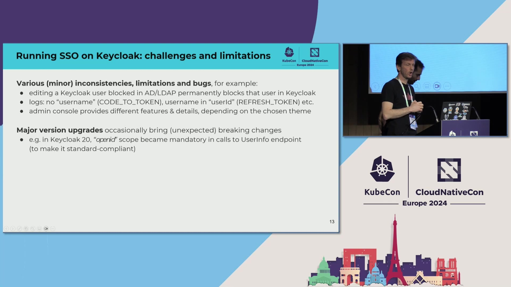
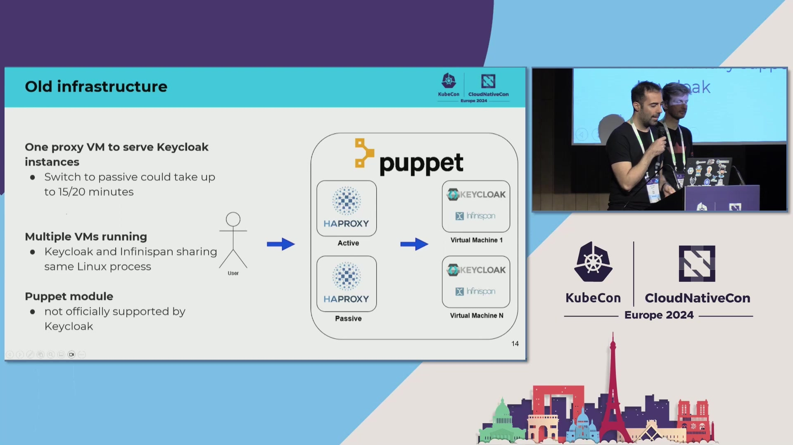
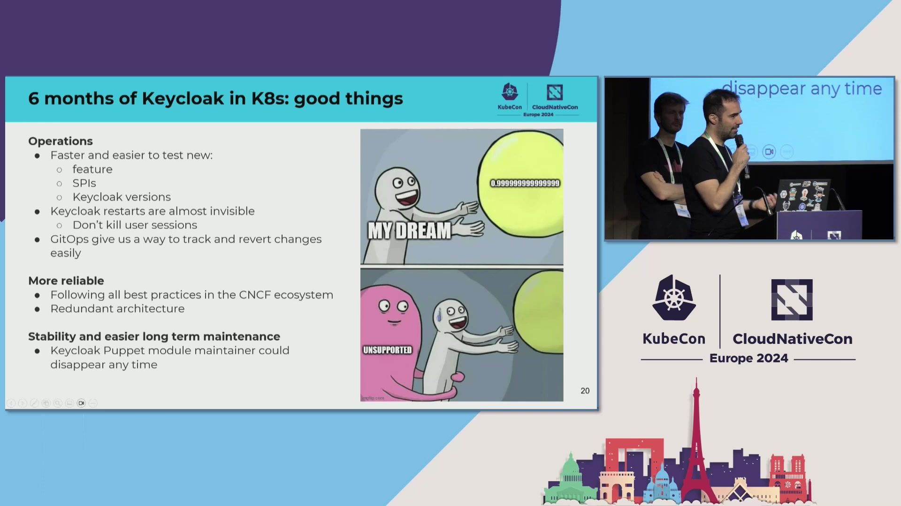

# [CERN](https://home.cern) Reference Architecture

> **Source:** [The Hard Life of Securing a Particle Accelerator - Antonio Nappi & Sebastian Lopienski, CERN](https://www.youtube.com/watch?v=rqDrrTKzNd8)  
> **Duration:** 38:53  
> **Speakers:** Antonio Nappi & Sebastian Lopienski

---

## Executive Summary

[CERN](https://home.cern), the European Organization for Nuclear Research, operates one of the world's largest and most complex IT infrastructures supporting particle physics research. Managing authentication and authorization for 200,000 users, 10,000 OIDC clients, and handling 10,000 logins per hour requires a robust, highly available identity management system.

This reference architecture describes [CERN](https://home.cern)'s migration of their **[Keycloak](https://www.keycloak.org)**-based single sign-on service from legacy VM infrastructure to a [cloud-native](https://glossary.cncf.io/cloud-native-tech/) **[Kubernetes](https://kubernetes.io)** platform. The architecture employs multiple Kubernetes clusters across availability zones following the cattle service model, [GitOps](https://glossary.cncf.io/gitops/)-based deployment automation with **[Argo CD](https://argoproj.github.io/cd/)**, and distributed caching with Infinispan to enable stateless application design.

The migration, completed in September 2023, eliminated 15-minute failover times, improved operational efficiency by approximately 70%, and demonstrated four times better performance than the VM-based predecessor. Load testing with 5,550 concurrent users proved the infrastructure could handle significantly higher throughput with better resource utilization.

This architecture demonstrates how critical authentication services can be successfully migrated to Kubernetes while maintaining stringent security and availability requirements for a research organization handling sensitive particle accelerator control systems. The patterns established serve as a pathfinder for migrating [CERN](https://home.cern)'s 900+ remaining services to cloud-native architectures.

---

## Background

[CERN](https://home.cern) operates the Large Hadron Collider and numerous other particle physics experiments, requiring robust IT infrastructure to support thousands of researchers worldwide. The organization's IT landscape includes approximately 250,000 cores of computing power, vast data storage systems, and complex control systems for particle accelerators. As the birthplace of the World Wide Web in 1989, [CERN](https://home.cern) has a rich history of computing innovation.

Authentication and authorization are mission-critical components of [CERN](https://home.cern)'s infrastructure. A failure in identity management could impact not just research activities but also the safe operation of particle accelerators. The single sign-on service supports daily operations including administrative, financial, and engineering systems, but critically also serves real-time experimental data collection during particle collider operations.

[CERN](https://home.cern)'s legacy authentication infrastructure relied on **[Keycloak](https://www.keycloak.org)** running on virtual machines managed by Puppet, with an active-passive HAProxy load balancer setup. This architecture, while functional, posed several challenges: manual failover processes taking up to 15 minutes, limited scalability, and operational complexity in managing VM-based infrastructure.

The decision to migrate to **[Kubernetes](https://kubernetes.io)** aligned with [CERN](https://home.cern)'s broader cloud-native strategy and offered opportunities for improved resilience through multi-cluster deployment, simplified operations through GitOps automation, and better resource utilization through [containerization](https://glossary.cncf.io/container/). This modernization effort serves as a pathfinder for migrating [CERN](https://home.cern)'s 900+ other services to cloud-native architectures, making the success of this project crucial for the organization's digital transformation strategy.

---

## Technical Challenge

[CERN](https://home.cern)'s legacy Keycloak deployment faced several critical technical challenges that necessitated architectural modernization. The most pressing issue was the active-passive HAProxy load balancer configuration, which required manual failover procedures taking up to 15 minutes. For a service handling 10,000 logins per hour and supporting real-time particle accelerator operations, this downtime window was unacceptable and created a dangerous single point of failure.

The VM-based infrastructure management through Puppet added significant operational complexity. Scaling required manual intervention, updates demanded careful coordination to avoid service disruptions, and the architecture lacked the self-healing capabilities of modern orchestration platforms. The tight coupling between Keycloak application servers and Infinispan cache within the same Java process made troubleshooting difficult—when performance issues arose, the team couldn't determine whether Keycloak or Infinispan was the bottleneck.

Operational procedures were fragile and time-consuming. Upgrading Keycloak Service Provider Interfaces (SPIs) required orchestrated multi-step procedures: shut down the first node, wait for cache replication to complete, verify data consistency, then proceed to the next node. This process consumed significant team time and carried high risk of user session loss if executed incorrectly. The team spent more time maintaining infrastructure than improving the SSO service itself.

The logging infrastructure based on Flume and the monitoring setup were tightly coupled to the VM environment, making [observability](https://glossary.cncf.io/observability/) fragmented across instances. Configuration management suffered from drift between environments despite Puppet's presence—manual changes and inconsistent updates created subtle differences between development, staging, and production. The architecture depended on a single Puppet module maintainer who continuously updated configurations to track new Keycloak releases, creating an unsustainable single point of knowledge.

Security requirements for a research organization handling sensitive accelerator control systems demanded mutual TLS communication, proper secret management, and compliance with specific policies. These requirements were harder to enforce consistently in the VM-based environment where networking and security configurations were managed through multiple disparate systems. Additionally, [CERN](https://home.cern) needed to prove that **[Kubernetes](https://kubernetes.io)** could meet stringent availability requirements before committing to migrating hundreds of other critical services.

---

## Architecture Overview

The modernized [CERN](https://home.cern) Keycloak architecture follows a cloud-native, multi-cluster approach designed for high availability and operational efficiency. At the infrastructure layer, multiple independent **[Kubernetes](https://kubernetes.io)** clusters are deployed across different availability zones, following the cattle service model where clusters are treated as replaceable units rather than carefully maintained pets. This approach enables zone-level failures to be handled gracefully without manual intervention.

Instead of the legacy active-passive HAProxy setup, the new architecture employs a three-node floating IP load balancer cluster that provides automatic failover without the previous 15-minute downtime window. This load balancer distributes traffic across **[Keycloak](https://www.keycloak.org)** pods running in multiple Kubernetes clusters, ensuring continuous availability even if an entire availability zone becomes unavailable. The floating IP mechanism enables sub-second failover by automatically migrating the IP address to healthy nodes.

The platform layer introduces critical components that enable operational excellence. The Keycloak Operator manages the lifecycle of Keycloak instances within Kubernetes, handling deployment, scaling, and configuration updates declaratively. This operator-based approach eliminates manual operational overhead present in the VM-based architecture. **[Argo CD](https://argoproj.github.io/cd/)** implements [GitOps](https://glossary.cncf.io/gitops/) principles, treating Git as the single source of truth for all infrastructure configuration, including Keycloak Custom Resource Definitions (CRDs), monitoring configurations, and logging setups.

The [observability](https://glossary.cncf.io/observability/) stack replaces legacy monitoring and logging solutions with cloud-native alternatives: **[Prometheus](https://prometheus.io)** for metrics collection and **[Fluent Bit](https://fluentbit.io)** for log aggregation with custom parsing rules specific to Keycloak's log format. These tools integrate seamlessly with the Kubernetes environment and provide unified visibility across all clusters and availability zones.

The most significant architectural decision was separating **[Keycloak](https://www.keycloak.org)** from Infinispan cache infrastructure. Previously, both ran in the same Java process on each VM, creating operational coupling and making troubleshooting nearly impossible. In the new architecture, Keycloak becomes stateless, running as pods in Kubernetes that can scale from zero to any number of replicas. Infinispan continues running on VMs using **[Podman](https://podman.io)** containers managed by Puppet, configured as a remote cache cluster accessed by Keycloak over the network via DNS-based discovery.

*Figure 1: Architecture Component*

*Figure 2: Architecture Component*

*Figure 3: Architecture Component*

*Figure 4: Architecture Component*

*Figure 5: Architecture Component*

*Figure 6: Architecture Component*

---

## Architecture Diagrams

This reference architecture includes three complementary diagrams that illustrate different aspects of the system from various perspectives. Together, these diagrams provide complete visibility into the component structure, data flow patterns, and deployment topology.

**Diagram 1: Component Architecture with Three-Layer Organization**

The component diagram shows the complete system with nine key components organized into three layers. The infrastructure layer includes multi-cluster Kubernetes deployments across availability zones, floating IP load balancers for automatic failover, and the Infinispan cache cluster running separately on VMs with **[Podman](https://podman.io)**. The platform layer contains the Keycloak Operator for lifecycle management, **[Argo CD](https://argoproj.github.io/cd/)** for [GitOps](https://glossary.cncf.io/gitops/) synchronization, Git repositories as the source of truth, **[Prometheus](https://prometheus.io)** for metrics, and **[Fluent Bit](https://fluentbit.io)** for logging. The application layer focuses on **[Keycloak](https://www.keycloak.org)** itself with custom SPIs.

This diagram emphasizes the GitOps workflow where Argo CD continuously synchronizes configuration from Git to all Kubernetes clusters, the operator-managed lifecycle of Keycloak pods, and the critical remote caching connection between stateless Keycloak instances and the Infinispan cluster. Annotations highlight key metrics: 200,000 users and 10,000 OIDC clients served by Keycloak, automatic failover with no downtime for the load balancer, multi-availability-zone deployment following the cattle model, and GitOps as the single source of truth.

**Diagram 2: Authentication Data Flow Across Availability Zones**

The data flow diagram traces an authentication request through the system, from user browser through the floating IP load balancer to **[Keycloak](https://www.keycloak.org)** pods in different availability zones. It illustrates how each pod queries the Infinispan cache for existing sessions (cache hit returns immediately, cache miss triggers full authentication), validates credentials against [CERN](https://home.cern)'s authorization service via custom SPI integration, and returns JWT session tokens to users.

This diagram emphasizes the 10,000 logins per hour capacity, automatic failover if a zone becomes unavailable, the shared cache enabling stateless architecture, and DNS-based discovery of cache nodes. The separation between Keycloak's stateless compute layer and Infinispan's stateful storage layer becomes clear, showing how sessions persist across pod restarts.

**Diagram 3: Multi-Cluster Deployment with GitOps Automation**

The deployment diagram illustrates the multi-cluster reality with three **[Kubernetes](https://kubernetes.io)** clusters across availability zones A, B, and C. **[Argo CD](https://argoproj.github.io/cd/)** sits above all clusters, monitoring the Git configuration repository for changes and synchronizing them across all environments. Each cluster runs independent Keycloak pods managed by operators, with all pods connecting to the shared Infinispan cache infrastructure.

This diagram shows the physical separation of the Infinispan VM infrastructure from the Kubernetes clusters, managed by Puppet rather than Kubernetes to reduce migration risk. The diagram emphasizes GitOps automation as the control plane, cattle model philosophy for cluster management, and the shared infrastructure pattern for caching.

---

## CNCF Projects

This architecture leverages six CNCF projects, each serving a specific purpose in the overall system. **[Kubernetes](https://kubernetes.io)** provides [container orchestration](https://glossary.cncf.io/container-orchestration/), **[Keycloak](https://www.keycloak.org)** handles identity management, **[Argo CD](https://argoproj.github.io/cd/)** enables GitOps, **[Prometheus](https://prometheus.io)** collects metrics, **[Fluent Bit](https://fluentbit.io)** aggregates logs, and **[Podman](https://podman.io)** runs the cache infrastructure.

### Kubernetes (Orchestration & Management)

**[Kubernetes](https://kubernetes.io)** (CNCF Graduated) serves as the foundational container orchestration platform, hosting **[Keycloak](https://www.keycloak.org)** pods across multiple clusters in different availability zones. The team selected Kubernetes for its maturity, extensive ecosystem, and proven scalability at enterprise scale.

The migration from VM-based infrastructure to Kubernetes occurred in September 2023, moving from puppet-managed VMs to operator-managed containers. The multi-cluster approach treats each Kubernetes cluster as cattle rather than pets—clusters are replaceable and zone failures are handled gracefully without manual intervention.

Key features utilized include:

- Deployments with rolling updates for zero-downtime changes
- Operator-based lifecycle management for Keycloak
- ConfigMaps for Infinispan cache configuration
- Volume mounts for custom Keycloak configurations
- Horizontal Pod Autoscaler for dynamic scaling based on load
- Network policies for service-to-service security

Cluster management follows the cattle service model philosophy. Clusters are not individually named or maintained—they're treated as interchangeable compute capacity that can be destroyed and recreated from configuration without special recovery procedures.

### Keycloak (Security & Identity)

**[Keycloak](https://www.keycloak.org)** (CNCF Incubation, joined Spring 2023) is the open source identity and access management solution at the heart of this architecture. It provides single sign-on with multi-factor authentication for 200,000 users, manages 10,000 OIDC clients, and handles 10,000 logins per hour during peak periods.

[CERN](https://home.cern) runs Keycloak on the Quarkus framework, designed specifically for Kubernetes with fast startup times (30-40 seconds for pod restarts) and low memory footprint. The stateless design enabled by remote caching allows Keycloak pods to be ephemeral and easily replaceable.

Custom Service Provider Interfaces (SPIs) extend Keycloak functionality:

- Integration with [CERN](https://home.cern)'s authorization service for user provisioning
- Custom themes for organizational branding and look-and-feel
- OTP validation endpoints for SSH two-factor authentication
- Compromised password detection using breach databases
- Custom CAPTCHA implementation for privacy and availability

The operator-based deployment model allows declarative management of Keycloak instances through Kubernetes CRDs. The team uses the operator's "unsupported fields" feature for advanced configuration not yet exposed in the stable API, trading official support for necessary functionality.

### Argo CD (CI/CD)

**[Argo CD](https://argoproj.github.io/cd/)** (CNCF Graduated) implements [GitOps](https://glossary.cncf.io/gitops/) principles, making Git the single source of truth for all infrastructure configuration. The tool continuously monitors Git repositories containing Keycloak operator CRDs, configurations for monitoring and logging, and custom resource definitions.

When changes are committed to Git, Argo CD automatically synchronizes them across all Kubernetes clusters in different availability zones. This ensures configuration consistency without manual intervention and eliminates configuration drift that plagued the Puppet-based approach.

Key features utilized include:

- Automatic synchronization from Git to multiple clusters
- Declarative ApplicationSet resources for multi-cluster management
- Health status assessment for deployed applications
- Rollback capability through Git revert operations
- Merge request workflow requiring peer review before changes

The GitOps approach provides clear audit trails through Git history. Every infrastructure change has a commit message, reviewer approval, and timestamp. During incidents, the team can quickly identify what changed and when, then revert problematic commits to restore service.

### Prometheus (Observability)

**[Prometheus](https://prometheus.io)** (CNCF Graduated) collects telemetry from Keycloak pods, Kubernetes clusters, and Infinispan cache infrastructure. ServiceMonitor resources automatically configure Prometheus to scrape metrics from Keycloak pods as they scale up and down, requiring no manual configuration updates.

Keycloak exposes standard JVM metrics (heap usage, garbage collection, thread counts) and application-specific metrics (login rates, authentication failures, session counts, response times). The multi-cluster deployment required federation—a central Prometheus instance aggregates metrics from cluster-specific instances for unified visibility.

Alerting rules detect anomalous conditions:

- High authentication failure rates indicating credential attacks
- Resource exhaustion warnings (CPU, memory)
- Cache connection failures between Keycloak and Infinispan
- Certificate expiration warnings (30 days, 7 days, 24 hours)
- Pod crash loops indicating configuration issues

Alerts route to PagerDuty for critical issues requiring immediate attention and Slack channels for lower-severity warnings that can be addressed during business hours.

### Fluent Bit (Observability)

**[Fluent Bit](https://fluentbit.io)** (CNCF Sub-project of Fluentd) handles log aggregation, replacing the legacy Flume-based logging infrastructure. Deployed as a DaemonSet on each Kubernetes node, Fluent Bit collects logs from all pods with minimal resource overhead.

Custom parsing rules extract structured data from Keycloak's logs, identifying authentication events, errors, and performance indicators. The lightweight architecture was critical—with hundreds of pods across multiple clusters, log shipping overhead needed to be minimal. Fluent Bit's memory footprint of 20-30MB per node made it ideal for this use case.

Parsed logs forward to [CERN](https://home.cern)'s centralized logging system for indexing and search. Engineers can query logs across all services and regions, correlating requests using trace IDs. The structured logging approach with standardized fields (timestamp, severity, service, trace_id, user_id) enables cross-service queries during debugging.

### Podman (Runtime)

**[Podman](https://podman.io)** (CNCF Incubating) serves as the container runtime for Infinispan cache clusters running on VMs. The team deliberately kept Infinispan separate from Kubernetes, running on VMs managed by Puppet, to reduce migration risk. This pragmatic decision allowed focusing on the Keycloak migration while keeping the cache layer on proven infrastructure.

Podman provides daemonless container execution, important for [CERN](https://home.cern)'s security requirements. Containers run as rootless processes without requiring a privileged daemon, reducing the attack surface. The Infinispan cache cluster uses DNS aliases for discovery, configured remotely via Keycloak ConfigMaps and volume mounts.

This separation pattern—Kubernetes for stateless applications, VMs with Podman for stateful caching—proved wise for risk management. The team can now plan Infinispan migration to Kubernetes as a separate project with lessons learned from the Keycloak migration.

### Project Summary

| Project | Category | Usage |
|---------|----------|-------|
| Kubernetes | Orchestration & Management | Primary container orchestration across multiple clusters in different availability zones, operator-based Keycloak deployment, cattle service model for cluster management |
| Keycloak | Security & Identity | Open source identity and access management for 200,000 users, 10,000 OIDC clients, 10,000 logins/hour with custom SPIs for CERN authorization integration |
| Argo CD | CI/CD | GitOps continuous deployment synchronizing configuration from Git to all Kubernetes clusters, single source of truth for infrastructure configuration |
| Prometheus | Observability | Metrics collection for Keycloak performance, resource utilization, and system health across multi-cluster deployment with federation |
| Fluent Bit | Observability | Lightweight log aggregation with custom parsing rules for Keycloak application logs, replacing legacy Flume infrastructure with minimal overhead |
| Podman | Runtime | Container runtime for Infinispan cache clusters on VMs, separate from Kubernetes infrastructure, Puppet-managed configuration for risk mitigation |

---

## Integration Patterns

Three primary integration patterns characterize [CERN](https://home.cern)'s architecture, demonstrating how CNCF projects work together to enable reliable SSO service. These patterns showcase the operational benefits of cloud-native technologies beyond individual project capabilities.

**Pattern 1: Operator-Based Lifecycle Management**

**Projects Involved:** **[Kubernetes](https://kubernetes.io)**, **[Keycloak](https://www.keycloak.org)** Operator

The Operator Pattern replaces manual VM management with declarative, automated lifecycle control. The Keycloak Operator runs within Kubernetes and watches for Keycloak Custom Resources (CRs). When operators create or modify a Keycloak CR specifying desired state (number of replicas, resource limits, Infinispan cache configuration), the operator reconciles actual state with desired state by creating pods, configuring services, mounting volumes for cache configuration files, and applying settings.

This pattern eliminates manual deployment procedures required in the VM-based architecture. If a pod fails, the operator automatically creates a replacement without human intervention. Rolling updates happen gracefully—the operator creates new pods with updated configuration, waits for them to become healthy, then terminates old pods. The operator also handles health checks, resource management, and configuration validation automatically.

The team uses the operator's "unsupported fields" feature for advanced configuration not yet exposed in the stable API, such as specific Infinispan remote cache settings. While this creates some uncertainty about long-term support, it enabled production deployment with necessary functionality that standard CRDs didn't yet support.

**Pattern 2: GitOps Continuous Deployment**

**Projects Involved:** **[Argo CD](https://argoproj.github.io/cd/)**, **[Kubernetes](https://kubernetes.io)**, Git

The GitOps Integration Pattern creates a fully automated deployment pipeline from Git commits to production clusters. Developers commit Keycloak operator CRDs, monitoring configurations with **[Prometheus](https://prometheus.io)** ServiceMonitors, and logging setups with **[Fluent Bit](https://fluentbit.io)** configurations to Git repositories. **[Argo CD](https://argoproj.github.io/cd/)** polls these repositories every three minutes, detects changes, compares desired state in Git with actual cluster state, and executes synchronization to align clusters with Git.

This pattern provides several critical benefits beyond simple automation. Git becomes the single source of truth—there is no configuration stored only in clusters. Configuration drift across availability zones becomes impossible because Argo CD continuously enforces consistency. Rollback is as simple as reverting a Git commit and letting Argo CD synchronize. All changes have clear audit trails with Git history showing what changed, who changed it, when, and why (commit messages).

The merge request workflow adds governance—all infrastructure changes require peer review before merging to the main branch. This caught numerous configuration errors during code review that would have caused production incidents. The pattern proved so successful that [CERN](https://home.cern) adopted it as standard for all Kubernetes deployments.

**Pattern 3: Remote Caching for Stateless Applications**

**Projects Involved:** **[Keycloak](https://www.keycloak.org)**, Infinispan, **[Kubernetes](https://kubernetes.io)**, **[Podman](https://podman.io)**

The Remote Caching Integration Pattern enables stateless **[Keycloak](https://www.keycloak.org)** design by separating session storage from application logic. Keycloak pods are configured to connect to external Infinispan cache clusters via HotRod protocol instead of embedding Infinispan within the same Java process. Cache configuration is provided through Kubernetes ConfigMaps specifying Infinispan server endpoints, authentication credentials, and cache topology.

A DNS alias points to three Infinispan server IP addresses for high availability. If one cache server fails, Keycloak automatically fails over to another server using HotRod client-side failover. The ConfigMap containing Infinispan configuration is mounted as a volume in Keycloak pods, allowing configuration updates without rebuilding container images.

This separation provides multiple benefits. Keycloak can scale from zero to any number of replicas without coordination—new pods simply connect to the existing cache cluster. Pod restarts complete in 30-40 seconds because there's no cache replication delay. During the first production week, incorrect Java heap settings caused all pods to restart every three hours for three days, yet users experienced no service disruption because sessions persisted in Infinispan. Resource utilization can be analyzed separately for Keycloak (compute-bound) and Infinispan (memory-bound), enabling independent optimization.

---

## Implementation Details

The implementation followed a phased approach emphasizing risk mitigation and validation at each step. The project spanned from initial planning in early 2023 through production cutover in September 2023, with a small platform team of 2-3 engineers focused on the infrastructure migration.

**Phase 1: Infrastructure Preparation and Load Testing**

The team began by deploying multiple **[Kubernetes](https://kubernetes.io)** clusters across different availability zones, following the cattle service model philosophy. Each cluster was configured independently, ensuring clusters could be treated as replaceable units rather than carefully maintained pets. The floating IP load balancer cluster was implemented with three nodes to replace the legacy active-passive HAProxy setup, providing automatic failover capability.

Comprehensive load testing validated the architecture's performance before production migration. The team used Gatling's closed workload model with 5,550 concurrent users executing identical login scenarios repeatedly for 10-minute test runs. This test design—where the system receives more requests as it handles load faster—proved the Kubernetes infrastructure was four times more efficient than the VM-based predecessor. These quantitative results provided the evidence needed to secure management approval for the migration, overcoming initial skepticism about adding Kubernetes as an additional layer.

**Phase 2: Operator and GitOps Deployment**

The Keycloak Operator was deployed in each Kubernetes cluster, creating the foundation for declarative lifecycle management. The team installed Custom Resource Definitions (CRDs) describing Keycloak deployments, deployed the operator controller in a dedicated namespace, and granted necessary RBAC permissions for the operator to manage Keycloak resources.

**[Argo CD](https://argoproj.github.io/cd/)** configuration established the [GitOps](https://glossary.cncf.io/gitops/) workflow. Git repositories were structured with base configurations and cluster-specific overlays, enabling shared configuration while allowing per-cluster customization when necessary. Argo CD ApplicationSets were configured to manage multiple clusters, with sync policies set for manual approval initially (later automated for non-production environments). The team committed all infrastructure configuration to Git: Keycloak operator CRDs, monitoring setup with **[Prometheus](https://prometheus.io)** ServiceMonitors, and logging configuration with **[Fluent Bit](https://fluentbit.io)** replacing legacy Flume.

**Phase 3: Remote Caching Integration**

Separating Infinispan from Keycloak required careful configuration work. The team deployed Infinispan cache clusters on separate VMs using **[Podman](https://podman.io)** containers, continuing to use Puppet for configuration management to minimize migration risk. This pragmatic decision kept the cache layer on proven infrastructure while focusing on the Keycloak application migration.

Keycloak pods were configured to connect remotely via HotRod protocol through ConfigMaps specifying cache endpoints, authentication credentials, and topology information. DNS aliases were set up pointing to three Infinispan server IPs for high availability. The ConfigMap containing Infinispan configuration was mounted as a volume in Keycloak pods, enabling configuration updates without rebuilding container images. Extensive testing validated that pod restarts didn't lose user sessions and that cache connections failed over correctly when individual cache servers were stopped.

**Phase 4: Production Cutover and Stabilization**

The production migration occurred in September 2023 during a planned maintenance window. The team used a blue-green deployment approach: deploy new Kubernetes-based infrastructure in parallel, validate functionality with internal testing, switch DNS to point to new load balancers, monitor for issues, and keep old VM infrastructure running for quick rollback if needed.

The cutover succeeded without major incidents, though the first production week revealed an interesting resilience test. Incorrect Java heap settings caused all Keycloak pods to restart every three hours for three consecutive days. Despite continuous pod restarts across the entire production service, no user complaints were received—the separated Infinispan cache layer preserved user sessions through restarts, and the 30-40 second pod startup time meant brief interruptions went unnoticed. This unintentional stress test provided unexpected validation of the architecture's resilience.

**Phase 5: Observability and Operational Refinement**

Post-migration work focused on observability improvements and operational refinement. **[Prometheus](https://prometheus.io)** alerting rules were tuned based on production behavior, eliminating noisy alerts while ensuring critical issues triggered pages. **[Fluent Bit](https://fluentbit.io)** parsing rules were refined to extract more structured data from Keycloak logs, improving debugging capability. The team developed runbooks for common operational scenarios, including pod restarts, cache connectivity issues, and certificate rotation procedures.

---

## Deployment Architecture

[CERN](https://home.cern) operates a multi-cluster **[Kubernetes](https://kubernetes.io)** deployment across multiple availability zones within their infrastructure. Three independent Kubernetes clusters are configured identically through **[Argo CD](https://argoproj.github.io/cd/)** synchronization from Git, but operate independently to ensure zone-level failures don't cascade across the entire system.

The cattle service model philosophy means clusters are not named or individually managed—they're treated as interchangeable compute capacity. If a cluster experiences issues, traffic automatically routes to healthy clusters without manual intervention, and the problematic cluster can be destroyed and recreated from configuration stored in Git without special recovery procedures. This design eliminates the need for complex cluster-specific knowledge and reduces operational burden significantly.

The floating IP load balancer cluster sits at the edge, providing the entry point for all authentication requests. This three-node cluster uses floating IP addresses that automatically migrate between nodes if one becomes unavailable, with health checks ensuring requests route only to healthy nodes. The load balancer distributes traffic across **[Keycloak](https://www.keycloak.org)** pods in all available Kubernetes clusters. This architecture eliminated the 15-minute manual failover window of the legacy HAProxy active-passive setup, reducing failover time to under one second with automatic detection and rerouting.

Within each Kubernetes cluster, multiple Keycloak pods run concurrently with horizontal scaling based on load. The stateless nature of Keycloak pods, enabled by remote Infinispan caching, makes scaling seamless—new pods immediately begin serving traffic without warmup periods or state migration. During normal operation, each cluster runs a baseline number of pods sufficient for typical load. During peak periods with 10,000 logins per hour, the Kubernetes Horizontal Pod Autoscaler creates additional pods automatically based on CPU and memory metrics.

The Infinispan cache cluster runs on separate VM infrastructure, deliberately isolated from Kubernetes to reduce migration risk. This design allows independent management and scaling of the cache layer. DNS-based discovery enables Keycloak pods to locate cache servers without hardcoded IP addresses. If cache servers are added or removed, DNS updates propagate automatically without requiring Keycloak pod restarts. The cache configuration is mounted via ConfigMaps, allowing updates to cache topology or settings through [GitOps](https://glossary.cncf.io/gitops/) workflows rather than manual VM configuration.

---

## Security Considerations

---

## Observability and Operations

[CERN](https://home.cern)'s [observability](https://glossary.cncf.io/observability/) strategy combines cloud-native tools with operational practices tailored for a critical identity service. **[Prometheus](https://prometheus.io)** collects telemetry from **[Keycloak](https://www.keycloak.org)** pods, Kubernetes clusters, and Infinispan cache infrastructure. ServiceMonitor resources automatically configure Prometheus to scrape metrics from Keycloak pods as they scale, eliminating manual configuration updates when pod counts change.

Keycloak exposes standard JVM metrics including heap usage, garbage collection statistics, and thread counts, plus application-specific metrics like login rates, authentication failures, session counts, and response times. The multi-cluster deployment required Prometheus federation—a central Prometheus instance aggregates metrics from cluster-specific instances, providing unified visibility across all availability zones. Alerting rules detect anomalous conditions: high authentication failure rates suggesting credential attacks, resource exhaustion approaching limits, cache connection failures between Keycloak and Infinispan, and certificate expiration warnings at 30 days, 7 days, and 24 hours before expiry.

**[Fluent Bit](https://fluentbit.io)** handles log aggregation via DaemonSet deployment on each Kubernetes node. Custom parsing rules extract structured data from Keycloak's logs, identifying authentication events, errors, and performance indicators. The lightweight architecture minimizes resource overhead—with hundreds of pods across multiple clusters, log shipping overhead needed to be minimal. Fluent Bit's memory footprint of 20-30MB per node made it ideal for this use case.

Parsed logs forward to [CERN](https://home.cern)'s centralized logging system for indexing and search. Engineers query logs across all services and regions, correlating requests using trace IDs. The structured logging approach with standardized fields enables cross-service queries during debugging. During incidents, engineers search for error patterns across all clusters simultaneously, then correlate with Prometheus metrics to identify root causes.

Operational procedures leverage [GitOps](https://glossary.cncf.io/gitops/) for change management. All configuration changes go through Git pull requests with peer review. This workflow caught numerous configuration errors during code review that would have caused production incidents. Git history provides audit trails for incident investigations, making it easy to correlate issues with recent changes. Rollback procedures use Git reverts—if a change causes issues, reverting the commit and synchronizing with **[Argo CD](https://argoproj.github.io/cd/)** returns the system to the previous state within minutes.

Capacity planning uses Prometheus metrics to track resource utilization trends. The team monitors CPU and memory usage across all pods, identifying when clusters approach capacity limits. The stateless architecture simplifies capacity decisions—adding capacity requires only adjusting replica counts or adding nodes, without complex state migration. The team estimates operational time spent on infrastructure maintenance decreased by approximately 70% compared to the VM-based approach, freeing resources for feature development and service improvements.

---

## Results and Impact

The migration to **[Kubernetes](https://kubernetes.io)** delivered dramatic improvements across technical, operational, and reliability dimensions that exceeded initial expectations. The most visible improvement was eliminating the 15-minute manual failover window that plagued the legacy infrastructure. The floating IP load balancer provides automatic failover in under one second, dramatically improving availability for [CERN](https://home.cern)'s 200,000 users.

Performance improvements validated the architectural approach. Load testing demonstrated the Kubernetes-based infrastructure was four times more efficient than the VM-based predecessor, handling identical workloads with significantly better throughput. This quantitative improvement came despite adding Kubernetes as an additional layer, dispelling management concerns that containerization would degrade performance. The Gatling closed workload model with 5,550 concurrent users proved the new infrastructure could handle peak loads of 10,000 logins per hour with better resource utilization.

Operational efficiency transformed dramatically through automation and improved architecture. **[Keycloak](https://www.keycloak.org)** pod restart times dropped to 30-40 seconds compared to the complex multi-hour procedures previously required for coordinated cache replication during VM updates. Operations like SPI upgrades that formerly consumed hours of team time now complete in minutes with simple pod restarts and no user impact. The team estimates operational time spent on infrastructure maintenance decreased by approximately 70%, freeing resources for feature development and SSO service improvements.

The stateless Keycloak architecture proved its resilience during an unintentional real-world stress test. During the first production week, incorrect Java heap settings caused all Keycloak pods to restart every three hours for three consecutive days. Despite continuous pod restarts across the entire production service, no user complaints were received. The separated Infinispan cache layer preserved user sessions through restarts, and the 30-40 second pod startup time meant brief interruptions went unnoticed by users accessing [CERN](https://home.cern) systems.

[GitOps](https://glossary.cncf.io/gitops/) with **[Argo CD](https://argoproj.github.io/cd/)** eliminated configuration drift that previously caused subtle issues across environments. Configuration consistency across multiple Kubernetes clusters is now enforced automatically, eliminating the manual verification procedures required with Puppet. Every infrastructure change now has a clear audit trail in Git history, correlating changes with incidents during troubleshooting. The merge request workflow requiring peer review caught configuration errors before deployment that would have caused production incidents.

The migration served as a successful pathfinder for [CERN](https://home.cern)'s broader cloud-native transformation. The patterns established—operator-based lifecycle management, GitOps automation, separated stateless and stateful layers, and multi-cluster deployment—now serve as templates for migrating 900+ additional services. The project's success built organizational confidence in Kubernetes and cloud-native technologies, accelerating the broader transformation timeline and providing reusable patterns other teams can adopt.

### Key Metrics

| Metric | Improvement | Business Impact |
|--------|-------------|-----------------|
| Failover Time | 15 minutes → <1 second (automatic) | Eliminated authentication service disruption during infrastructure maintenance and zone failures |
| Infrastructure Performance | 1x baseline → 4x throughput (400% improvement) | Load testing proved Kubernetes infrastructure handles peak loads more efficiently than VMs |
| Pod Restart Time | Multi-hour procedures → 30-40 seconds | Simplified operations and enabled rapid recovery with no user session loss |
| Operational Efficiency | Manual hours → Minutes for changes (~70% reduction) | GitOps automation freed staff time for strategic projects and service improvements |
| Service Resilience | Manual intervention → Automatic recovery | 3 days of continuous pod restarts with zero user complaints demonstrated architecture resilience |
| Configuration Consistency | Manual verification → Automatic synchronization | Eliminated configuration drift across 3 availability zones with GitOps enforcement |

---

## Lessons Learned

Several architectural and organizational decisions proved critical to the migration's success, while some challenges revealed areas for improvement in future projects. The decision to separate **[Keycloak](https://www.keycloak.org)** from Infinispan delivered benefits beyond initial expectations, enabling independent scaling, simplified troubleshooting with separate resource analysis, and the rapid pod restart capability that defines the architecture's operational simplicity.

Proving performance improvements with quantitative load testing was essential for securing management buy-in. The team's use of Gatling with a closed workload model provided irrefutable evidence: four times better efficiency compared to VMs, demonstrating that **[Kubernetes](https://kubernetes.io)** wouldn't degrade performance despite adding an orchestration layer. Organizations considering similar migrations should invest in comprehensive load testing early to build confidence, identify bottlenecks before production, and secure resources needed for implementation.

The pragmatic decision to keep Infinispan on VMs managed by Puppet rather than migrating everything to Kubernetes simultaneously reduced migration risk significantly. While seemingly counterintuitive for a cloud-native transformation, this staged approach allowed the team to focus on the Keycloak application migration without simultaneously changing the cache infrastructure. This risk mitigation strategy proved wise—the Keycloak migration succeeded smoothly, and the team can now plan Infinispan migration to Kubernetes as a separate project with lessons learned applied.

However, several challenges and limitations warrant attention for future projects. The Keycloak operator's use of "unsupported fields" for advanced features creates uncertainty about long-term support and upgrade paths. While this pragmatic approach enabled production deployment with necessary functionality, the team wishes the Keycloak project would provide clearer roadmaps for preview features. Specifically, token exchange support has remained in preview status for years despite heavy production use by many organizations, making it difficult to plan long-term architectural decisions.

Realm configuration management remains partially unsolved in the [GitOps](https://glossary.cncf.io/gitops/) workflow. While Keycloak operators now support realm imports via CRDs, many configuration elements still reside in the database rather than Git. The team's workaround—regularly exporting realm configuration to Git for change detection—provides visibility but lacks the true declarative approach desired. Future work will explore tooling to export realm configuration automatically and detect drift between Git and database state.

Load testing before cutover revealed issues that would have caused production incidents if discovered during migration. Specifically, initial node pool sizing was too small, causing pod evictions during simulated peak load. The team increased minimum nodes from 10 to 20 per cluster and tuned Horizontal Pod Autoscaler thresholds based on load test results. Organizations should invest in realistic load testing that simulates not just normal operations but failure scenarios, ensuring the architecture handles degraded conditions gracefully.

The multi-cluster architecture required careful configuration management thought. While identical configuration across clusters was the goal, reality demanded cluster-specific settings like cluster names, zone labels, and storage classes. The team learned to structure Git repositories with base configurations and cluster-specific overlays using Kustomize, balancing consistency with necessary customization. Future migrations can benefit from this repository structure pattern established during the Keycloak project.

For organizations considering similar migrations of critical services to Kubernetes, [CERN](https://home.cern)'s experience offers important guidance: prioritize comprehensive testing and observability before cutover, embrace GitOps for operational consistency and audit trails, use operators for stateful application management to reduce operational burden, and accept that pragmatic staged migrations reduce risk even if they delay full cloud-native transformation. The separation of concerns between stateless application logic and stateful storage proved architecturally sound and operationally beneficial.

---

## Conclusion

[CERN](https://home.cern)'s successful migration of **[Keycloak](https://www.keycloak.org)** from VM-based infrastructure to multi-cluster **[Kubernetes](https://kubernetes.io)** demonstrates that critical identity services can be modernized using [cloud-native](https://glossary.cncf.io/cloud-native-tech/) patterns while improving reliability, operational efficiency, and organizational agility. The architecture combining Kubernetes multi-cluster deployment, [GitOps](https://glossary.cncf.io/gitops/) automation with **[Argo CD](https://argoproj.github.io/cd/)**, operator-based application management, and distributed caching with Infinispan provides a reference for organizations managing large-scale identity services.

The quantitative improvements validate the architectural approach: eliminating 15-minute manual failover windows with automatic sub-second failover, achieving four times better performance efficiency through load testing validation, and reducing operational maintenance time by approximately 70% through automation. The successful pathfinding for broader organizational transformation demonstrates how focused projects can build confidence and establish patterns for larger initiatives.

Key success factors included pragmatic risk mitigation through staged migration (keeping Infinispan on VMs initially), comprehensive testing before cutover to identify issues in controlled environments, investment in [observability](https://glossary.cncf.io/observability/) infrastructure providing objective validation of improvements, and organizational support for learning and iteration during implementation. The separation of cache infrastructure from Kubernetes demonstrated practical wisdom in managing migration risk while still achieving cloud-native benefits.

Looking forward, [CERN](https://home.cern) plans to continue cloud-native transformation, migrating the remaining 900+ services using patterns validated by the Keycloak migration. This project's success built organizational confidence in Kubernetes and cloud-native technologies, accelerating the broader transformation timeline. Future enhancements may include migrating the Infinispan cache layer to Kubernetes for fully integrated infrastructure, exploring active-active multi-region deployment for even higher availability, and integrating additional authentication methods as research collaboration patterns evolve.

For organizations considering similar migrations of critical services, [CERN](https://home.cern)'s experience offers essential lessons: comprehensive testing and observability enable confident migration, GitOps provides operational consistency that manual processes cannot match, operators simplify stateful application management dramatically, and pragmatic staged approaches often succeed where ambitious all-at-once transformations fail. The architecture demonstrates that cloud-native technologies deliver real operational benefits for critical infrastructure when implemented thoughtfully with appropriate risk mitigation.

---

## About This Reference Architecture

**Company:** [CERN](https://home.cern)  
**Industry:** Scientific Research & Education  
**Publication Date:** 2026-02-10  
**Generated by:** [casestudypilot](https://github.com/cncf/casestudypilot) reference-architecture-agent v1.0.0  
**Source Video:** [https://www.youtube.com/watch?v=rqDrrTKzNd8](https://www.youtube.com/watch?v=rqDrrTKzNd8)  
**TAB Status:** Proposed (pending submission)  
**Architectural Significance:** Demonstrates large-scale SSO migration from VMs to Kubernetes with operator-based deployment, GitOps automation, and high-availability patterns for research infrastructure

### CNCF TAB Submission

This reference architecture is ready for submission to the CNCF Technical Advisory Board. To submit:

1. Review this reference architecture for technical accuracy
2. Create an issue at: https://github.com/cncf/tab/issues/new
3. Select "Reference Architecture Submission" template
4. Provide link to this reference architecture
5. TAB will review within 2-4 weeks

For more information on the TAB review process, see: https://github.com/cncf/tab/blob/main/process/reference-architectures.md

---

## License

This reference architecture is licensed under the Creative Commons Attribution 4.0 International License.  
© 2026-02-10 Cloud Native Computing Foundation